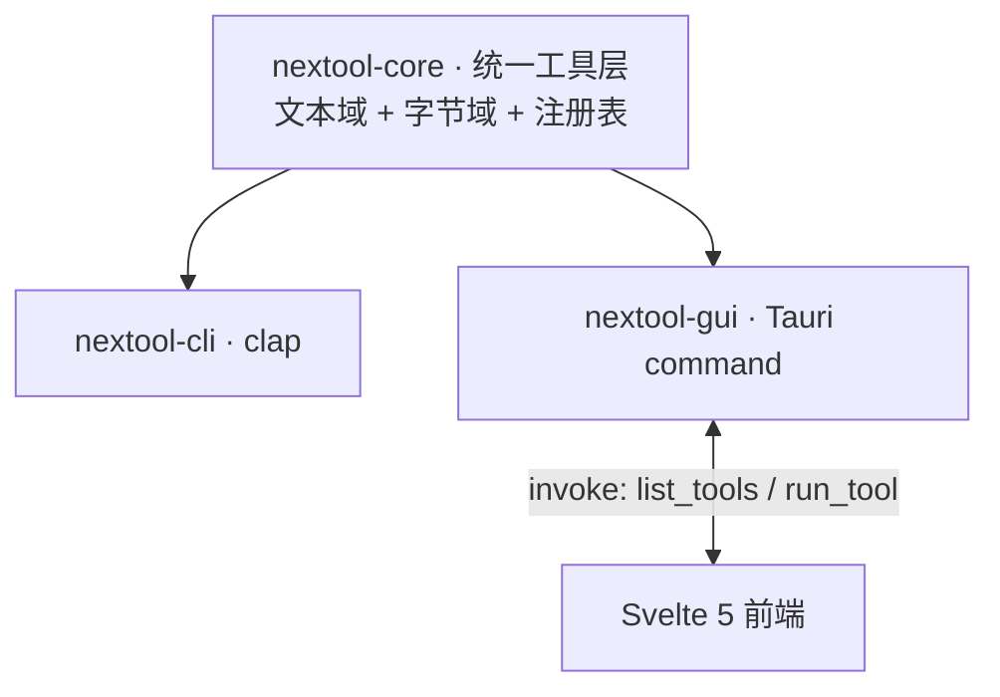

<div align="center">

# NexToolkit

纯本地通用工具集 · CLI + 桌面 GUI · 纯 Rust 核心

[](https://www.rust-lang.org/)
[](https://tauri.app/)
[](https://svelte.dev/)
[](LICENSE)
[](#)

**文件不离本机 · 无云 · 无遥测 · 无账号**

</div>

---

140+ 工具,8 组:编解码、数据转换、格式化、生成器、文本处理、加密、网络/时间、文件转换。CLI 与 GUI 共享同一 Rust 核心库,同输入同输出。

## 特性

- **纯本地** — 所有处理在本机完成,文件不上传,无网络请求(除用户主动调用的 HTTP 探测工具)
- **双交付** — CLI 单二进制(headless 可用)+ Tauri 桌面 GUI(系统 WebView,无 Electron 臃肿)
- **纯 Rust 核心** — `nextool-core` 无 C 绑定、无重引擎打包;外部引擎(ffmpeg/LibreOffice/calibre/pandoc/Ghostscript/tesseract)运行时探测系统已装路径
- **工具自描述** — 文本工具经 `Tool` trait + 注册表自描述,CLI 与 GUI 自动发现,无需逐工具接线

## 架构



- **core** — 单一事实源:文本工具(`&str→String`)经 `Tool` trait + `registry.rs` 自描述;字节/文件工具(`&[u8]`/路径)在 `fileconv/` 子层。无 UI 依赖。
- **cli** — clap 子命令,参数/stdin 输入,headless 可用。
- **gui** — 36 个 Tauri 命令(4 通用入口 + 32 文件命令);前端动态渲染工具列表。

详见 [docs/tech.md](docs/tech.md) 与 [docs/flow.md](docs/flow.md)。

## 安装

下载 [Release](https://github.com/int2t05/NexToolkit/releases) 产物:CLI 单二进制(linux/macos/windows)或 GUI 安装包(msi/nsis/deb/AppImage/dmg)。

源码构建:

```bash
cargo build -p nextool-cli --release          # CLI
npm install && npm run build                   # 前端 → dist/(GUI 构建前置)
npm run tauri build                            # GUI
```

## CLI 用法

```bash
# 编解码(含字符编码转换)
nextool encode base64 encode "Hello"
nextool encode charset encode --charset gbk "中文"
echo '{"a":1}' | nextool convert json-yaml to

# 生成器
nextool generate hash sha256 abc
nextool generate uuid-v4
nextool generate password --length 16 --upper --digits

# 文本处理
nextool text case snake "Hello World"
nextool text regex-match '\d+' "a12b3"

# 加密
nextool crypto aes-encrypt --password pw "Secret"
nextool crypto rsa-keygen 2048

# 文件转换(纯 Rust)
nextool file-conv archive compress zip a.txt b.txt
nextool file-conv image convert photo.png jpg
nextool file-conv pdf split doc.pdf

# 通用文件转换(按源格式自动路由引擎)
nextool file-conv convert doc.docx pdf         # Office→PDF(LibreOffice)
nextool file-conv convert note.md html         # MD→HTML(pandoc)
nextool file-conv convert book.epub pdf        # 电子书→PDF(calibre)
nextool file-conv convert big.pdf pdf          # PDF 压缩(Ghostscript)
```

工具全集与参数详见 [docs/api.md](docs/api.md)。

## GUI

```bash
npm install && npm run tauri dev
```

左侧 3 级功能树(分组 > 子分类 > 工具)+ 搜索 + 收藏,右侧参数表单 + 输入输出 + 语法高亮,中英双语,暗色主题,Ctrl+K 命令面板。TopBar 引擎管理入口,显示 6 引擎状态 + 下载安装引导。

## 引擎

6 个外部引擎运行时探测,未装的引擎在 GUI 引擎管理页显示下载链接:

| 引擎 | 用途 | Windows 默认路径 |
|---|---|---|
| ffmpeg | 音视频转码 | PATH |
| LibreOffice | Office↔PDF | `C:\Program Files\LibreOffice\program\` |
| calibre | 电子书转换 | PATH |
| pandoc | 标记语言互转 | PATH |
| Ghostscript | PDF 压缩 | `C:\Program Files\gs\gs<version>\bin\` |
| tesseract | OCR | `C:\Program Files\Tesseract-OCR\` |

核心包不打包重引擎,未装时返回明确错误提示安装。

## 测试

```bash
cargo test -p nextool-core -p nextool-cli      # 真实数据,无 mock
cargo clippy -p nextool-core -p nextool-cli -- -D warnings
bash tests/run.sh                                # E2E 留痕(产物落盘)
./scripts/pre-push.sh                           # 全门(fmt + clippy + test + build)
```

core 单测 + CLI 集成测试(`assert_cmd`,真实二进制)+ 顶层 `tests/` E2E 留痕脚本(bash,产物落盘供人工检查)。CI 三平台编译验证。

## 未来方向

- **智能层** — Smart Detection(剪贴板自动选工具)、Recipe 流水线(工具链式组合)
- **格式扩展** — 更多文档/图像/音视频格式覆盖,纯 Rust 替代引擎(ocrs/symphonia)评估
- **i18n** — 中英已交付,日韩待做

详见 [docs/todo.md](docs/todo.md)。

## 文档

- [docs/prd.md](docs/prd.md) — 产品需求
- [docs/tech.md](docs/tech.md) — 技术与架构
- [docs/api.md](docs/api.md) — 接口契约
- [docs/flow.md](docs/flow.md) — 业务流程与数据流
- [docs/todo.md](docs/todo.md) — 待办与路线图
- [CONTRIBUTING.md](CONTRIBUTING.md) — 贡献指南

## 协议

MIT
