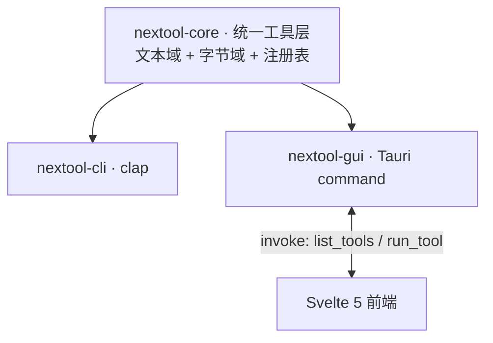

# NexToolkit

> 开源、纯本地、轻量快捷的通用工具集。Tauri 桌面 GUI + 独立 CLI,跨平台,纯 Rust 核心。文件不离本机。

64 个工具,8 组:编解码、转换、格式化、生成器、文本、加密、网络/时间、文件转换。CLI 与 GUI 共享同一核心库——同输入同输出。

## 架构



- **core**:单一事实源——文本工具(`&str→String`)经 `Tool` trait + `registry.rs` 自描述;字节/文件工具(`&[u8]`/路径)在 `fileconv/` 子层。无 UI 依赖。
- **cli**:clap 子命令,参数/stdin 输入,headless 可用。
- **gui**:13 个 Tauri 命令(10 文件操作 + `list_tools`/`run_tool`/`list_file_tools`);前端动态渲染工具列表。
- 详见 [docs/tech.md](docs/tech.md) 与 [docs/flow.md](docs/flow.md)。

## 安装

下载 [Release](https://github.com/int2t05/NexToolkit/releases) 产物:CLI 单二进制(linux/macos/windows)或 GUI 安装包(msi/nsis/deb/AppImage/dmg)。或源码构建:

```bash
cargo build -p nextool-cli --release          # CLI
npm install && npm run build                   # 前端 → dist/(GUI 构建前置)
npm run tauri build                            # GUI
```

## CLI 用法

结构:`nextool <分组> <工具> [模式/参数]`。输入来自参数或 stdin(管道友好)。成功退出 0,失败非零 + stderr。

```bash
# 编解码
nextool encode base64 encode "Hello"            # SGVsbG8=
echo -n "Man" | nextool encode base64 encode    # stdin

# 转换
echo '{"a":1}' | nextool convert json-yaml to
nextool convert numbase 16 10 ff                # 255

# 格式化
echo '{"a":1}' | nextool format json-fmt

# 生成器
nextool generate hash sha256 abc
nextool generate uuid-v4
nextool generate password --length 16 --upper --digits

# 文本
nextool text case snake "Hello World"           # hello_world
nextool text regex-match '\d+' "a12b3"

# 加密
nextool crypto aes-encrypt --password pw "Secret"
nextool crypto rsa-keygen 2048
nextool crypto rsa-sign --priv-pem key.pem "data"
nextool encode jwt-verify --key secret "<jwt>"

# 网络/时间
nextool net-time ipcalc 192.168.1.5/24
nextool net-time cron-next "0 * * * * *" --count 3
nextool net-time dns A example.com
nextool net-time http https://example.com

# 单位换算
nextool convert unit 1 km m                     # 1000

# 文件转换(归档,产物落源目录)
nextool file-conv archive list archive.zip
nextool file-conv archive extract archive.7z     # 支持 zip/tar/gz/7z
nextool file-conv archive compress zip a.txt b.txt
nextool file-conv archive convert archive.zip tar

# 文件转换(图像)
nextool file-conv image convert photo.png jpg
nextool file-conv image resize big.png --width 800 --height 0   # 按宽等比

# 文件转换(PDF)
nextool file-conv pdf split doc.pdf
nextool file-conv pdf rotate doc.pdf             # 所有页顺时针 90°
nextool file-conv pdf encrypt doc.pdf --password secret
nextool file-conv pdf decrypt doc.pdf --password secret

# 引擎转换(运行时探测系统已装引擎,未装则提示安装)
nextool file-conv engine av video.mp4 --to mp3         # ffmpeg 音视频
nextool file-conv engine office-to-pdf doc.docx        # LibreOffice Office→PDF
nextool file-conv engine ebook book.epub --to pdf      # calibre 电子书
nextool file-conv engine markup note.md --to html      # pandoc 标记语言
nextool file-conv engine pdf-compress big.pdf          # Ghostscript PDF 压缩
nextool file-conv engine ocr scan.png                  # tesseract OCR
```

工具全集与参数详见 [docs/api.md](docs/api.md)。

## GUI

下载安装包,或开发模式:`npm install && npm run tauri dev`。左侧八组导航 + 搜索 + 收藏,右侧参数表单 + 输入输出 + 复制,中英双语,暗色主题,输出语法高亮,Ctrl+K 命令面板。

## 测试与质量

```bash
./scripts/pre-push.sh                          # 本地 push 前验证:fmt + clippy + test + build
cargo test -p nextool-core -p nextool-cli      # 真实数据,无 mock
cargo clippy -p nextool-core -p nextool-cli -- -D warnings
```

core 单测 + CLI 集成测试(`assert_cmd`,真实二进制)。CI 三平台编译验证。本地 hook 一次性安装:

```bash
cp scripts/pre-push.sh .git/hooks/pre-push && chmod +x .git/hooks/pre-push
```

## 未来方向

- **文件转换(对标 freeconvert)**:归档(zip/tar/gz/7z)+ 图像(7 格式)+ PDF(拆分/旋转/加解密)+ 单位换算(10 类)+ HTTP 探测已交付;6 引擎转换(ffmpeg/LibreOffice/calibre/pandoc/Ghostscript/tesseract,运行时探测)已接线。PDF 合并待做。详见 [docs/todo.md](docs/todo.md)。
- **引擎层**:6 引擎已接线通用命令(`file-conv engine <av|office-to-pdf|ebook|markup|pdf-compress|ocr>`),运行时探测系统已装;核心包不打包重引擎。
- **智能层**:Smart Detection(剪贴板自动选工具)、Recipe 流水线(工具链式组合)。
- **i18n**:中英已交付;日韩待做。

## 文档

- [docs/prd.md](docs/prd.md) — 产品需求
- [docs/tech.md](docs/tech.md) — 技术与架构
- [docs/api.md](docs/api.md) — 接口契约
- [docs/flow.md](docs/flow.md) — 业务流程与数据流
- [docs/todo.md](docs/todo.md) — 待办与路线图
- [CONTRIBUTING.md](CONTRIBUTING.md) — 贡献指南
- [CLAUDE.md](CLAUDE.md) — AI 项目上下文

## 协议

MIT
