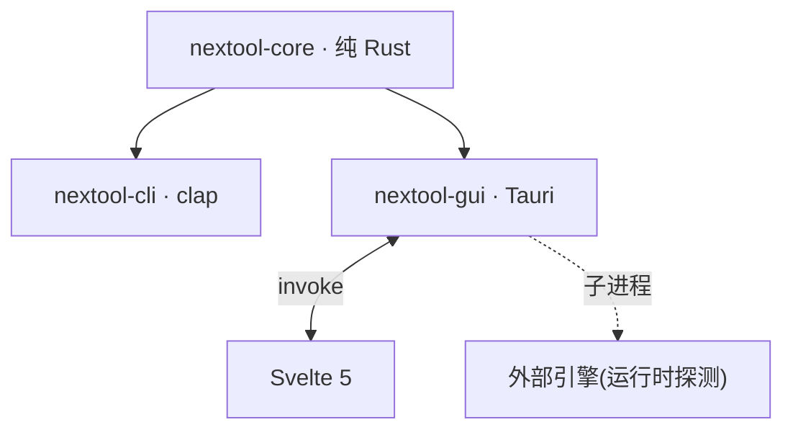

<div align="center">

# NexToolkit

纯本地通用工具集 · CLI + 桌面 GUI · 纯 Rust 核心

[](https://www.rust-lang.org/)
[](https://tauri.app/)
[](https://svelte.dev/)
[](LICENSE)

**文件不离本机 · 无云 · 无遥测**

</div>

---

143 工具,9 组:编解码、文本处理、数据转换、格式化、加密与哈希、生成器、网络、时间、文件转换。CLI 与 GUI 共享同一 Rust 核心。

## 架构



core 是单一事实源,CLI 与 GUI 薄封装它。引擎不打包进核心,运行时探测系统已装路径。

## 安装

下载 [Release](https://github.com/int2t05/NexToolkit/releases) 产物:CLI 单二进制或 GUI 安装包。

源码构建:

```bash
cargo build -p nextool-cli --release     # CLI
npm install && npm run tauri build        # GUI
```

## CLI

```bash
nextool encode base64 encode "Hello"
nextool encode charset encode --charset gbk "中文"
nextool text case snake "Hello World"
nextool convert json-yaml to <<< '{"a":1}'
nextool generate hash sha256 abc
nextool crypto aes-encrypt --password pw "Secret"
nextool file-conv convert doc.docx pdf    # 通用转换(自动路由引擎)
nextool file-conv pdf split doc.pdf
nextool file-conv engine check            # 引擎状态检查
nextool file-conv engine install pandoc   # 安装便携版引擎
```

## GUI

```bash
npm install && npm run tauri dev
```

左侧 3 级功能树 + 搜索 + 收藏,右侧参数表单 + 输入输出 + 语法高亮。明暗主题跟随系统。TopBar 引擎管理:状态显示 + 便携版一键安装。

## 引擎

6 个外部引擎运行时探测,未装时 GUI 引擎管理页显示安装选项:

| 引擎 | 用途 | 安装方式 |
|---|---|---|
| ffmpeg | 音视频转码 | 便携版自动安装 |
| pandoc | 标记语言互转 | 便携版自动安装 |
| LibreOffice | Office↔PDF | 安装包(下载提示) |
| calibre | 电子书转换 | 安装包(下载提示) |
| Ghostscript | PDF 压缩 | 安装包(下载提示) |
| tesseract | OCR | 安装包(下载提示) |

## 未来方向

- **智能层** — Smart Detection(剪贴板自动选工具)、Recipe 流水线
- **格式扩展** — PDF AES-256 加密、Office 互转、批量图像处理
- **引擎便携版** — calibre/tesseract 便携版评估、LibreOffice 常驻进程
- **i18n** — 日韩支持

详见 [docs/todo.md](docs/todo.md)。

## 文档

- [docs/prd.md](docs/prd.md) — 产品需求
- [docs/tech.md](docs/tech.md) — 技术架构
- [docs/api.md](docs/api.md) — 接口契约
- [docs/flow.md](docs/flow.md) — 业务流程
- [docs/todo.md](docs/todo.md) — 待办与方向
- [CONTRIBUTING.md](CONTRIBUTING.md) — 贡献指南

## 协议

MIT
