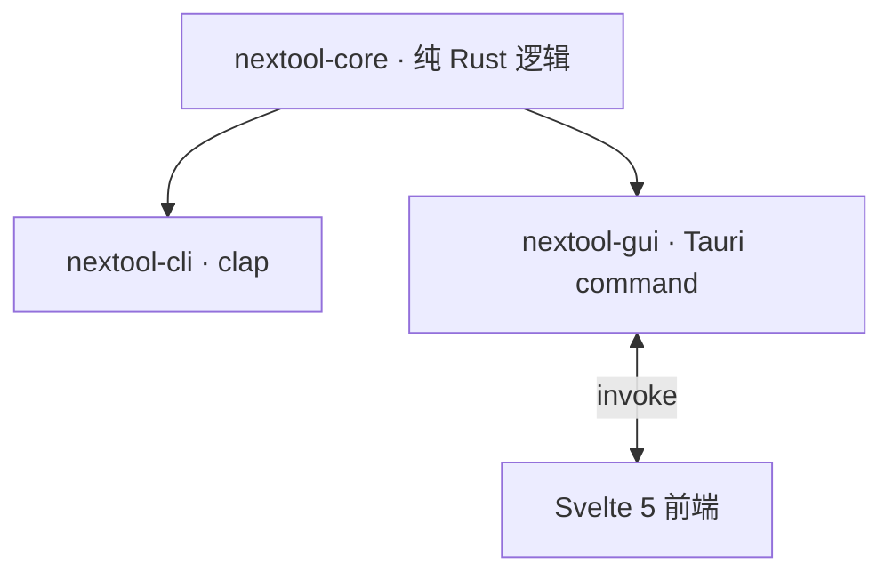

# NexToolkit

> 开源、纯本地、轻量快捷的通用工具集。Tauri 桌面 GUI + 独立 CLI,跨平台,纯 Rust 核心。文件不离本机。

## 功能

36 个工具,8 组:编解码、格式转换、格式化、生成器、文本、加密、网络/时间、文件转换。CLI 与 GUI 共享同一核心库,行为一致。文件转换产物落源文件所在目录。

## 架构



- **core**:纯逻辑,无 UI/IO 依赖,可独立单测。
- **cli**:clap 子命令,参数/stdin 输入,headless 可用。
- **gui**:Tauri command 薄封装,前端 Svelte 5。
- 详见 [docs/tech.md](docs/tech.md) 与 [docs/flow.md](docs/flow.md)。

## 安装

下载 [Release](https://github.com/int2t05/NexToolkit/releases) 产物:CLI 单二进制(linux/macos/windows)或 GUI 安装包(msi/nsis/deb/AppImage/dmg)。或源码构建:

```bash
cargo build -p nextool-cli --release   # CLI
npm install && npm run tauri build      # GUI
```

## CLI 用法

结构:`nextool <分组> <工具> [模式/参数]`。输入可来自参数或 stdin(管道友好)。成功退出 0,失败非零 + stderr。

```bash
# 编解码
nextool encode base64 encode "Hello"          # SGVsbG8=
echo -n "Man" | nextool encode base64 encode  # stdin

# 转换
echo '{"a":1}' | nextool convert json-yaml to
nextool convert numbase 16 10 ff              # 255

# 格式化
echo '{"a":1}' | nextool format json-fmt

# 生成器
nextool generate hash sha256 abc
nextool generate uuid-v4
nextool generate password --length 16 --upper --digits

# 文本
nextool text case snake "Hello World"         # hello_world
nextool text regex-match '\d+' "a12b3"

# 加密
nextool crypto aes-encrypt --password pw "Secret"
nextool crypto rsa-keygen 2048

# 网络/时间
nextool net-time ipcalc 192.168.1.5/24
nextool net-time cron-next "0 * * * * *" --count 3
nextool net-time dns A example.com

# 文件转换(归档,产物落源目录)
nextool file-conv archive list archive.zip              # 列出归档内文件
nextool file-conv archive extract archive.zip           # 解压到 archive_extracted/
nextool file-conv archive compress zip a.txt b.txt      # 压缩为 a.zip
nextool file-conv archive convert archive.zip tar       # 转 a.tar
```

工具全集与参数详见 [docs/api.md](docs/api.md)。

## GUI

下载安装包,或开发模式:`npm install && npm run tauri dev`。左侧七组导航 + 搜索,右侧参数表单 + 输入输出 + 复制,中英双语,暗色主题。

## 测试与质量

```bash
cargo test -p nextool-core -p nextool-cli      # 真实数据,无 mock
cargo clippy -p nextool-core -p nextool-cli -- -D warnings
```

core 单测 + CLI 集成测试,CI 三平台编译验证。

## 未来方向

- **文件转换(对标 freeconvert)**:归档(zip/tar/gz)已交付;图像/PDF 纯 Rust 待做,音视频接 ffmpeg 子进程;产物落源目录。
- **引擎层**:重格式转换按需接入,核心包不打包重引擎。
- **智能层**:Smart Detection(剪贴板自动选工具)、Recipe 流水线(工具链式组合)。
- **交互**:Ctrl+K 命令面板、收藏、输出语法高亮。
- 详见 [docs/todo.md](docs/todo.md)。

## 文档

- [docs/prd.md](docs/prd.md) — 产品需求
- [docs/tech.md](docs/tech.md) — 技术与架构
- [docs/api.md](docs/api.md) — 接口契约
- [docs/flow.md](docs/flow.md) — 业务流程与数据流
- [docs/todo.md](docs/todo.md) — 当前不足与未来方向
- [CONTRIBUTING.md](CONTRIBUTING.md) — 贡献指南

## 协议

MIT
