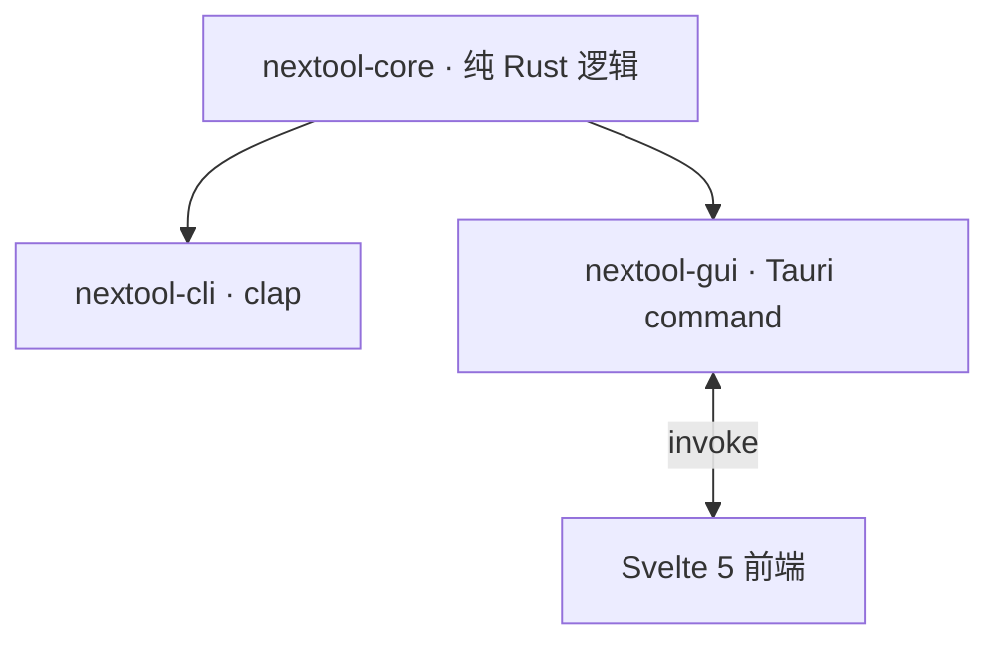

# NexToolkit

> 开源、纯本地、轻量快捷的通用工具集。Tauri 桌面 GUI + 独立 CLI,跨平台,纯 Rust 核心。文件不离本机。

## 功能

32 个工具,7 组:编解码、格式转换、格式化、生成器、文本、加密、网络/时间。CLI 与 GUI 共享同一核心库,行为一致。

## 架构



- **core**:纯逻辑,无 UI/IO 依赖,可独立单测。
- **cli**:clap 子命令,参数/stdin 输入,headless 可用。
- **gui**:Tauri command 薄封装,前端 Svelte 5。
- 详见 [docs/tech.md](docs/tech.md)。

## 安装

下载 [Release](https://github.com/int2t05/NexToolkit/releases) 产物:CLI 单二进制(linux/macos/windows)或 GUI 安装包(msi/nsis/deb/AppImage/dmg)。或源码构建:

```bash
cargo build -p nextool-cli --release   # CLI
npm install && npm run tauri build      # GUI
```

## CLI 用法

结构:`nextool <分组> <工具> [模式/参数]`。输入可来自参数或 stdin(管道友好)。成功退出 0,失败非零 + stderr 错误。

### 编解码 `encode`

```bash
nextool encode base64 encode "Hello"          # SGVsbG8=
nextool encode base64 decode "SGVsbG8="       # Hello
echo -n "Man" | nextool encode base64 encode  # stdin:TWFu
nextool encode url encode "a b"               # a%20b
nextool encode hex encode "A"                 # 41
nextool encode jwt "eyJhbGciOiJIUzI1NiJ9.eyJzdWIiOiIxIn0.sig"  # 解析 header/payload
```

工具:`base64` `url` `html` `hex`(各 encode/decode)、`jwt`(解码不验签)。

### 格式转换 `convert`

```bash
echo '{"a":1,"b":[2,3]}' | nextool convert json-yaml to      # JSON→YAML
nextool convert numbase 16 10 ff                             # 255
nextool convert numbase 255 10 16                            # ff
echo '# Title' | nextool convert md-html                     # <h1>Title</h1>
```

工具:`json-yaml` `json-toml` `json-csv`(各 to/from)、`md-html`、`numbase <from> <to>`(2..36)。

### 格式化 `format`

```bash
echo '{"a":1}' | nextool format json-fmt       # 美化(2 空格缩进)
echo '{"a":1}' | nextool format json-min       # 压缩
echo 'select*from t' | nextool format sql-fmt  # 关键字大写
echo '<a><b>1</b></a>' | nextool format xml-fmt
```

工具:`json-fmt` `json-min` `sql-fmt` `xml-fmt` `xml-min` `css-min`。

### 生成器 `generate`

```bash
nextool generate hash sha256 abc               # ba7816bf...
nextool generate hmac sha256 --key secret "data"
nextool generate uuid-v4                       # 随机 UUID
nextool generate uuid-v7                       # 基于时间戳
nextool generate password --length 16 --upper --digits
nextool generate lorem 3                       # 3 段 Lorem Ipsum
echo "text" | nextool generate qr              # 二维码 SVG
```

工具:`hash <md5|sha1|sha256|sha512>`、`hmac <algo> --key <key>`、`uuid-v4`、`uuid-v7`、`password [--length N] [--upper/--lower/--digits/--symbols]`、`lorem <段数>`、`qr`。

### 文本 `text`

```bash
nextool text case snake "Hello World"          # hello_world
nextool text case camel "hello_world"          # helloWorld
echo -e "b\na\na" | nextool text sort-lines    # 排序
echo -e "a\na\nb" | nextool text dedup-lines   # 去重保序
nextool text regex-match '\d+' "a12b3"          # 12\n3
nextool text regex-replace '\d+' '#$0' "a12b3"  # a#12b#3
nextool text diff "a\nb" "a\nc"                # unified diff
```

工具:`case <upper|lower|title|snake|camel|kebab>`、`sort-lines`、`dedup-lines`、`reverse`、`regex-match <pattern>`、`regex-replace <pattern> <replacement>`、`diff <a> <b>`。

### 加密 `crypto`

```bash
nextool crypto aes-encrypt --password pw "Secret"     # base64 密文
nextool crypto aes-decrypt --password pw "<密文>"      # 还原
nextool crypto rsa-keygen 2048                        # PEM 密钥对
nextool crypto rsa-encrypt --pub-pem pub.pem "data"   # 公钥加密(--pub-pem 可内联 PEM 或文件路径)
nextool crypto pbkdf2 --salt s1 --iterations 1000 "pwd"
nextool crypto argon2 --salt 12345678 "pwd"           # salt ≥8 字节
```

工具:`aes-encrypt`/`aes-decrypt --password`、`rsa-keygen <bits>`、`rsa-encrypt --pub-pem`、`rsa-decrypt --priv-pem`、`pbkdf2 --salt [--iterations N]`、`argon2 --salt`。

### 网络/时间 `net-time`

```bash
nextool net-time ipcalc 192.168.1.5/24                 # 网络/广播/掩码/主机范围
nextool net-time ts-to-human 1700000000 --tz Asia/Shanghai
nextool net-time ts-from-human "2023-11-15 06:13:20" --tz Asia/Shanghai
nextool net-time cron-next "0 * * * * *" --count 3     # 接下来 3 次触发
nextool net-time dns A example.com
```

工具:`ipcalc`、`ts-to-human <ts> [--tz]`、`ts-from-human [--tz]`、`cron-next <expr> [--count N]`、`dns <A|AAAA|MX|TXT> <domain>`。

## GUI

下载安装包,或开发模式:`npm install && npm run tauri dev`。左侧七组导航 + 搜索,右侧参数表单 + 输入输出 + 复制,中英双语,暗色主题。

## 测试与质量

```bash
cargo test -p nextool-core -p nextool-cli      # 真实数据,无 mock
cargo clippy -p nextool-core -p nextool-cli -- -D warnings
```

core 单测 + CLI 集成测试,CI 三平台编译验证。

## 未来方向

- **引擎层**:按需接入重格式转换(ffmpeg 音视频、PDF 操作、图像),核心包不打包重引擎。
- **智能层**:Smart Detection(剪贴板自动选工具)、Recipe 流水线(工具链式组合)。
- **交互**:Ctrl+K 命令面板、收藏、输出语法高亮。
- 详见 [docs/ROADMAP.md](docs/ROADMAP.md) 与 [docs/todo.md](docs/todo.md)。

## 文档

- [docs/pro.md](docs/pro.md) — 产品需求
- [docs/tech.md](docs/tech.md) — 技术与架构
- [docs/todo.md](docs/todo.md) — 当前不足与近期方向
- [docs/ROADMAP.md](docs/ROADMAP.md) — 长期路线图
- [CHANGELOG.md](CHANGELOG.md) — 更新日志
- [CONTRIBUTING.md](CONTRIBUTING.md) — 贡献指南

## 协议

MIT
