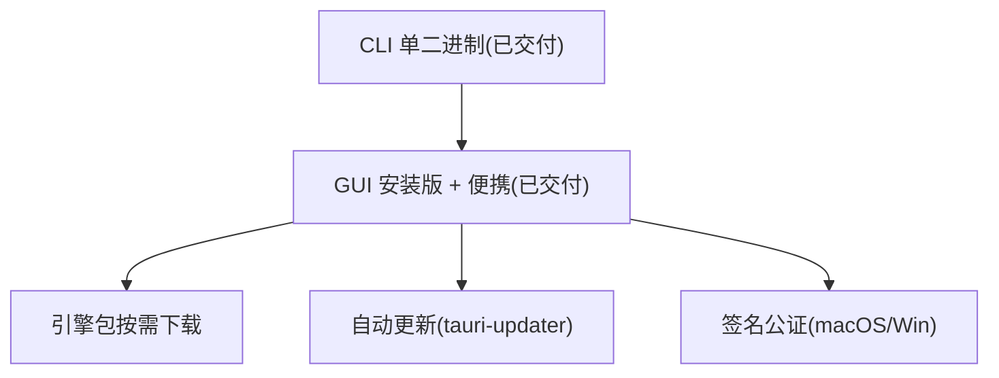

# 路线图

> 项目长期方向。近期待办见 [todo.md](todo.md)。

## 愿景

从"开发者编码工具集"演进为"纯本地一站式工具箱":核心层保持轻量纯 Rust,引擎层按需接入重格式转换,最终对标 freeconvert 广度且数据不离本机。

## 引擎层

核心层不打包重引擎,按需下载独立引擎包,首次使用时提示安装。

| 格式族 | 引擎 | 体积 | 可行性 |
|---|---|---|---|
| 音视频 | ffmpeg | ~80MB | 中(体积大但单二进制、秒启动) |
| 图像(常用栅格) | Rust `image` | 纯 Rust | 高(已可纳入核心层) |
| 图像(HEIC/RAW) | libheif/libraw | 中 | 中 |
| PDF(操作) | lopdf/qpdf | 轻 | 高 |
| Office↔PDF | LibreOffice | ~500MB | 低(与轻量根本冲突,仅探测系统已装) |
| 电子书 | pandoc/Calibre | 大 | 低-中(小众,MOBI/AZW3 不做) |

**原则:** 重引擎独立分发,不破坏核心包体积;数据仍纯本地。

## 智能层(远期)

- **Smart Detection**:剪贴板数据类型探测,自动推荐工具(参考 DevToys `IDataTypeDetector`)。
- **Recipe 流水线**:工具链式组合,配方可编码进 URL 分享(参考 CyberChef `NodeRecipe`)。
- **插件系统**:第三方工具扩展(WASM 或动态库,远期评估)。

## 分发演进

## 不做

- 在线/云转换(违背纯本地定位)。
- 移动端、账号/登录/遥测。
- 单位/时区换算、字体转换(与定位无关)。
- Office↔PDF 高质量互转打包(LibreOffice 500MB+,仅探测系统已装)。
