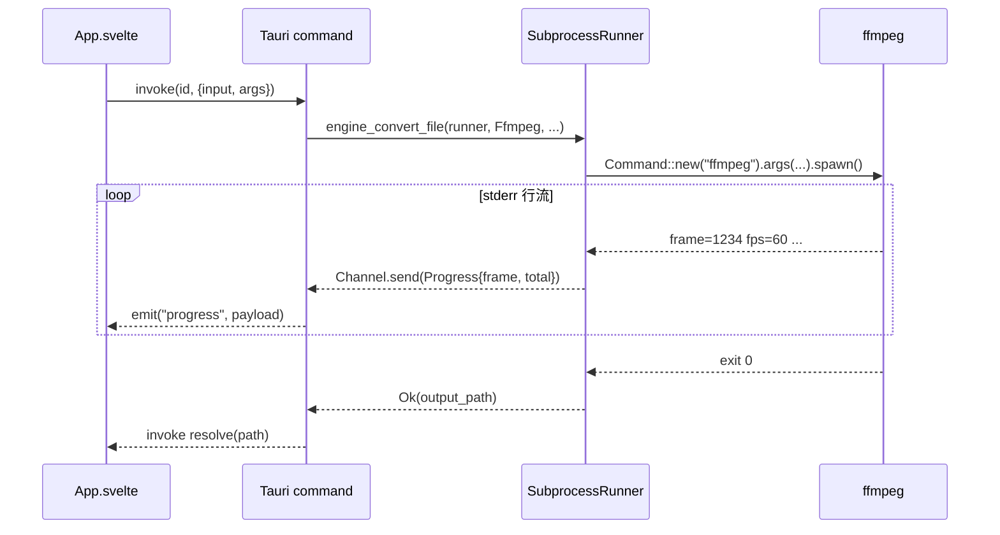

# 引擎层可行性设计

> 前瞻设计文档。关联 `codebase-audit.md` 接缝 C(EngineRunner port)与 `../todo.md` P4 引擎接线。
>
> 本文档定义重引擎(ffmpeg/LibreOffice/calibre/ghostscript/tesseract)的接线原则与 port 设计,是 engine 模块实现前的设计依据。

## 设计目标

todo.md P4 要求接线 5 个重引擎。接线前需先回答:

1. **打包策略**:重引擎是否内置进核心包?
2. **可测试性**:引擎子进程调用如何单测(不强制每台开发机装全 5 个引擎)?
3. **失败路径**:引擎未安装时用户体验如何?
4. **进度反馈**:长任务(视频转码、OCR)如何向 GUI 流式报告进度?

本文档给出统一决策,`codebase-audit.md` 接缝 C 的 `EngineRunner` port 是其落地形态。

---

## 统一决策:外部探测,不内置打包

**所有重引擎外部探测,不内置打包进核心包。**

| 维度 | 决策 | 理由 |
|---|---|---|
| 打包 | 不内置 | ffmpeg ~80MB、LibreOffice ~500MB,内置破坏核心包体积 |
| 探测 | 运行时 PATH 探测 | 用户系统已装的版本即可用,不重复分发 |
| 提示 | 首次使用提示安装 | 引擎未安装时返回明确错误,GUI 侧栏待做工具点击显示安装指引 |
| 数据 | 纯本地 | 引擎子进程读写本地文件,无网络,符合 PRD"文件不离本机" |

**对齐 PRD**:重引擎独立分发,不破坏核心包体积;纯本地,无云端依赖。

---

## EngineRunner port 设计

### 端口定义

```rust
pub trait EngineRunner: Send + Sync {
    /// 引擎是否已安装(探测 PATH)
    fn is_available(&self, engine: Engine) -> bool;
    /// 执行引擎命令(input→output 文件路径)
    fn run(&self, engine: Engine, input: &str, output: &str) -> ToolResult<()>;
}
```

### 适配器

| 适配器 | 用途 | 实现 |
|---|---|---|
| `SubprocessRunner` | prod | `Command::new(engine.binary()).arg("--version")` 探测;`Command::new(...).args(convert_args()).status()` 执行 |
| `FakeRunner` | test | `Mutex<Option<(Engine, String, String)>>` 记录调用;返回 canned Ok/Err |

### 核心函数

```rust
pub fn engine_convert(
    runner: &dyn EngineRunner,
    engine: Engine,
    input: &str,
    output: &str,
) -> ToolResult<String> {
    if !runner.is_available(engine) {
        return Err(ToolError::InvalidInput(format!(
            "未检测到 {}({}),请先安装",
            engine.binary(),
            engine.desc()
        )));
    }
    runner.run(engine, input, output)?;
    Ok(output.to_string())
}
```

### engine_convert_file fs_util 包装

`fs_util.rs` 的 `engine_convert_file(input, engine, output_ext, output, runner)` 包装:

```text
计算输出路径(源目录 + 改扩展名)
  → engine_convert(runner, engine, input, output)
  → 返回产物路径
```

**关键:engine 非字节域**。与其它 fs_util 函数(`write_output` 接 `Vec<u8>`)不同,引擎输入输出都是文件路径(路径→路径),不经 `Vec<u8>`,不能用 `write_output`。流程独立设计。

---

## 引擎未安装的错误路径

引擎未安装时,`engine_convert` 返回 `ToolError::InvalidInput("未检测到 {binary}({desc}),请先安装")`。

**GUI 行为**:侧栏"待做工具"(引擎未接线或未安装的工具)点击后,显示安装提示卡片,包含:
- 引擎名称与用途
- 官方下载链接
- 本机探测结果(`is_available` 返回值)

CLI 行为:直接打印错误信息,退出码非零。

---

## 接线步骤

每引擎独立接线,互不阻塞。按需求优先级排序:

| 顺序 | 引擎 | 用途 | 进度反馈机制 |
|---|---|---|---|
| 1 | ffmpeg | 音视频转码 | Tauri Channel 解析 stderr `frame=` 行,计算时间进度 |
| 2 | LibreOffice | Office↔PDF | 无标准进度行,用输出文件大小估算 |
| 3 | calibre | 电子书转换 | 解析 stdout 百分比行 |
| 4 | Ghostscript | PDF 压缩优化 | 解析 stdout 百分比行 |
| 5 | tesseract | OCR 文字识别 | 解析 stdout 百分比行 |

### 进度流设计(ffmpeg 示例)



**进度通道**:Tauri `Channel<ProgressPayload>` 流式推送,前端订阅 `onProgress` 更新进度条。非轮询。

### LibreOffice 进度估算

LibreOffice headless 无标准进度行。方案:
1. 转换前记录输入文件大小 `total`
2. spawn 后轮询输出文件大小 `current`
3. `progress = current / total`(粗估,因格式差异不一定线性)

精度低于 ffmpeg,但 Office 转换通常秒级完成,进度条主要起"未卡死"指示作用。

---

## 原则汇总

1. **重引擎不打包进核心**——核心包保持轻量,引擎用户按需安装
2. **运行时探测系统已装**——`SubprocessRunner.is_available` 走 PATH,不重复分发
3. **首次使用提示安装**——`ToolError::InvalidInput` 明确告知缺什么、怎么装
4. **数据纯本地**——子进程读写本地文件,无网络
5. **每引擎独立不阻塞**——ffmpeg 接线不依赖 LibreOffice,任一引擎缺失不影响其他
6. **port 优先于内联**——`EngineRunner` trait 隔离 spawn 副作用,`FakeRunner` 保证可测

---

## 目录结构示意

`engine.rs` 单文件包含完整 port 设计(不拆子模块,5 引擎零依赖,无需细分):

```text
crates/core/src/fileconv/engine.rs
├── enum Engine { Ffmpeg, LibreOffice, Calibre, Ghostscript, Tesseract }
│   ├── fn binary(&self) -> &'static str      // "ffmpeg"/"soffice"/...
│   ├── fn desc(&self) -> &'static str         // 用途说明
│   └── fn convert_args(&self, input, output) -> Vec<String>  // 命令参数
├── trait EngineRunner                          // port
│   ├── fn is_available(&self, engine) -> bool
│   └── fn run(&self, engine, input, output) -> ToolResult<()>
├── struct SubprocessRunner                     // prod 适配器
├── struct FakeRunner { ... }                   // test 桩(cfg(test))
└── fn engine_convert(runner, engine, input, output) -> ToolResult<String>
```

`fs_util.rs` 内 `engine_convert_file` 是 port 的真实消费者,证明 seam 非孤儿。

---

## 测试策略

| 层 | 测试 | 标记 |
|---|---|---|
| 纯逻辑 | `Engine::binary()`/`convert_args()` 各引擎参数构造 | 普通单测 |
| port 逻辑 | `engine_convert` 可用性检查 + 调用委托 + 错误传播(用 `FakeRunner`) | 普通单测 |
| 真实引擎 | `SubprocessRunner.is_available` + 端到端转换 | `#[ignore]`(需本机安装) |

`FakeRunner` 覆盖三种路径:引擎不可用(Err)、执行成功(Ok + 路径)、执行失败(Err 传播)。无需本机安装任何引擎即可验证 port 契约。

---

## 关联文档

- `codebase-audit.md` 接缝 C — port 的审计来源与 ADR-3
- `../todo.md` P4 — 引擎接线需求来源
- `../prd.md`(若有)— "重引擎独立分发"+"纯本地"原则来源
