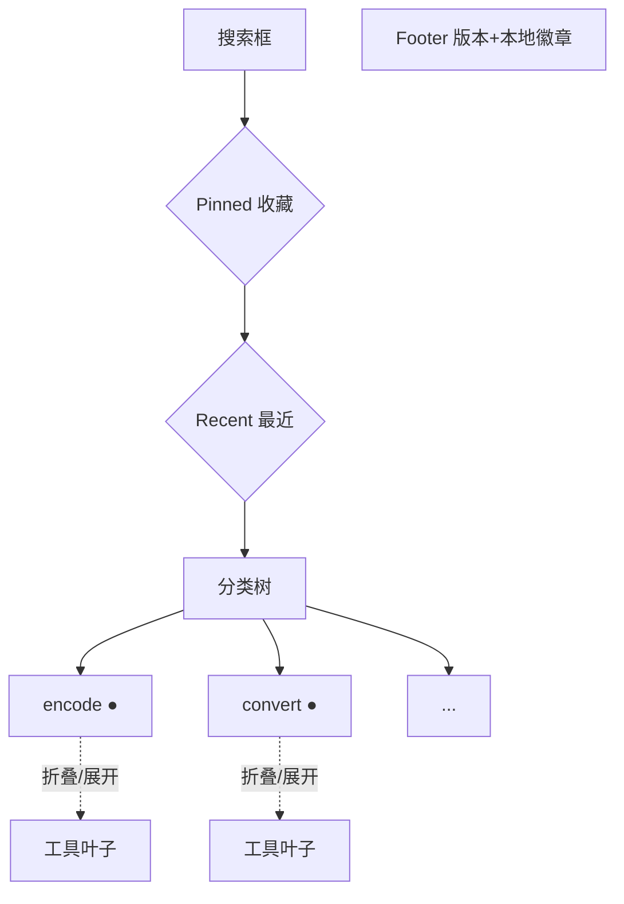

# 前端结构设计

> 描述 `src/` 前端的组件架构、设计 token、共享状态与左侧功能树。是当前实现的权威说明。
>
> 设计语言调研依据:`reference/` 下 nexine(token 命名 / 暗色骨架)、youran-toolbox(分类色 + color-mix / 可折叠侧栏)、hexkit(Pinned/Recent/Footer 信息架构)。均为 git-ignored 竞品源码,仅作设计借鉴。

## 源码结构

```text
src/
├── main.ts                    # mount;import tokens.css + app.css
├── app.css                    # 全局基础:reset / 滚动条 / 选区 / focus-visible / hljs token(走 --ntx-*)
├── bindings.ts                # invoke<T> 薄封装(不变)
├── App.svelte                 # 外壳:布局 + onMount(loadTools)+ 全局 keydown
├── lib/
│   ├── styles/tokens.css      # 设计 token:暗色 oklch 色板 + 分类色 + 尺度(--ntx- 前缀)
│   ├── state.svelte.ts        # 共享响应状态($state class 单例)
│   ├── types.ts               # ToolMetaDto/ParamSpecDto + GROUPS/GROUP_LABEL/GROUP_CAT_VAR
│   └── format.ts              # escapeHtml / basename / joinFileNames 纯函数
└── components/
    ├── TopBar.svelte          # 品牌 + 本地徽章 + Ctrl+K 按钮 + 语言切换
    ├── Sidebar.svelte         # ★左侧功能树(核心)
    ├── ToolPanel.svelte       # 工具头(名+收藏)+ 描述 + ParamForm + 主输入 + 操作 + OutputArea
    ├── ParamForm.svelte       # 动态参数表单(text/textarea/select/file/password/number)
    ├── OutputArea.svelte      # 错误 + 输出(text/highlighted/svg)
    └── CommandPalette.svelte  # Ctrl+K 浮层
```

## 设计 token(`lib/styles/tokens.css`)

暗色单主题(不做明色)。`--ntx-` 前缀,oklch 色彩空间(感知均匀,支持 `color-mix` 派生选中态/分类标记)。

| 类别 | token |
|---|---|
| 表面(冷调蓝灰) | `--ntx-bg` / `surface` / `surface-2` / `surface-3` / `border` / `border-strong` |
| 文字 | `--ntx-fg` / `fg-muted` / `fg-subtle` |
| 主色 | `--ntx-primary` / `primary-hover` / `primary-fg` / `primary-soft`(`color-mix` 14% 主色 + surface) |
| 语义 | `--ntx-success` / `danger` / `warning` / `info`(各带 `-soft` 派生) |
| 分类色(8) | `--ntx-cat-{encode,convert,format,generate,text,crypto,nettime,fileconv}`(色相均匀分布) |
| hljs | `--ntx-hljs-{keyword,string,number,comment,attr,tag,built_in}` |
| 尺度 | `--ntx-space-1..6`(4/8/12/16/24/32)· `--ntx-radius-{sm,base,lg,xl}`(6/8/12/16)· `--ntx-shadow-{sm,md,lg}` |
| 字体 | `--ntx-font-sans`(系统栈 + 'Noto Sans SC'/'PingFang SC')· `--ntx-font-mono`('Cascadia Code'/'JetBrains Mono'/Consolas) |

组件内联样式一律 `var(--ntx-*)`,不硬编码色值。hljs token 色在 `app.css` 全局 `.hljs-*` 引用 token。

## 共享状态(`lib/state.svelte.ts`)

Svelte5 `.svelte.ts` 模块导出 `$state` class 单例 `appState`,6 组件直接 `import { appState }`,避免 prop drilling。

```ts
class AppState {
  tools = $state<ToolMetaDto[]>([]);
  selectedTool = $state<ToolMetaDto | null>(null);
  lang = $state<'zh' | 'en'>('zh');
  query = $state('');
  favorites = $state<Set<string>>(loadFavorites());
  recent = $state<string[]>(loadRecent());            // 最近使用 id(localStorage)
  collapsedGroups = $state<Set<string>>(loadCollapsed()); // 折叠的分类(localStorage)
  // 派生:filteredTools / paletteTools / favoriteTools / recentTools / highlightedOutput / isSvgOutput
  // 方法:loadTools / selectTool / openTool / toggleFavorite / addRecent / toggleGroup / isGroupExpanded / pickFile / run / copyOutput / onKeydown / t
}
export const appState = new AppState();
```

**突变规则**:`Set` 突变整体重赋值(`this.favorites = new Set(next)`),不就地 mutate,确保响应触发。导出的是实例引用(从不重赋值),字段为 `$state`——避开"外部模块重赋值 exported `$state` 绑定"的 Svelte5 限制。

**selectTool vs openTool**:`selectTool(tool)` 纯选择 + 初始化参数默认值 + 清空输出(初始自动加载用,不计入最近);`openTool(tool)` = selectTool + addRecent(用户点击用)。

## 左侧功能树(`Sidebar.svelte`)— 核心



| 区 | 行为 |
|---|---|
| 搜索 | 绑 `appState.query`;过滤工具;搜索时强制展开有匹配的分类(无匹配的分类整组隐藏);带清除按钮 |
| Pinned | `favoriteTools` 派生;空时隐藏 |
| Recent | `recentTools` 派生(最近 5,localStorage 持久化);空时隐藏 |
| 分类树 | 8 分类为可折叠父节点:分类色圆点(`var(--ntx-cat-*)`)+ 标签(zh/en)+ 数量 + chevron(`@lucide/svelte` ChevronDown/Right);工具为缩进叶子 |
| Footer | 版本 + 100% 本地徽章 |

**展开规则**(`isGroupExpanded`):搜索时 → 有匹配则展开;选中工具所在分类 → 强制展开;否则 → `!collapsedGroups.has(group)`。折叠状态独立持久化(非手风琴)。默认全展开。

## run() 分流(不变)

| 路径 | 命令 | args 形态 |
|---|---|---|
| 文本工具(`textIds` 内) | `invoke('run_tool', {id, input, args})` | `[[key, value], ...]`(Rust `Vec<(String,String)>`) |
| 文件工具 | `invoke(id, args)` | 对象(number 转 `Number`,file 取 `files` 数组) |

文本工具 str→str 统一入口;文件工具签名各异(archive 接 `Vec<PathBuf>`、image 单路径、pdf 密码),强行统一会丢类型信息。UI 层合并渲染,执行时承认两类 I/O 不同。

## output_kind 与 i18n

- `output_kind`(Rust `ToolMeta` 单点定义):`text` → 纯文本;`svg` → `{@html}` 直渲染;`json`/`sql`/`xml`/... → highlight.js 按语言高亮。前端零推断。
- i18n:`appState.t(zh, en)` helper,`lang` `$state` 切换;`GROUP_LABEL` 中英双语映射在 `types.ts`。

## 图标

`@lucide/svelte`(Svelte5 runes 原生,tree-shakeable)。注意:旧包 `lucide-svelte` 1.x 的 Icon.svelte 用 `$$props`(legacy),与 runes 模式冲突,必须用 `@lucide/svelte`。

## Svelte5 注意

- **`selectedTool` 可空**:`{#if appState.selectedTool}{@const tool = appState.selectedTool}…`,闭包内引用 `tool` 非 `appState.selectedTool`(类型守卫不在闭包内持久,`svelte-check` 会捕获)。
- **`.svelte.ts` runes**:`$state`/`$derived` class 字段合法;`this` 在派生内绑定实例。

## 不引入

- **ts-rs**:手写 `ToolMetaDto` interface(~15 行);`ToolMeta` 字段稳定,运行时 serde 不匹配抛清晰错误。
- **CSS 框架**(tailwind/unocss/shadcn):纯 CSS 变量足够,保持零框架。
- **自托管 web 字体**:系统栈 + 中文 fallback,保持轻量(纯本地信条)。
- **明色主题 / 用户可切换主色**:暗色精修范围外。

## 关联文档

- `codebase-audit.md` — 后端架构审计(GUI 动态渲染是其中设计 7,本文档是其前端落地与演进)
- `engine-feasibility.md` — 引擎工具的进度流(前端 `onProgress` 订阅,未来项)
