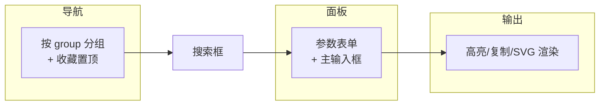

# 前端结构设计

> 前瞻设计文档,基于重构后实际状态。定义 `src/` 前端源码的职责划分、动态渲染机制与运行时分流。
>
> 重构前的静态 `tools.ts` schema 已删除,本文档记录重构后的设计决策。

## 源码结构

```text
src/
├── main.ts        # Svelte5 mount 入口
├── App.svelte     # schema 驱动主组件(导航 + 搜索 + 工具面板 + 输出区)
├── bindings.ts    # Tauri invoke 泛型薄封装
└── app.css        # 全局样式
```

| 文件 | 职责 | 重构动作 |
|---|---|---|
| `main.ts` | Svelte5 `mount(App, {target})` | 无变化 |
| `App.svelte` | 工具元数据驱动渲染 + 执行分流 | 重构核心 |
| `bindings.ts` | `invoke<T>(cmd, args)` 薄封装 | 保留 |
| `tools.ts` | 静态工具 schema(291 行) | **已删(0.3 重构)** |

**`tools.ts` 删除理由**:静态 schema 在 core 已有 `ToolMeta` 单点注册,前端再维护一份等价数据是双源漂移源。改 `list_tools` 动态渲染后,前端零 schema 代码。

---

## App.svelte 职责

App.svelte 是单组件主界面,职责分四区:



| 区 | 职责 |
|---|---|
| 左侧导航 | 按 `group` 分组渲染工具按钮;收藏工具置顶(`localStorage` 持久化) |
| 搜索框 | 实时过滤 `name`/`desc`(不区分大小写);Ctrl+K 唤起命令面板 |
| 工具面板 | 参数表单(按 `ParamSpec` 动态生成)+ 主输入框(`needs_main_input` 时显示) |
| 输出区 | 按 `output_kind` 决定渲染:文本/高亮/SVG;复制按钮 |

---

## 动态渲染机制

### onMount 并发加载

```typescript
onMount(async () => {
  const [textTools, fileTools] = await Promise.all([
    invoke<ToolMetaDto[]>('list_tools'),       // 54 文本工具
    invoke<ToolMetaDto[]>('list_file_tools'),  // 10 文件工具
  ]);
  textIds = new Set(textTools.map((t) => t.id));
  allTools = [...textTools, ...fileTools];
});
```

- **并发**:`Promise.all` 同时拉两类,合并渲染
- **区分**:`textIds: Set<string>` 记录文本工具 id,`run()` 时按是否在 Set 内分流
- **合并**:两类工具统一进 `allTools`,导航按 `group` 字段分组(文本工具各 group + `fileconv` 组)

### ToolMetaDto 前端接口

```typescript
interface ParamSpecDto {
  key: string;
  kind: string;        // text|textarea|select|number|password|bool|file
  label: string;
  default: string | null;
  options: string[];   // select 选项(由 Rust EnumIter 生成)
  placeholder: string | null;
  multiple: boolean;   // file 多选
}

interface ToolMetaDto {
  id: string;
  name: string;
  desc: string;
  group: string;
  params: ParamSpecDto[];
  needs_main_input: boolean;
  output_kind: string;  // text|svg|<highlight.js 语言名>
}
```

手写 ~15 行,对齐 Rust `ToolMetaDto`/`ParamSpecDto`(snake_case 字段经 serde 直传)。

---

## run() 分流

```typescript
async function run() {
  if (textIds.has(selectedTool.id)) {
    // 文本工具:run_tool 通用入口
    const args = params.filter(p => p.kind !== 'file')
                       .map(p => [p.key, String(params[p.key] ?? '')]);
    result = await invoke<string>('run_tool', { id, input: mainInput, args });
  } else {
    // 文件工具:原命令名,args 对象
    const args = {};
    for (const p of selectedTool.params) {
      if (p.kind === 'file')      args[p.key] = p.multiple ? files[p.key] : files[p.key]?.[0];
      else if (p.kind === 'number') args[p.key] = Number(params[p.key]);
      else                          args[p.key] = params[p.key];
    }
    result = await invoke<unknown>(selectedTool.id, args);
  }
}
```

| 路径 | 命令 | args 形态 |
|---|---|---|
| 文本工具 | `invoke('run_tool', {id, input, args})` | `[[key, value], ...]`(Rust `Vec<(String,String)>`) |
| 文件工具 | `invoke(id, args)` | 对象(number 转 `Number`,file 取 `files` 数组) |

**为何不统一**:文本工具 str→str 统一入口;文件工具签名各异(archive 接 `Vec<PathBuf>`、image 接单路径、pdf 接密码),强行统一会丢类型信息。前端在 UI 层合并渲染,执行时承认两类 I/O 不同。

---

## output_kind 字段

替代旧 `outputLanguage(toolId)` 前缀推断(按 id 前缀猜语言,脆弱):

| 值 | 渲染 |
|---|---|
| `text` | 纯文本(`<pre>`) |
| `svg` | SVG 直渲染(`{@html output}`) |
| `json`/`sql`/`xml`/`yaml`/... | highlight.js 按语言高亮 |

```typescript
const highlightedOutput = $derived.by(() => {
  const kind = selectedTool.output_kind;
  if (kind === 'text' || kind === 'svg') return escapeHtml(output);
  return hljs.highlight(output, { language: kind }).value;
});
```

`output_kind` 由 Rust `ToolMeta` 单点定义,前端零推断。

---

## GROUP_LABEL 中英双语

```typescript
const GROUP_LABEL: Record<string, { zh: string; en: string }> = {
  encode:   { zh: '编解码',    en: 'Encoders' },
  convert:  { zh: '转换',      en: 'Converters' },
  format:   { zh: '格式化',    en: 'Formatters' },
  generate: { zh: '生成器',    en: 'Generators' },
  text:     { zh: '文本',      en: 'Text' },
  crypto:   { zh: '加密',      en: 'Crypto' },
  nettime:  { zh: '网络/时间', en: 'Net/Time' },
  fileconv: { zh: '文件转换',  en: 'Files' },
};
```

`lang: 'zh' | 'en'` `$state` 切换,导航标签与占位文均走 `t(zh, en)` helper。

---

## bindings.ts

```typescript
import { invoke as tauriInvoke } from '@tauri-apps/api/core';

export async function invoke<T = string>(cmd: string, args?: Record<string, unknown>): Promise<T> {
  return tauriInvoke<T>(cmd, args);
}
```

泛型薄封装,不附加逻辑。所有命令调用经此入口,便于未来加日志/错误格式化(当前 YAGNI,不加)。

---

## 设计参考

| 项目 | 借鉴点 |
|---|---|
| it-tools | 布局(左侧导航 + 主面板)、交互模式、i18n |
| tauri2-svelte5-shadcn | Svelte5 runes(`$state`/`$derived`)+ Tauri invoke 模式 |
| OpenCovibe | 集中式 API(bindings.ts 单入口) |

---

## 不引入 ts-rs(YAGNI)

**决策**:前端手写 `ToolMetaDto` interface(~15 行),不引入 `ts-rs` 自动生成 Rust↔TS 类型绑定。

- **理由**:命令数重构后降至 ~12 项,`ToolMetaDto` 字段稳定,手写 interface 足够。ts-rs 引入构建步骤依赖 + `#[derive(TS)]` 污染 core 类型定义,收益不抵成本。
- **代价**:Rust `ToolMeta` 字段变更需手动同步前端 interface(编译期不检查)。
- **缓解**:`ToolMeta` 字段变化低频(核心架构稳定后几乎不变);运行时 serde 不匹配会抛清晰错误。
- **结论**:手写,待规模/字段漂移成实际问题再引入 ts-rs。

---

## 关联文档

- `codebase-audit.md` — 重构总览(GUI 动态渲染是设计 7,最大收益点)
- `engine-feasibility.md` — 引擎工具的进度流(前端 `onProgress` 订阅)
