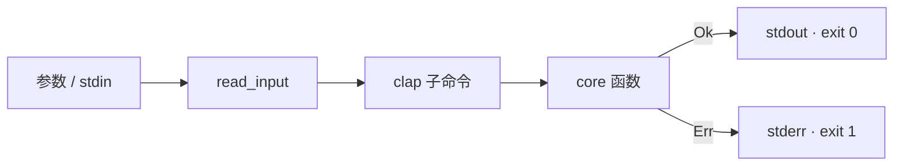
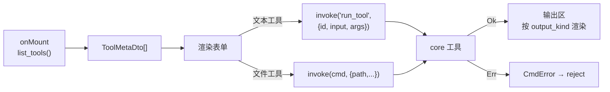
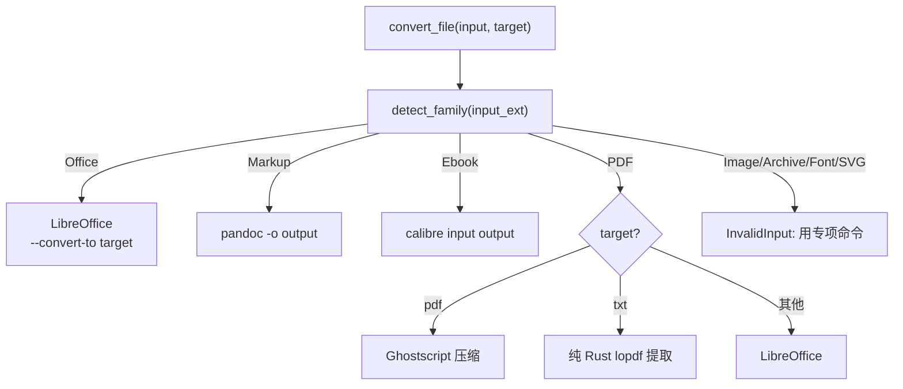
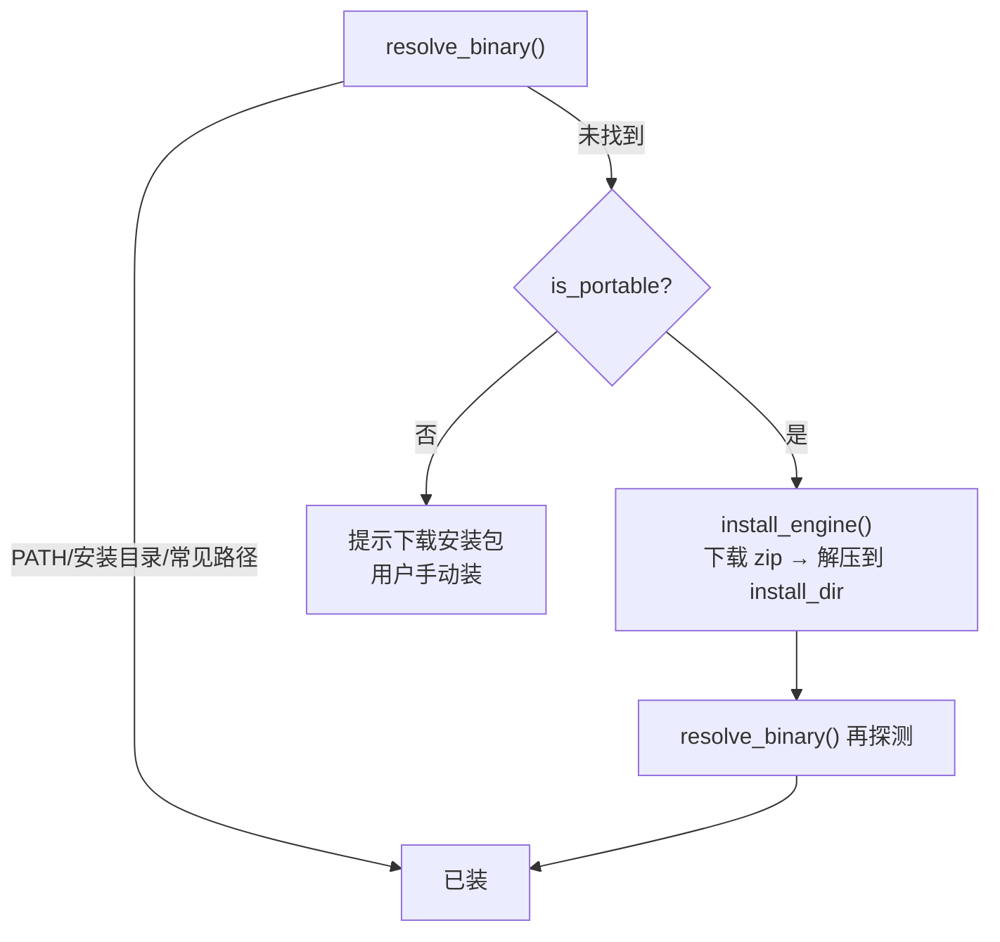
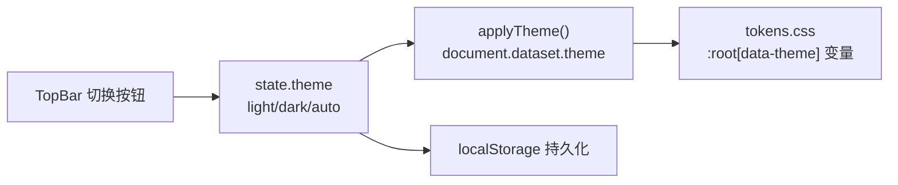
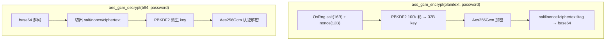
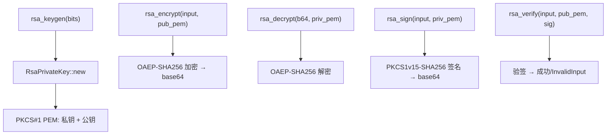
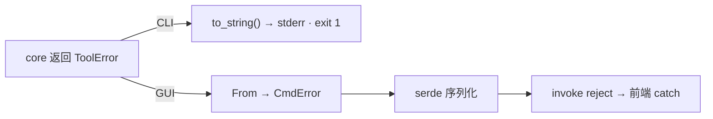

# 业务流程

CLI 与 GUI 共享 `nextool-core`,数据流以 core 为中心。

## CLI 管道

`read_input` 优先取位置参数,缺省读 stdin。子命令调 core 同名函数,`Ok` 打印 stdout 退出 0,`Err` 经 `to_string()` 进 stderr 退出 1。

## GUI invoke

前端 `onMount` 拉取元数据动态渲染。文本工具经 `run_tool` 通用入口,文件工具签名各异保留独立 command。`output_kind` 决定渲染:高亮/SVG/纯文本。`Err` 经 `CmdError` 序列化 reject,前端 catch 展示。

## 通用文件转换路由

`convert_any` 按源文件扩展名判定 `FormatFamily`,路由到对应引擎或纯 Rust 函数。同扩展名用 `_converted` 后缀避免覆盖源。Image/Archive/Font/Svg 族返回错误提示用专项命令。

## 引擎安装流程

便携版(ffmpeg/pandoc)自动下载解压到 `%APPDATA%/NexToolkit/engines/<engine>/`。安装包引擎(LibreOffice/calibre/Ghostscript/tesseract)提供下载链接,用户手动安装后重启应用。`resolve_binary` 查找优先级:PATH → 安装目录 → Windows 常见路径。

## 主题切换

三态切换:`auto` 跟随系统(`@media prefers-color-scheme`)、`light` 强制明色、`dark` 强制暗色。`localStorage` 持久化用户选择。

## AES-256-GCM 加解密

随机 salt+nonce 使同明文产生不同密文。密文自包含 salt/nonce,解密只需口令。认证失败返回 `InvalidInput`。

## RSA 密钥与加解密

密钥对输出 PKCS#1 PEM。加解密用 OAEP-SHA256,签名用 PKCS1v15-SHA256。PEM 解析兼容 PKCS#8/SPKI 与 PKCS#1。

## 错误传播

core 统一 `ToolError`(12 变体)。CLI 直接 `to_string` 进 stderr 非零退出;GUI 经 `From` 转字符串序列化 reject。两入口错误信息一致。
