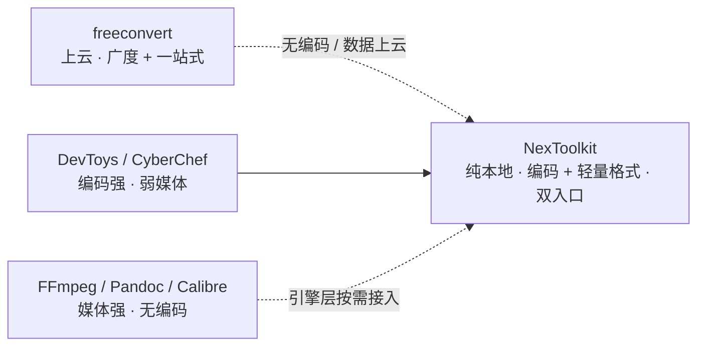

# 产品需求

> 开源、纯本地、轻量快捷的通用工具集。Tauri 桌面 GUI + 独立 CLI,跨平台,纯 Rust 核心。

## 定位

市面无单一本地开源工具能同时覆盖"开发者编码工具 + 全格式转换":编码工具箱强编码弱媒体,格式引擎强媒体弱编码,在线服务以数据上云换一站式。NexToolkit 用 Tauri + Rust 自研填补此缺口,核心层纯 Rust 保证轻量,重格式转换归引擎层按需接入。

**卖点:** 零上传(隐私)、无大小限制、无网络依赖、编码/加密能力。

## 工具矩阵(共 141 = 107 文本 + 34 文件,纯 Rust 核心 + 引擎层按需接入)

| 分组 | 工具 | 说明 |
|---|---|---|
| Encoders | base64 · url · html · hex · jwt · base32/58/85 · punycode · quoted-printable · morse · braille · 零宽 | 编解码;jwt 解析/验签(HS256/RS256) |
| Converters | json-yaml · json-toml · json-csv · json-xml · csv-tsv · csv-yaml · csv-xml · tsv-json · yaml-toml/xml · toml-xml · md-html · md-txt · numbase · unit | 结构化互转 + 进制/单位换算(10 类) |
| Formatters | json-fmt · sql-fmt · xml-fmt · css-min | 美化与压缩 |
| Generators | hash · hmac · hmac-multi · uuid · password · lorem · qr | hash 含 MD5/SHA1/SHA256/SHA512;uuid v4/v7;qr 生成 SVG |
| Text | case · sort · dedup · reverse · regex · diff · stats · trim · tab↔space · align · replace · escape · number-lines | case 含 snake/camel/kebab/title;diff 文本逐行 |
| Crypto | aes-gcm · chacha20 · rsa · rsa-sign/verify · ed25519 · kdf(pbkdf2/argon2/scrypt) · bcrypt · crc32/64 | AES-GCM/ChaCha20;RSA/Ed25519 密钥/加解密/签名验签;KDF;Bcrypt;CRC |
| Net/Time | ipcalc · timestamp · cron · dns · http | IP/时间戳/cron/DNS + HTTP 探测 |
| Files | archive · image · pdf · font · svg · xlsx · engine | zip/tar/gz/7z/bz2/xz/zst 归档 + 14 格式图像互转/裁剪/翻转/滤镜/亮度/JPEG 压缩 + PDF 拆分(范围/每N页/奇偶)/旋转/合并/加解密/删除/提取/元数据/页码 + 字体 TTF↔WOFF + 元数据 + SVG→PNG/JPG + XLSX↔JSON + 6 引擎接线(音视频/Office↔PDF/电子书/标记语言/PDF 压缩/OCR);产物落源目录 |

## 验收

| 指标 | 目标 | 验证 |
|---|---|---|
| 跨平台三形态分发 | Win/macOS/Linux 各出 CLI 二进制、便携 GUI、安装版 | CI 三平台矩阵 |
| 双入口行为一致 | CLI 与 GUI 同输入同输出(共享 core) | 共享 core 集成测试 |
| CLI 冷启动 | <200ms | hyperfine 基准 |
| CLI 体积 | <8MB(release strip) | 资产测量 |
| 便携 GUI 体积 | <20MB(Win,skip WebView2) | 资产测量 |
| 测试 | core 单测 + CLI 集成测试全绿,真实数据无 mock | cargo test |

## 边界

- **Always**:提交前跑测试 + clippy;core 不引入 UI 依赖;新工具同步加 CLI 与 GUI 入口;中文注释。
- **Ask first**:新增非纯 Rust 依赖(外部引擎);改 workspace 结构;改 CI 矩阵。
- **Never**:提交密钥;放宽 CSP 或通配 capabilities;为通过测试删测试用例;core 依赖 UI 层;mock 测试。

## 非目标

- 不做在线/云转换(纯本地是核心卖点)。
- 不做移动端、账号/登录/遥测。
- 重引擎格式转换(音视频/Office↔PDF/电子书/标记语言)不打包进核心,归引擎层运行时探测系统已装按需接入(见 [todo.md](todo.md))。
- PDF 压缩优化、PDF OCR 归引擎层(Ghostscript/tesseract,运行时探测),不打包进核心——见 [todo.md](todo.md)。
- 不做 7z 创建、RAR 创建(RAR 专有格式仅授权 WinRAR 可创建;7z/RAR 解压已交付)——见 [todo.md](todo.md)。
