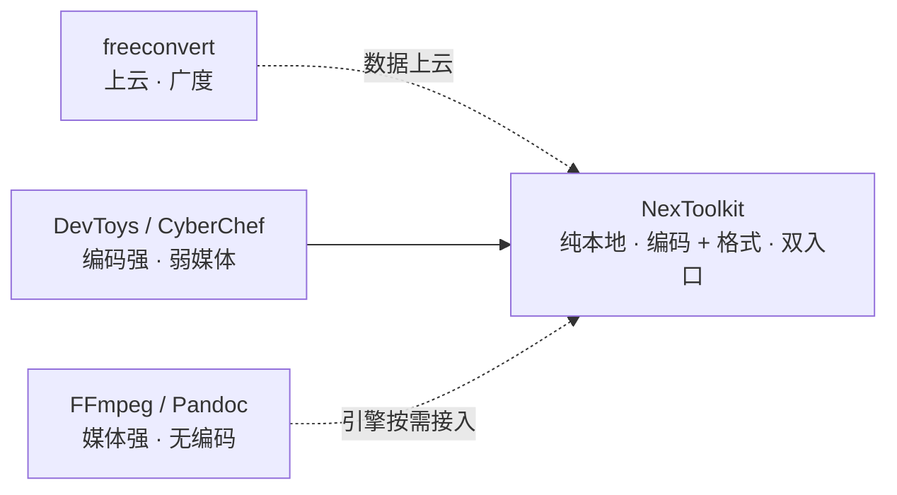
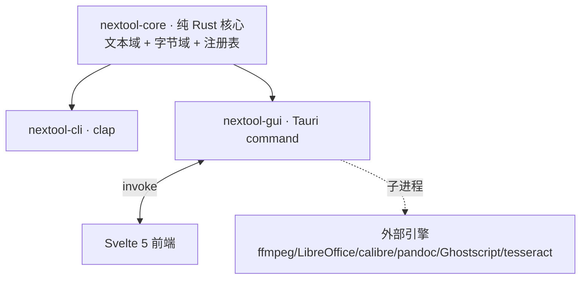

# 产品需求

纯本地通用工具集。Tauri 桌面 GUI + CLI,纯 Rust 核心,无云无遥测。

## 定位

编码工具箱强编码弱媒体,格式引擎强媒体弱编码,在线服务以数据上云换一站式。NexToolkit 用 Tauri + Rust 填补此缺口:纯 Rust 核心保证轻量,重格式转换归引擎层运行时探测按需接入。

**卖点:** 零上传、无大小限制、无网络依赖、编码/加密能力。

## 工具矩阵

143 工具(109 文本 + 34 文件),9 组:

| 分组 | 文本工具数 | 说明 |
|---|---|---|
| 编解码 | 28 | base64/32/58/85 · url/html · hex · 字符编码(GBK/Big5 等)· jwt · punycode · QP · 摩斯/盲文/零宽 |
| 文本处理 | 15 | case · sort · dedup · reverse · regex · diff · stats · trim · escape |
| 数据转换 | 25 | JSON↔YAML/TOML/CSV/XML · MD→HTML/TXT · 进制 · 单位换算(10 类) |
| 格式化 | 6 | JSON/SQL/XML 美化压缩 · CSS 压缩 |
| 加密与哈希 | 21 | AES-GCM · ChaCha20 · RSA · Ed25519 · KDF · Bcrypt · CRC · HMAC |
| 生成器 | 7 | hash · uuid v4/v7 · password · lorem · qr |
| 网络 | 3 | ipcalc · dns · http |
| 时间 | 3 | timestamp · cron |
| 文件转换 | 34 | 归档 · 图像 · PDF · 字体 · SVG · 电子表格 · 引擎转换 · 通用路由 |

## 架构

core 是单一事实源,CLI 与 GUI 都薄封装它。引擎不打包进核心,运行时探测系统已装路径。

## 验收

| 指标 | 目标 |
|---|---|
| 跨平台 | Win/macOS/Linux 各出 CLI + GUI |
| 双入口一致 | CLI 与 GUI 同输入同输出 |
| CLI 体积 | <8MB(release strip) |
| 测试 | core 单测 + CLI 集成 + E2E 留痕,真实数据无 mock |

## 边界

- **Always**:提交前跑测试 + clippy;core 不引入 UI 依赖;新工具同步加 CLI 与 GUI 入口。
- **Ask first**:新增非纯 Rust 依赖;改 workspace 结构;改 CI 矩阵。
- **Never**:提交密钥;放宽 CSP;mock 测试;core 依赖 UI 层;云转换。

## 非目标

- 不做在线/云转换(纯本地是核心卖点)。
- 不做移动端、账号/登录/遥测。
- 重引擎不打包进核心,运行时探测按需接入。
- 不做 RAR 创建(专有格式)。
