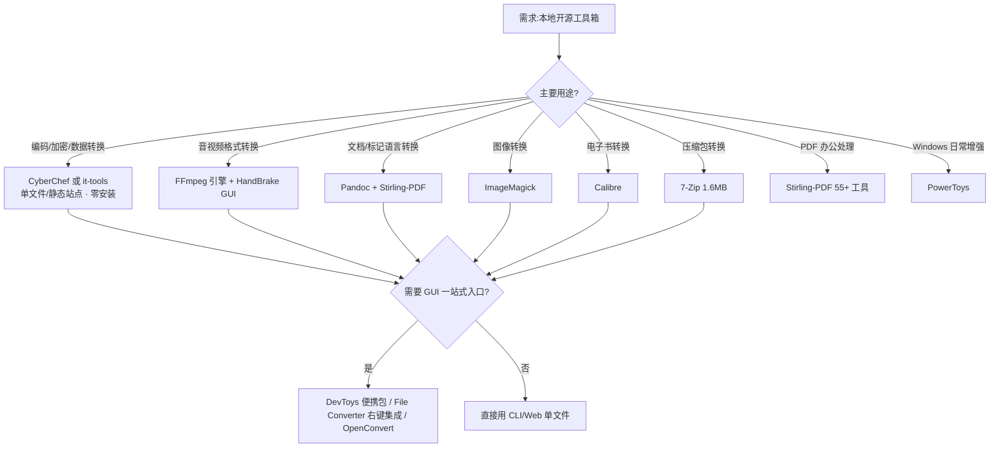
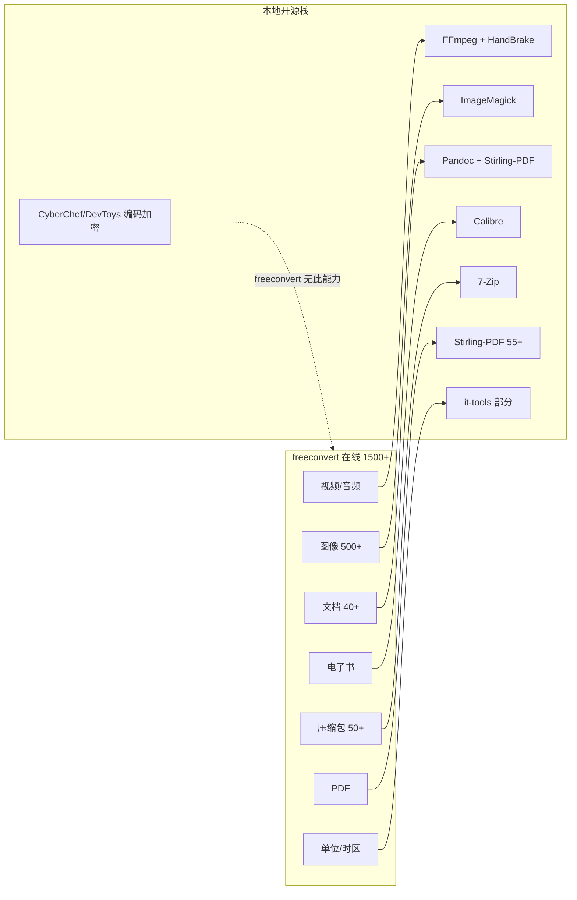
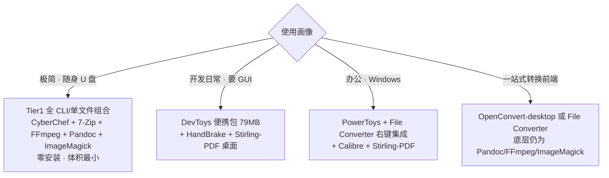

# 本地开源常用工具箱技术选型调研

> 调研日期:2026-08-21 ｜ 调研模式:技术选型(tech-selection)｜ 平台假设:Windows 11,优先可跨平台
> 核心筛选标准:开源 · 纯本地运行 · 轻量快捷(零安装/小体积/秒启动)· 功能全面(格式转换 + 编码工具 + 日常办公)
> 对标基准:freeconvert.com(在线一站式格式转换,1500+ 转换)

---

## §1 TL;DR

**核心结论:** 没有任何单一本地开源工具能对标 freeconvert 的"格式广度 + 一站式"体验;本地正确答案是**分层组合栈**——编码用 CyberChef/it-tools,音视频用 FFmpeg/HandBrake,文档用 Pandoc,图像用 ImageMagick,电子书用 Calibre,压缩包用 7-Zip,PDF 办公用 Stirling-PDF。但本地栈在**隐私(数据不出设备)**与**编码/加密能力(freeconvert 完全缺失)**上反向碾压 freeconvert。

**按便携度三类推荐:**

| 便携度 | 首选 | 一句话定位 |
|---|---|---|
| **第一类·极致便携(零安装/单文件)** | CyberChef + it-tools + 7-Zip + FFmpeg + Pandoc + ImageMagick | 解压/双击即用,体积最小,多数 CLI |
| **第二类·免安装便携包(GUI)** | DevToys(便携 79MB)+ HandBrake(便携 33MB)+ Stirling-PDF | 解压即用且带完整 GUI |
| **第三类·需安装但纯本地** | PowerToys + File Converter(Tichau)+ Calibre | 系统集成/右键集成,体积偏大但完全本地 |

**freeconvert 对标结论:** 在视频/音频/图像/电子书/PDF 五大格式族上,本地开源工具**覆盖度等同或更广**;仅在"单位/时区换算"等边缘类别覆盖较窄;而 freeconvert **不具备任何编码/加密/哈希能力**,这是本地工具箱的独占优势。代价是本地失去"单点上传即转"的一站式 UX,需多工具组合。

---

## §2 核心认知

**主线判断:** freeconvert 的竞争力是"广度 + 单点 UX",代价是数据上云;本地开源工具的竞争力是"隐私 + 编码能力 + 可离线",代价是**没有任何单一产品覆盖全部格式族**——必须按格式族拆分选型,再用 GUI 前端(DevToys/File Converter/OpenConvert)做聚合。

**三个关键认知:**

1. **"工具箱"分两种,不可混为一谈。** 一种是"开发者编码工具箱"(CyberChef、it-tools、DevToys)——强于 Base64/JWT/哈希/格式化,但**几乎不做音视频/电子书格式转换**;另一种是"格式转换工具箱"(FFmpeg、HandBrake、Pandoc、Calibre、ImageMagick、7-Zip)——专精某一格式族。用户要的"功能全面"需两者叠加。
2. **便携度与 GUI 成反比。** 最便携的(CyberChef 单 HTML、FFmpeg 单二进制)多为 Web/CLI;带完整 GUI 的便携包(DevToys 79MB)体积上升一个量级;深度系统集成(PowerToys 660MB 安装后)最不便携。
3. **协议陷阱真实存在。** Stirling-PDF 是"开源内核(MIT)+ 专有目录"的 open-core,高级功能需付费;DevToys 虽 MIT,但 README 附"请勿作为试用ware分发"的道义条款;FFmpeg 依编译配置可能落入 GPL。选型须按用途核对协议。

---

## §3 第一类·极致便携(零安装 / 单文件 / 秒启动)

定义:无需安装器、不写注册表、解压或双击即用,体积最小。多数为 Web 单页或 CLI。

| 工具 | 协议 | 便携形态 | 平台 | 核心覆盖 | 活跃度 |
|---|---|---|---|---|---|
| **CyberChef** | Apache 2.0 | 单个 HTML 包,浏览器直接打开 | 跨平台(Web) | 编码/加密/压缩/哈希/解析,数百操作,支持 2GB 文件 | v11.0.0(2026-04),活跃 |
| **it-tools** | GPLv3 | 静态 SPA,Docker 一行自托管或 PWA 离线 | 跨平台(Web) | 80+ 工具/10 类:加密/转换/Web/网络/文本/生成 | 2026-08 仍在更新,活跃 |
| **FFmpeg** | LGPL/GPL(依编译) | 单二进制,解压即用 | 跨平台(CLI) | 音视频转换引擎,几乎所有格式 | 活跃 |
| **Pandoc** | GPL | 单二进制,解压即用 | 跨平台(CLI) | 文档/标记语言转换(markdown↔docx/html/epub/pdf) | 活跃 |
| **ImageMagick** | ImageMagick License(类 Apache 2.0) | portable .7z,解压即用,无注册表 | 跨平台(CLI) | 图像转换/编辑,海量格式 | 活跃 |
| **7-Zip** | LGPL + BSD3 + unRAR 限制 | 安装器 1.6MB;另有 standalone 控制台版 | 跨平台 | 压缩包转换(7z/zip/tar/gz/解压 rar/iso/dmg...) | v26.02(2026-06),活跃 |

**简评:**

- **CyberChef**([源](https://github.com/gchq/CyberChef)):GCHQ 出品,完全客户端运行,"recipe"拖拽编排,可下载整包离线运行于虚拟机或内网。**编码工具箱首选**,freeconvert 完全无此能力。
- **it-tools**([源](https://github.com/CorentinTh/it-tools)):约 4 万 star,Vue3 SPA,**无后端、无数据库**,所有工具浏览器内运行,PWA 可离线安装。覆盖 JWT/哈希/bcrypt/RSA、JSON↔YAML/TOML/CSV、QR、正则等。Docker 自托管锁定版本,消除托管站供应链风险。
- **FFmpeg**([源](https://ffmpeg.org/)):音视频转换的事实标准,几乎所有 GUI 转换器(HandBrake、File Converter、OpenConvert)的底层引擎。CLI 单文件,便携度极高,代价是无官方 GUI。
- **Pandoc**([源](https://www.pandoc.org/)):文档转换"瑞士军刀",markdown/docx/html/epub/latex 互转;PDF 输出需 LaTeX 引擎(pdflatex/tectonic 等)。
- **ImageMagick**([源](https://imagemagick.com/download/)):官方提供 Windows portable .7z,"Just copy to your host and run (no installer, no Windows registry entries)"——便携度验证确认。
- **7-Zip**([源](https://www.7-zip.org/)):1.6MB,LGPL 开源,支持压缩包格式极广(解压 RAR/ISO/DMG/CAB 等),填补 freeconvert Archive Converter 缺口。

---

## §4 第二类·免安装便携包(GUI · 解压即用)

定义:官方提供 portable zip,解压即用且带完整 GUI,体积中等。

| 工具 | 协议 | 便携包体积 | 平台 | 核心覆盖 | 活跃度 |
|---|---|---|---|---|---|
| **DevToys** | MIT | portable zip ≈ 79MB(Windows x64) | Win/Mac/Linux(GUI) | 30 默认工具 + 44 扩展:编码/转换/格式化/生成/图形 | v2.0+,活跃 |
| **HandBrake** | GPLv2 | portable zip 33.3MB(Win x64 GUI) | Win/Mac/Linux(GUI) | 视频转码(基于 FFmpeg/x264/x265/SVT-AV1) | v1.11.2,活跃 |
| **Stirling-PDF** | 开源内核 MIT + 专有目录(open-core) | Docker/JAR/原生桌面 app | 跨平台(Web/桌面) | 55+ PDF 工具:合并/拆分/OCR/签名/水印/转换 | 活跃 |

**简评:**

- **DevToys**([源](https://github.com/DevToys-app/DevToys)):MIT,跨平台,便携 zip 官方提供([releases](https://github.com/DevToys-app/DevToys/releases) 中 `devtoys_win_x64_portable.zip` ≈ 79MB,CLI 便携 ≈ 33MB)。Smart Detection 自动识别剪贴板内容选工具。**编码/开发工具箱的 GUI 首选**。
- **HandBrake**([源](https://github.com/HandBrake/HandBrake)):GPLv2,官方 downloads 页明确提供 zip package(免安装);Windows 需 .NET Desktop Runtime 10.0。视频转码 GUI 首选。
- **Stirling-PDF**([源](https://github.com/Stirling-Tools/stirling-pdf)):约 9 万 star,55+ PDF 工具,桌面原生 app / Docker / JAR 皆可。**注意**:Desktop-Local 模式仅基础工具本地运行,OCR/文档格式转换/压缩/修复等高级工具需连自托管服务器或 Stirling.com 云(消耗 credits)——纯离线场景能力受限。

---

## §5 第三类·需安装但纯本地(系统集成 / 体积偏大)

定义:需安装器或系统集成(右键菜单/系统服务),体积偏大,但数据仍完全本地。

| 工具 | 协议 | 体积 | 平台 | 核心覆盖 | 活跃度 |
|---|---|---|---|---|---|
| **PowerToys** | MIT | 安装器 ≈ 278MB,安装后 ≈ 660MB | Windows | 30+ 系统增强工具(窗口/启动器/OCR/图像缩放/重命名) | v0.100(2026-06),活跃 |
| **File Converter(Tichau)** | GPLv3 | 需安装(右键集成) | Windows | 资源管理器右键转换(底层 FFmpeg+ImageMagick+Ghostscript) | v2.2(2026-02),活跃 |
| **Calibre** | GPLv3 | portable 191MB / 安装 624MB | Win/Mac/Linux(GUI) | 电子书管理 + 转换(几乎所有电子书格式) | v9.13(2026-08),活跃 |
| **OpenConvert-desktop** | 开源(Electron,LICENSE 见仓库) | AppImage/安装包 | 跨平台(GUI) | 一站式转换前端(底层 Pandoc+FFmpeg+Sharp) | 较新 |

**简评:**

- **PowerToys**([源](https://github.com/microsoft/PowerToys)):Microsoft 官方,MIT,137k star,30+ 工具。**定位是 Windows 日常办公/系统增强**(FancyZones、PowerToys Run、Text Extractor OCR、Image Resizer、PowerRename),**不含编码工具,格式转换仅有 Image Resizer**——不可作为格式转换主力。
- **File Converter**([源](https://github.com/Tichau/FileConverter)):GPLv3,Windows 资源管理器右键即转,底层复用 FFmpeg/ImageMagick/Ghostscript。是**把 Tier1 CLI 引擎包装成日常 UX 的最佳本地方案**,对标 freeconvert 的"上传即转"体验。
- **Calibre**([源](https://github.com/kovidgoyal/calibre)):GPLv3,电子书管理+转换王者,跨平台,有官方 portable。体积偏大但电子书格式覆盖无出其右。
- **OpenConvert-desktop**([源](https://github.com/OpenConvert/OpenConvert-desktop)):Electron 一站式转换 GUI,底层仍是 Pandoc/FFmpeg/Sharp,支持图像/文档/视频/音频/批量处理。较新,生态待验证,作为"一站式前端"备选。

---

## §6 对标 freeconvert 格式转换能力评估

**freeconvert 基准**([源](https://www.freeconvert.com/)):在线服务,1500+ 转换,9 大类——Video / Audio / Image(500+ 含 RAW)/ Document(40+:DOC/PDF/HTML/PPT/ODP)/ Ebook / Archive(50+:RAR/ZIP/Tar/Gz/7z)/ Unit / Time(时区)/ PDF。**本质:数据上云,单点 UX,无编码/加密能力。**

| 格式族 | freeconvert(在线) | 本地开源代表 | 本地覆盖度 | 说明 |
|---|---|---|---|---|
| 视频 | Video Converter(MP4/MOV/AVI/WEBM/MKV/WMV/FLV…) | FFmpeg + HandBrake | ★★★★★ 等同或更广 | 本地可控码率/分辨率/编解码 |
| 音频 | Audio Converter(MP3/WAV/AAC/OGG/FLAC/M4A) | FFmpeg | ★★★★★ 等同 | 同上 |
| 图像 | Image Converter(500+ 含 RAW) | ImageMagick + FFmpeg | ★★★★★ 等同或更广 | ImageMagick 格式覆盖极深 |
| 文档 | Document Converter(40+:DOC/PDF/HTML/PPT/ODP) | Pandoc + Stirling-PDF | ★★★★ | Office 二进制(DOCX/PPTX→PDF)需 LibreOffice 引擎,Stirling-PDF fat 版内置 |
| 电子书 | Ebook Converter(EPUB/MOBI/AZW3…) | Calibre | ★★★★★ 等同或更广 | Calibre 电子书格式覆盖最全 |
| 压缩包 | Archive Converter(50+:RAR/ZIP/Tar/Gz/7z) | 7-Zip | ★★★★ | RAR 仅解压不能创建(unRAR 协议限制) |
| PDF | PDF Converter | Stirling-PDF(55+ 工具) | ★★★★★ 远超 | 合并/拆分/OCR/签名/水印/压缩/freeconvert 无此深度 |
| 单位换算 | Unit Converter(Lbs↔Kg 等) | it-tools(部分) | ★★★ | 本地覆盖窄 |
| 时区换算 | Time Converter(PST↔EST) | it-tools(日期转换) | ★★★ | 本地覆盖窄 |
| 编码/加密/哈希 | **无** | CyberChef / it-tools / DevToys | ★★★★★ 本地独占 | freeconvert 完全缺失 |

**缺口结论:** 本地栈在 7/9 格式族等同或超越 freeconvert;仅在"单位/时区"边缘类别略弱(可由 it-tools 部分覆盖)。**反向看,freeconvert 在编码/加密/哈希上完全空白**——这是本地工具箱不可替代的独占价值。本地栈的唯一真实短板是"一站式 UX",由 File Converter / OpenConvert / DevToys 等 GUI 前端弥补。

---

## §7 选型建议与组合方案

**推荐组合(按画像):**

1. **极简随身(U 盘/内网):** CyberChef(编码)+ 7-Zip(压缩)+ FFmpeg(音视频)+ Pandoc(文档)+ ImageMagick(图像)。全部单文件,零安装,总体积小,代价是 CLI 为主。
2. **开发者日常(GUI):** DevToys 便携包(编码/格式化/生成一站式)+ HandBrake(视频)+ Stirling-PDF 桌面(PDF)。平衡便携与 UX。
3. **Windows 办公:** PowerToys(系统增强/OCR/重命名)+ File Converter(右键格式转换)+ Calibre(电子书)+ Stirling-PDF(PDF 深度处理)。完全本地,集成度高。
4. **对标 freeconvert 一站式体验:** File Converter 或 OpenConvert-desktop 作前端,底层引擎即 Tier1 的 FFmpeg/Pandoc/ImageMagick——**用本地引擎复刻 freeconvert UX,且数据不出设备**。

**选型优先级建议:** 优先 Tier1/Tier2 满足"轻量快捷"硬指标;Tier3 仅当需要系统集成(右键、OCR、启动器)时引入。任何场景下,**编码工具箱(CyberChef/it-tools/DevToys)与格式转换引擎(FFmpeg/Pandoc/ImageMagick/Calibre/7-Zip)都应成对出现**,缺一则不"全面"。

---

## §8 避坑清单

1. **"一站式开源工具箱"不存在,勿求单点全能。** 证据:CyberChef/it-tools/DevToys 强编码但弱媒体格式转换;FFmpeg/HandBrake/Pandoc/Calibre 强格式转换但无编码工具——任何单一产品均无法同时覆盖(见 §6 矩阵)。
2. **Stirling-PDF 是 open-core,非纯 MIT。** 证据:其 [LICENSE](https://github.com/Stirling-Tools/stirling-PDF/blob/main/LICENSE) 明确"app/proprietary/、app/saas/、engine/ 等目录为专有许可",核心代码 MIT。高级功能(OCR、文档格式转换、压缩、修复)在 Desktop-Local 模式不可用,需服务器/云 credits([源](https://docs.stirlingpdf.com/Modes%20and%20Licensing/))。
3. **DevToys 虽 MIT,但 README 附道义条款。** 证据:官方讨论 [#944](https://github.com/DevToys-app/DevToys/discussions/944) 确认"MIT 允许再分发,但作者请求勿作为试用ware分发"——法律上 MIT,商业再分发前建议沟通。
4. **FFmpeg 协议依编译配置浮动。** 证据:ffmpeg.org 说明默认 LGPL,但启用 GPL 编解码器(如 x264/x265)后整体落入 GPL。企业商用须核对所用发行版的编译选项。
5. **7-Zip 的 RAR 仅解压不能创建。** 证据:[license.txt](https://sevenzip.sourceforge.io/license.txt) 载明 unRAR 限制条款"不得用于开发 RAR 兼容压缩器"。需创建 RAR 时本地无开源方案。
6. **HandBrake portable 仍依赖 .NET 运行时。** 证据:官方 releases 注明 Windows 需 .NET Desktop Runtime 10.0——并非完全"零依赖",纯净机上首次运行需补运行时。
7. **PowerToys 不能当格式转换主力。** 证据:其 30+ 工具中仅 Image Resizer 涉及图像尺寸转换,无音视频/文档/编码能力([源](https://learn.microsoft.com/en-us/windows/powertoys/))。
8. **警惕"it-tools 仿站"供应链风险。** 证据:第三方分析指出存在仿 it-tools UX 的站点悄悄上传 JWT/密钥;自托管 Docker 锁定版本可消除该风险([源](https://webnestify.cloud/insights/operations-automation/it-tools-self-hosted-developer-utilities/))。
9. **流行国产工具箱 uTools / Quicker 非开源。** 核查轨迹:GitHub 搜索 "utools toolbox" 仅返回第三方插件(causebefore/EMTools、yanmiao99/financial_toolbox_utools 等),**无官方 uTools 应用开源仓库**;搜索 "Quicker productivity tool" 仅返回无关项目(NehaDhami25/Quicker 为作业追踪应用),**无官方 Quicker 应用开源仓库**。两者官方应用均为闭源专有,不满足"开源"硬指标。
10. **freeconvert.com 为在线服务,数据上云。** 证据:官方首页明确"online file converter",数据需上传至其服务器——与"纯本地运行"硬指标冲突,仅作对标基准,非选型候选。

---

## §9 源附录与核查记录

### 9.1 源清单(按类别,访问日期 2026-08-21)

**GitHub 主源(P0):**
- CyberChef — https://github.com/gchq/CyberChef(Apache 2.0,v11.0.0)
- it-tools — https://github.com/CorentinTh/it-tools(GPLv3,≈40k★,2026-08 活跃)
- DevToys — https://github.com/DevToys-app/DevToys(MIT,≈31.8k★)｜releases — https://github.com/DevToys-app/DevToys/releases(便携包体积)
- PowerToys — https://github.com/microsoft/PowerToys(MIT,≈137k★)｜磁盘占用 — https://github.com/microsoft/PowerToys/blob/main/doc/devdocs/disk-usage-footprint.md
- HandBrake — https://github.com/HandBrake/HandBrake(GPLv2,v1.11.2)｜releases(便携 zip 33.3MB)
- Calibre — https://github.com/kovidgoyal/calibre(GPLv3,≈25.6k★)
- Stirling-PDF — https://github.com/Stirling-Tools/stirling-PDF(open-core,≈89.5k★)｜LICENSE
- File Converter — https://github.com/Tichau/FileConverter(GPLv3,v2.2)
- OpenConvert-desktop — https://github.com/OpenConvert/OpenConvert-desktop(Electron)
- 7-Zip — https://www.7-zip.org/(LGPL+BSD3+unRAR,v26.02)｜license.txt — https://sevenzip.sourceforge.io/license.txt

**官方文档(P1):**
- CyberChef 在线版 — https://gchq.github.io/CyberChef/
- it-tools DeepWiki(80+ 工具/10 类/PWA)— https://deepwiki.com/CorentinTh/it-tools
- DevToys 官网 — https://devtoys.app/
- PowerToys 文档 — https://learn.microsoft.com/en-us/windows/powertoys/
- Stirling-PDF 文档 — https://docs.stirlingpdf.com/｜授权模式 — https://docs.stirlingpdf.com/Modes%20and%20Licensing/
- HandBrake 下载 — https://handbrake.fr/downloads.php
- Pandoc 官网 — https://www.pandoc.org/
- ImageMagick 下载 — https://imagemagick.com/download/
- Calibre 便携版 — https://calibre-ebook.com/download_portable

**freeconvert 基准(P1,对标对象):**
- 首页(1500+ 转换)— https://www.freeconvert.com/
- Image Converter(500+ 格式)— https://www.freeconvert.com/image-converter
- Document Converter(40+)— https://www.freeconvert.com/document-converter
- Archive Converter(50+)— https://www.freeconvert.com/archive-converter
- API 文档(高级选项说明)— https://www.freeconvert.com/api/v1/

**社区信号(P2):**
- it-tools 自托管分析 — https://webnestify.cloud/insights/operations-automation/it-tools-self-hosted-developer-utilities/
- it-tools 仓库洞察 — https://appselfhost.com/repo-insight-it-tools-60-developer-utilities-zero-backend-one-docker-container/
- DevToys 评测 — https://www.howtogeek.com/the-0-windows-swiss-army-knife-every-developer-should-install-today/
- Calibre Portable(PortableApps,191MB/624MB)— https://portableapps.com/apps/office/calibre-portable

### 9.2 负面断言核查记录

| 负面断言 | 核查方式 | 结果 |
|---|---|---|
| uTools 官方应用未开源 | GitHub 搜 "utools toolbox" | 仅第三方插件,无官方应用仓库 → 断言成立 |
| Quicker 官方应用未开源 | GitHub 搜 "Quicker productivity tool" | 仅无关项目,无官方应用仓库 → 断言成立 |
| freeconvert 无编码/加密能力 | 抓取其首页及分类页 | 9 大类均为格式/单位/时区转换,无编码加密 → 断言成立 |
| 无单一本地开源工具覆盖全格式族 | 逐一核查各候选工具功能页 | 编码工具箱与格式转换引擎能力不重叠 → 断言成立 |

### 9.3 UNVERIFIED

- **OpenConvert-desktop 具体协议:** LICENSE 文件存在于仓库(已确认下载),但未读取全文内容;按 Electron 项目惯例推测为 MIT 类宽松协议。引入生产前应读 LICENSE 全文核对。
- **FFmpeg/Pandoc/CyberChef/it-tools 便携包精确体积:** 未逐一抓取 release 资产体积数值;本报告仅描述便携形态(单文件/静态包),未标注具体 MB。如需精确体积,应抓取各仓库最新 release assets 表。
- **it-tools 工具总数:** DeepWiki 记 80+,AppSelfHost 记 60+,两源不一致;报告取"80+"并标注,精确数以仓库 `src/tools/index.ts` 为准。

### 9.4 访问限制与缺口

- **freeconvert.com 直抓受限:** WebFetch 返回"Unable to verify if domain is safe"(网络/安全策略拦截);改用 Exa 缓存摘要获取其分类与格式数。数据来自 freeconvert 官方域内容(经 Exa 抓取),非二手榜单,但未能逐格式核对完整清单。
- **firecrawl_search 配额耗尽:** 返回 402;全程改用 Exa + GitHub MCP + WebFetch 组合,覆盖未受影响。
- **GitHub MCP 一次性连接失败:** 首次 `search_repositories` 报 upstream connect error;重试后恢复,后续调用正常。
- **未实测运行:** 本调研为选型评估,未在本机下载运行各工具;体积/启动速度数据均来自官方 release/文档,非实测。
