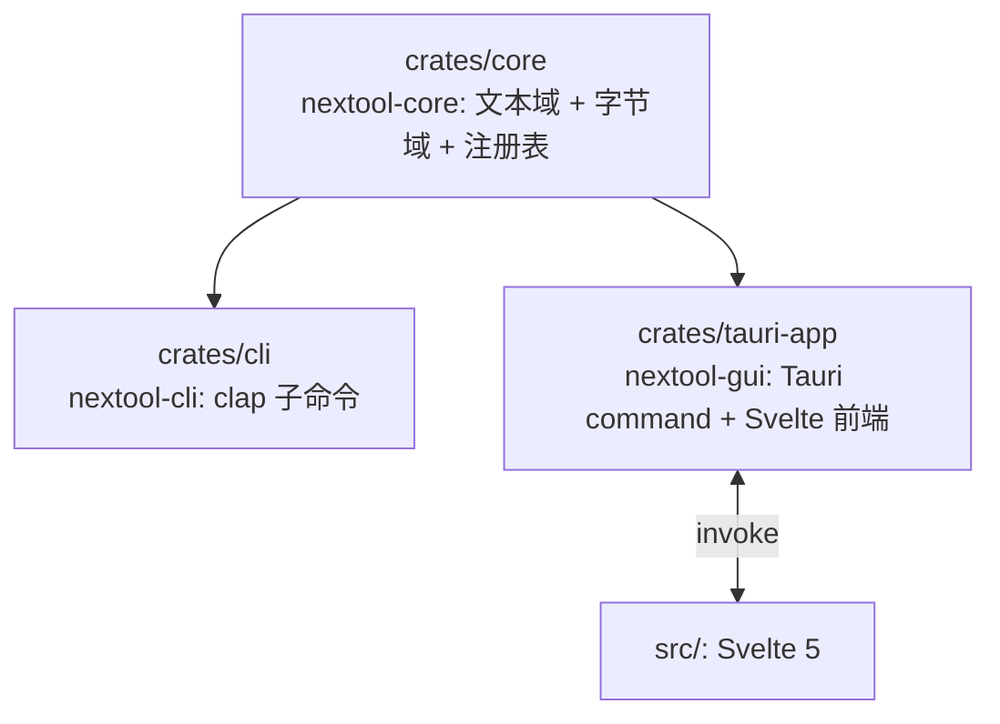

# 技术

技术栈、架构、构建命令。

## 技术栈

| 维度 | 决策 |
|---|---|
| 桌面框架 | Tauri 2(系统 WebView,产物 5–15MB) |
| 前端 | Svelte 5(runes)+ Vite + TypeScript |
| 核心 | Rust 1.80(workspace,edition 2021) |
| CLI | clap 4(独立二进制,headless 可用) |
| 错误 | thiserror(core 统一 ToolError,GUI 序列化) |

## Workspace 架构



core 是单一事实源,无 UI 依赖。CLI 与 GUI 薄封装 core,同输入同输出。

## 模块设计

| 层 | 模块 | 职责 |
|---|---|---|
| 文本域 | `core/src/{encode,convert,format,generate,text,crypto,nettime}/` | `&str→String` 纯逻辑,`Tool` trait 自描述 |
| 字节域 | `core/src/fileconv/{archive,image,pdf,font,svg,xlsx,extract,engine,route,fs_util}` | `&[u8]→Vec<u8>` 纯内存 + IO 边界 |
| 注册表 | `core/src/registry.rs` | `Tool` trait + `ToolMeta` + `tools()`/`find_tool()` |
| 引擎 | `core/src/fileconv/engine.rs` | `EngineRunner` port + `SubprocessRunner` + 运行时探测 + 便携版安装 |
| CLI | `crates/cli/src/*_cmd.rs` | clap 子命令,调 core 同名函数 |
| GUI | `crates/tauri-app/src/commands.rs` | `#[tauri::command]` + `FILE_TOOLS` 静态元数据 |
| 前端 | `src/components/*.svelte` | 动态渲染 `ToolMetaDto` + `invoke` 执行 |

## Tauri 命令

36 个命令(4 通用入口 + 32 文件命令):

| 分类 | 命令 | 数量 |
|---|---|---|
| 通用入口 | `list_tools` · `run_tool` · `list_file_tools` · `list_engines` | 4 |
| 通用转换 | `convert_file` | 1 |
| 引擎管理 | `engine_install_infos` · `install_engine` | 2 |
| 归档 | `archive_list/extract/compress/convert` | 4 |
| 图像 | `image_convert/resize/crop/flip/filter/adjust/compress_jpeg` | 7 |
| PDF | `split/rotate/encrypt/decrypt/split_ranges/split_every_n/split_parity/merge/delete_pages/extract_pages/set_metadata/add_page_numbers` | 12 |
| 字体 | `font_convert` · `font_meta` | 2 |
| SVG | `svg_convert` | 1 |
| 电子表格 | `xlsx_to_json` · `json_to_xlsx` | 2 |
| 文本提取 | `docx_to_text` | 1 |
| 引擎转换 | `av_convert` · `ocr` | 2 |
| 引擎转换(便携) | 便携版引擎经 `convert_file` 路由 | — |

## 构建命令

```bash
cargo build -p nextool-cli --release     # CLI
npm install && npm run build              # 前端 → dist/
npm run tauri build                       # GUI release
cargo test -p nextool-core -p nextool-cli # 测试
./scripts/pre-push.sh                     # 全门(fmt + clippy + test + build)
```

## 避坑

| 问题 | 解决 |
|---|---|
| Windows gnu target 编译 windows-sys ICE | 用 MSVC target |
| Tauri 构建需 `dist/` | 先 `npm run build` 再 `tauri build` |
| LibreOffice 不在 PATH | `resolve_binary` 回退查 Program Files 默认路径 |
| 子进程弹 cmd 窗口 | `CREATE_NO_WINDOW` 标志(Windows) |
| `-env:UserInstallation` 参数 | 用 `=` 连接为单参数(`-env:UserInstallation=file:///...`) |
