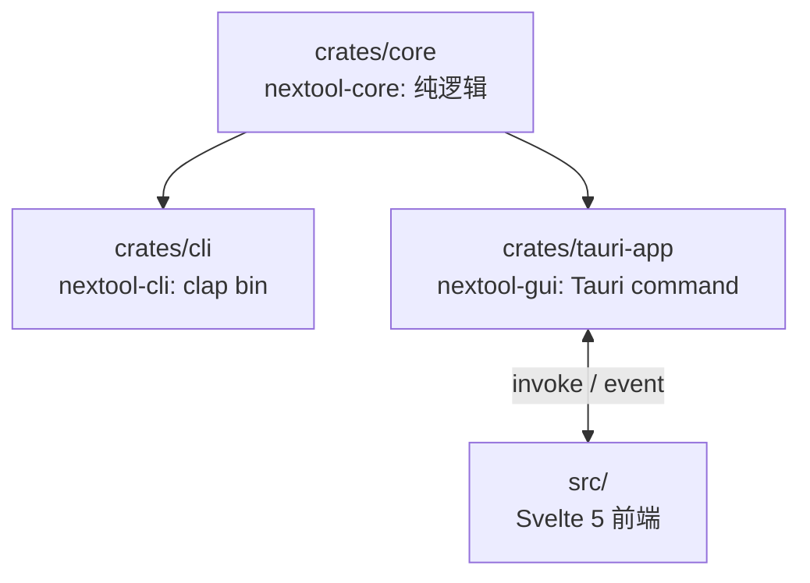
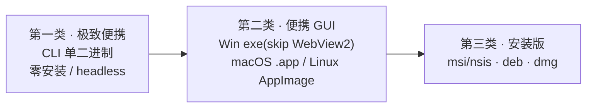
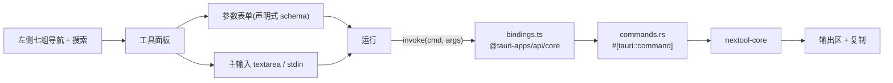

# 技术

> 技术栈、架构、构建命令与设计依据。每个决策标注来源:参考仓库(`reference/competitors/`,git 忽略)与官方文档。

## 技术栈

| 维度 | 决策 | 依据 |
|---|---|---|
| 桌面框架 | Tauri | 系统原生 WebView,产物 5–15MB,对比 Electron 80–200MB |
| 前端 | Svelte 5 + Vite + TypeScript | 编译期消除运行时,前端基线最小;Tauri 官方一等支持 |
| 后端 | Rust | 单二进制、无运行时依赖、crypto/编码 crate 成熟 |
| CLI | 独立 clap 二进制 | 几 MB、headless 可用、进 CI/管道;与 GUI 共享 core |
| Windows 链接器 | MSVC target | Tauri Windows 官方推荐;gnu target 编译 windows-sys(Tauri 依赖)栈溢出 ICE,弃用 |
| 错误 | thiserror(core) | 统一错误类型,GUI 层序列化为前端可读 |

## Cargo Workspace



```
NexToolkit/
├── Cargo.toml                # workspace + 共享 release profile
├── crates/
│   ├── core/                 # 纯逻辑:按域分模块,可独立单测
│   ├── cli/                  # clap 子命令,调 core;tests/cli_smoke.rs 集成测试
│   └── tauri-app/            # Tauri command 薄封装 + tauri.conf.json + capabilities
├── src/                      # Svelte 5 前端
├── docs/                     # prd / tech / todo / api / flow + audit
├── reference/                # 竞品源码(git 忽略,本地分析)
└── .github/workflows/        # ci.yml + release.yml(三平台)
```

## 模块设计

core 按域分模块(encode/convert/format/generate/text/crypto/nettime),每个工具为模块内自由函数,输入输出为普通 Rust 类型,错误统一为 `ToolError`。CLI 与 GUI 调同一函数,行为一致。

```rust
//! nextool-core:编解码模块

/// Base64 标准编码
pub fn base64_encode(input: &str) -> ToolResult<String> { ... }

/// Base64 标准解码(容忍首尾空白)
pub fn base64_decode(input: &str) -> ToolResult<String> { ... }
```

未采用统一 `Tool` trait:工具输入异构(文本/字节/双输入/多参数),强制 trait 不挣其复杂度,自由函数 + 统一错误更简洁。设计参考 CyberChef `Operation`(`reference/competitors/CyberChef/src/core/operations/`)与 DevToys 同工具双接口(`reference/competitors/DevToys/src/app/dev/DevToys.Api/`),实现时简化。

## 三类分发(便携度递减)



依据:市面工具按便携度分三类的共识(调研)。Windows 便携用 `webviewInstallMode: { type: "skip" }`(Win11 默认预装 WebView2),不嵌 runtime(嵌入增 100–200MB,违背轻量)。

## 前端架构



- `tools.ts`:声明式工具元数据(分组/参数 schema/needsMainInput)驱动 UI 渲染,新增工具只追加一项。
- `bindings.ts`:用官方 `@tauri-apps/api/core` invoke(非手写内部访问)。
- 暗色主题、中英双语切换、qr 输出 SVG 内联渲染。
- 参考 it-tools(Vue3 工具集,布局/复制交互/i18n)+ tauri2-svelte5-shadcn(runes + invoke 封装)+ OpenCovibe(集中式 API)+ comine(capabilities scope)。

## 命令

```bash
npm install                           # 前端依赖
cargo fetch                           # Rust 依赖
npm run tauri dev                     # GUI 开发(热重载)
cargo run -p nextool-cli -- <工具>    # CLI 开发
cargo build -p nextool-cli --release  # CLI 单二进制
npm run tauri build                   # GUI 全形态
cargo test -p nextool-core -p nextool-cli       # 测试(真实数据)
cargo clippy -p nextool-core -p nextool-cli -- -D warnings
cargo fmt --check --all
npm run check                         # svelte-check
```

> clippy 限定 core+cli:GUI 的 `generate_context!` 编译期读 `tauri.conf.json` 并校验 frontendDist,需前端 dist 已构建,故 GUI 编译验证由 CI tauri-build job 负责。

## 测试

准则:真实调用、真实数据,禁止 mock。优先用最高 seam(纯逻辑单测),全仓 seam 最少。

- core 单测(`crates/core/src/*.rs` `#[cfg(test)]`):每工具 ≥3 用例(正常/边界/错误)。
- CLI 集成测试(`crates/cli/tests/cli_smoke.rs`):`assert_cmd` 真起二进制,覆盖路由/stdin/退出码。
- GUI:由 CI tauri-build 三平台编译验证(本机内存受限无法编译 Tauri 全依赖图)。

## 避坑

1. **不手写 crypto**:PBKDF2/AES-GCM/RSA/Argon2/HMAC/Hash 全用成熟 crate。
2. **commands.rs 单文件注释分段**:47 个薄 command 样板,Tauri 必需;规模可控不拆。
3. **Capabilities 最小权限**:仅 `core:default` + `windows: ["main"]`,CSP 锁紧(`script-src 'self'`)。
4. **Windows WebView2**:`skip` + 文档说明;不嵌 runtime。
5. **体积优化**:release profile `lto`/`opt-level="z"`/`codegen-units=1`/`panic="abort"`/`strip`;前端 Svelte。

## 依据来源

| 来源 | 路径 | 用途 |
|---|---|---|
| DevToys | `reference/competitors/DevToys/` | 分层/分类/同契约/避坑 |
| CyberChef | `reference/competitors/CyberChef/` | 操作模型/分类配置 |
| Boop | `reference/competitors/Boop/` | 脚本模型/避坑 |
| it-tools | `reference/competitors/it-tools/` | 前端布局/交互/i18n |
| tauri2-svelte5-shadcn | `reference/competitors/tauri2-svelte5-shadcn/` | Tauri+Svelte runes/invoke/错误处理 |
| OpenCovibe | `reference/competitors/OpenCovibe/` | 集中式 API/Builder 链 |
| comine | `reference/competitors/comine/` | capabilities scope/ts-rs |

`UNVERIFIED:` DevToys 接口确切路径未逐一核实;各竞品实际产物体积未编译测量。
