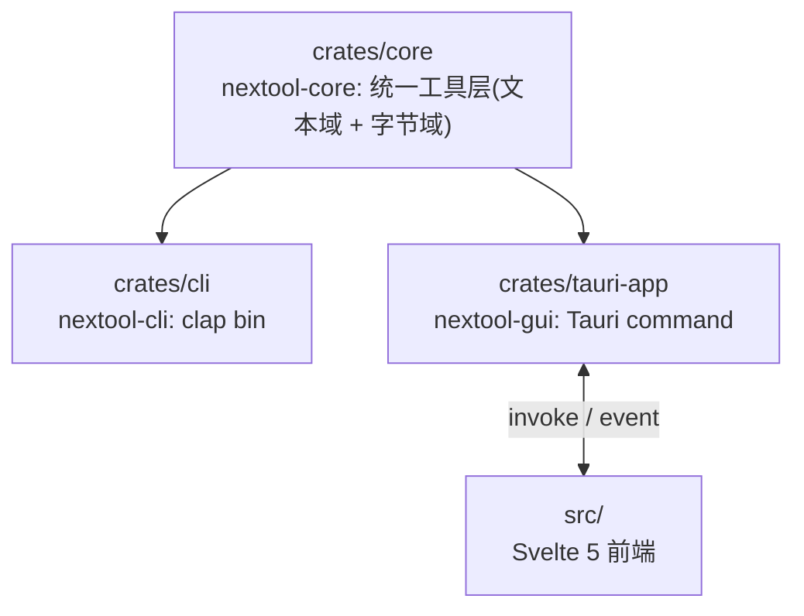
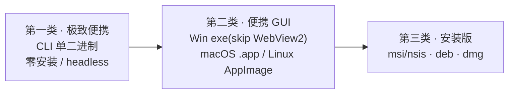
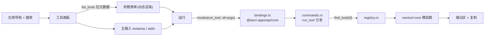

# 技术

> 技术栈、架构、构建命令与设计依据。每个决策标注来源:参考仓库(`reference/competitors/`,git 忽略)与官方文档。

## 技术栈

| 维度 | 决策 | 依据 |
|---|---|---|
| 桌面框架 | Tauri | 系统原生 WebView,产物 5–15MB,对比 Electron 80–200MB |
| 前端 | Svelte 5 + Vite + TypeScript | 编译期消除运行时,前端基线最小;Tauri 官方一等支持 |
| 后端 | Rust | 单二进制、无运行时依赖、crypto/编码 crate 成熟 |
| CLI | 独立 clap 二进制 | 几 MB、headless 可用、进 CI/管道;与 GUI 共享 core |
| Windows 链接器 | MSVC target | Tauri Windows 官方推荐;gnu target 编译 windows-sys(Tauri 依赖)栈溢出 ICE,弃用 |
| 错误 | thiserror(core) | 统一错误类型,GUI 层序列化为前端可读 |

## Cargo Workspace



```
NexToolkit/
├── Cargo.toml                # workspace + 共享 release profile
├── crates/
│   ├── core/                 # 统一工具层:文本域(&str→String)+ 字节域(&[u8]→Vec[u8]),按种类子文件夹(mod.rs 逻辑 + tools.rs 注册)+ registry 聚合 54 文本工具,可独立单测
│   │   └── src/fileconv/     # 文件转换(字节域):archive/image/pdf 纯内存 + engine 子进程 trait port + fs_util IO 边界
│   ├── cli/                  # clap 子命令,调 core;tests/cli_smoke.rs 集成测试
│   └── tauri-app/            # Tauri command 薄封装 + tauri.conf.json + capabilities
├── src/                      # Svelte 5 前端
├── docs/                     # prd / tech / todo / api / flow
├── reference/                # 竞品源码(git 忽略,本地分析)
└── .github/workflows/        # ci.yml + release.yml(三平台)
```

## 双域架构

core 统一承载文本域(`&str→String`)与字节域(`&[u8]→Vec<u8>`)。归档/图像是二进制数据,强制 String 会引入 base64 开销与 UTF-8 错误风险,故字节域独立子模块 `fileconv/`(非独立 crate)。字节域复用 core 根的 `ToolError`(单一错误定义,无新变体),分模块:

- `archive` 模块:归档纯内存逻辑(解压/压缩/互转/检测/路径安全,含 7z 解压),feature gate。
- `image` 模块:图像纯内存逻辑(格式互转/缩放/检测),feature gate;仅启用常用栅格格式(png/jpeg/gif/bmp/webp/tiff/ico)控制体积。
- `pdf` 模块:PDF 纯内存逻辑(拆分/旋转/加密/解密/加密检测),feature gate;lopdf default-features=false 去重依赖。
- `engine` 模块:外部引擎子进程桥接(ffmpeg/LibreOffice/calibre/ghostscript/tesseract),`EngineRunner` trait port + `SubprocessRunner`(prod)+ `FakeRunner`(test,可 mock),运行时探测 + 命令构造,无 feature gate。
- `path` 模块:纯字符串路径计算(产物路径 + 碰撞后缀),无 feature gate,各域复用。
- `fs_util` 模块:IO 边界,组合各域纯逻辑 + `std::fs` 落盘;`write_output`/`retry_unique` 抽取消重复,补 `list_archive_file`/`is_pdf_encrypted_file`/`engine_convert_file`,函数级 feature gate,供 CLI/GUI 共享。

core 另含纯 Rust 域:`http`(URL 探测,ureq/rustls)、`unit`(单位换算 10 类,纯数学);crypto 加 rsa_sign/rsa_verify;encode 加 jwt_verify。

## 模块设计

core 按种类分子文件夹(encode/text/convert/format/generate/crypto/nettime/unit/http + fileconv 子模块)。文本域种类为文件夹 `{module}/{mod.rs, tools.rs}`:`mod.rs` 裸函数逻辑 + `#[cfg(test)]` 测试,`tools.rs` struct + `impl Tool` 注册(供 registry 聚合);convert 额外有 `ir.rs`(DocFormat IR)。fileconv 子模块为单文件(archive/image/pdf/engine/fs_util/path)。输入输出为普通 Rust 类型,错误统一为 `ToolError`。CLI 与 GUI 调同一函数,行为一致。

```rust
//! nextool-core:编解码模块(mod.rs)

/// Base64 标准编码
pub fn base64_encode(input: &str) -> ToolResult<String> { ... }

/// Base64 标准解码(容忍首尾空白)
pub fn base64_decode(input: &str) -> ToolResult<String> { ... }
```

```rust
//! encode/tools.rs:元数据 + 字符串参数适配,供 registry 聚合
pub struct Base64Encode;
impl Tool for Base64Encode {
    fn meta(&self) -> &'static ToolMeta {
        static META: ToolMeta = ToolMeta { id: "base64_encode", name: "Base64 编码", ... };
        &META
    }
    fn run(&self, input: &str, _args: &ToolArgs) -> ToolResult<String> { base64_encode(input) }
}
```

文本工具采用统一 `Tool` trait(元数据 + 字符串参数执行一体),54 个文本工具经 `registry::tools()` 自描述供 GUI 动态渲染;文件工具(字节域/路径)I/O 模型不同不进此 trait,保留各自类型化命令。设计参考 CyberChef `Operation`(`reference/competitors/CyberChef/src/core/operations/`)与 DevToys 同工具双接口(`reference/competitors/DevToys/src/app/dev/DevToys.Api/`),实现时简化。

## 工具注册表

`registry.rs` 定义 `Tool` trait(`meta()` 返回静态元数据 + `run()` 字符串参数执行)与配套类型:`ToolMeta`(id/名称/分组/参数 schema/needs_main_input/output_kind)、`ParamSpec`/`ParamKind`(UI 渲染 + 字符串解析)、`OutputKind`(Text/Highlight/Svg)、`ToolArgs`(类型强转 helper,消除每工具手写 parse)。`tools()` 返回全部 54 个注册工具,`find_tool()` 按 id 查找供 `run_tool` 分发。

枚举加 strum 派生(`AsRefStr`/`EnumString`/`EnumIter`):`HashAlgo`/`CaseMode`/`ArchiveFormat`/`ImageFormat`。CLI 删 `*Arg` 适配器直接用 core 枚举(clap 经 `EnumString` 解析);GUI 删 `parse_*`,前端传字符串由 `ToolArgs` 转换。

GUI 经 `list_tools` 命令拉取元数据列表动态渲染参数表单,`run_tool(id, input, args)` 通用分发——新增文本工具只追加一个 `impl Tool`,无需改前端或加命令。`ToolError` 扩展至 12 变体(原 Utf8/Base64/Json/Io/EmptyInput/InvalidInput/Parse/Other + 新增 Yaml/Toml/Csv/Regex)。`PasswordOpts::default()`(upper/lower/digits=true, symbols=false)下沉 core,CLI/GUI 共用。

## 三类分发(便携度递减)



依据:市面工具按便携度分三类的共识(调研)。Windows 便携用 `webviewInstallMode: { type: "skip" }`(Win11 默认预装 WebView2),不嵌 runtime(嵌入增 100–200MB,违背轻量)。

## 前端架构



- `list_tools` 动态渲染:前端经 `list_tools` 命令拉取 registry 元数据(分组/参数 schema/needs_main_input/output_kind)渲染参数表单,新增文本工具只追加一个 `impl Tool`,无需改前端。
- `bindings.ts`:用官方 `@tauri-apps/api/core` invoke(非手写内部访问)。
- 暗色主题、中英双语切换、qr 输出 SVG 内联渲染。
- 参考 it-tools(Vue3 工具集,布局/复制交互/i18n)+ tauri2-svelte5-shadcn(runes + invoke 封装)+ OpenCovibe(集中式 API)+ comine(capabilities scope)。

## 命令

```bash
npm install                           # 前端依赖
cargo fetch                           # Rust 依赖
npm run tauri dev                     # GUI 开发(热重载)
cargo run -p nextool-cli -- <工具>    # CLI 开发
cargo build -p nextool-cli --release  # CLI 单二进制
npm run tauri build                   # GUI 全形态
cargo test -p nextool-core -p nextool-cli       # 测试(真实数据)
cargo clippy -p nextool-core -p nextool-cli -- -D warnings
cargo fmt --check --all
npm run check                         # svelte-check
```

> clippy 限定 core+cli:GUI 的 `generate_context!` 编译期读 `tauri.conf.json` 并校验 frontendDist,需前端 dist 已构建,故 GUI 编译验证由 CI tauri-build job 负责。

## 测试

准则:真实调用、真实数据,禁止 mock。优先用最高 seam(纯逻辑单测),全仓 seam 最少——仅 `EngineRunner` trait port 一处用 `FakeRunner` 测试桩(测试中无法真起 ffmpeg/LibreOffice)。

- core 单测(各模块 `mod.rs` 内 `#[cfg(test)]`):每工具 ≥3 用例(正常/边界/错误)。
- CLI 集成测试(`crates/cli/tests/cli_smoke.rs`):`assert_cmd` 真起二进制,覆盖路由/stdin/退出码。
- GUI:由 CI tauri-build 三平台编译验证(本机内存受限无法编译 Tauri 全依赖图)。

## 避坑

1. **不手写 crypto**:PBKDF2/AES-GCM/RSA/Argon2/HMAC/Hash 全用成熟 crate。
2. **commands.rs 13 个命令**:10 文件命令(archive 4 + image 2 + pdf 4,签名各异独立注册)+ 3 通用命令(list_tools/run_tool/list_file_tools),文本工具经 `run_tool` 通用分发不再逐个注册。
3. **Capabilities 最小权限**:仅 `core:default` + `windows: ["main"]`,CSP 锁紧(`script-src 'self'`)。
4. **Windows WebView2**:`skip` + 文档说明;不嵌 runtime。
5. **体积优化**:release profile `lto`/`opt-level="z"`/`codegen-units=1`/`panic="abort"`/`strip`;前端 Svelte。
6. **fileconv feature gate**:core 的 `archive` feature(默认开)条件依赖 `zip`/`tar`/`flate2`;`fs_util` 同 gate(依赖 archive 函数)。`--no-default-features` 可禁用归档独立使用。
7. **GUI 文件转换**:command 接收路径,后端 `std::fs` 读写(Rust 后端不受 capabilities 约束),仅 `tauri-plugin-dialog` 取路径,无需 fs 插件,capabilities 仅加 `dialog:default` 保持最小权限。
8. **产物碰撞**:`OpenOptions::create_new(true)` 原子检查无 TOCTOU 竞态,迭代 `_converted`→`(1)`→`(2)` 后缀,不静默覆盖。

## 依据来源

| 来源 | 路径 | 用途 |
|---|---|---|
| DevToys | `reference/competitors/DevToys/` | 分层/分类/同契约/避坑 |
| CyberChef | `reference/competitors/CyberChef/` | 操作模型/分类配置 |
| Boop | `reference/competitors/Boop/` | 脚本模型/避坑 |
| it-tools | `reference/competitors/it-tools/` | 前端布局/交互/i18n |
| tauri2-svelte5-shadcn | `reference/competitors/tauri2-svelte5-shadcn/` | Tauri+Svelte runes/invoke/错误处理 |
| OpenCovibe | `reference/competitors/OpenCovibe/` | 集中式 API/Builder 链 |
| comine | `reference/competitors/comine/` | capabilities scope/ts-rs |

`UNVERIFIED:` DevToys 接口确切路径未逐一核实;各竞品实际产物体积未编译测量。
