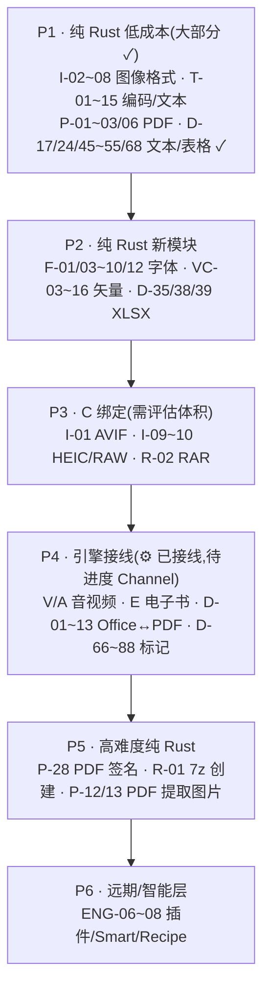

# 待办

> 对标 freeconvert 全功能(1500+ 转换)的缺口清单。粒度到单个格式转换/单个功能。
> 状态:✓ 已交付 · ☐ 待做 · ⚙ 引擎框架就绪待接线 · 🚫 非目标(违背纯本地定位)
> 依赖:`纯 Rust` = Rust crate 原生 · `引擎` = 外部子进程(ffmpeg/LibreOffice/calibre/ghostscript/tesseract)· `C 绑定` = 需 C 库链接

## 总览:对标 freeconvert 九大类

| 类别 | freeconvert 规模 | NexToolkit 现状 | 缺口数 |
|---|---|---|---|
| 文档转换 | ~30 格式 × N 组合 ≈ 325 对 | 15 对(MD→HTML/TXT + JSON↔YAML/TOML/CSV/XML + CSV↔TSV/YAML/XML + TSV↔JSON + YAML↔TOML/XML + TOML↔XML + PDF/DOCX→TXT) | ~310 对 |
| 音视频转换 | 30+ 格式 × N 组合 | 6 引擎接线(ffmpeg 通用) | ~80 |
| 图像转换 | 500+ 格式 | 14 格式互转(169 对,DDS 单向)+ 裁剪/翻转/滤镜/亮度/JPEG压缩 | ~322 对(含 RAW 单向) |
| 电子书转换 | 30+ 转换 | 6 引擎接线(calibre 通用) | ~25 |
| PDF 套件 | 15+ 工具 | 13(拆分4+旋转3角度+加解密+合并+删除/提取页+元数据+页码)+ 压缩/OCR(引擎) | ~18 |
| 归档转换 | 50+ 转换 | zip/tar/targz/gz/7z + bz2/xz/zst(8 格式) | ~16 |
| 字体转换 | 6 格式互转 | 3(TTF↔WOFF + 元数据) | ~9 |
| 矢量转换 | 14+ 格式 | 2(SVG→PNG/JPG) | ~14 |
| 编码/文本/加密/时间 | — | 107 文本工具 | 21 项 |

**缺口总计:~815 对/项**(含互转对;不含已交付 107 文本工具 + 34 文件工具)。下文逐类展开,含 N×M 互转矩阵。

---

## 一、文档转换(最大缺口,当前 15 对)

> **文档格式分四类**:Office 文档(Word/Excel/PPT)· 轻量标记(MD/HTML/TXT/RST/AsciiDoc/Org/Tex)· 电子表(CSV/JSON/YAML/TOML/XML)· PDF(见第五节 PDF 套件)。
> 引擎:LibreOffice headless(Office 互转/Office↔PDF)+ pandoc(轻量标记互转)+ lopdf(PDF 文本提取)。
> 纯 Rust 路径:docx/xlsx/pptx 是 OOXML(zip+XML),可用 `zip`+`quick-xml` 解析;md/html/txt 已有部分;CSV/JSON/YAML/TOML/XML 已有。
> **核心发现**:NexToolkit 当前只交付 **md→html 1 对**;freeconvert 文档类 40+ 格式 × N 组合 ≈ **500+ 对**。

### 1.0 文档格式清单(四类,~30 格式)

| 类别 | 格式 | 当前状态 | 引擎 |
|---|---|---|---|
| **Word 文档** | DOC · DOCX · DOCM · DOTX · DOTM · RTF · ODT · WPS · WPD · PAGES | 全缺 | LibreOffice / docx-rs(纯 Rust DOCX) |
| **电子表格** | XLS · XLSX · XLSM · XLT · XLTX · ODS · CSV · TSV · FODS | CSV 已有,余缺 | LibreOffice / calamine + rust_xlsxwriter(纯 Rust) |
| **演示文稿** | PPT · PPTX · PPS · PPSX · ODP · POT · POTX · KEY | 全缺 | LibreOffice |
| **轻量标记** | MD · HTML · TXT · RST · AsciiDoc(.adoc) · Org · Tex/LaTeX · MediaWiki · Textile · OPML · IPYNB(Jupyter) | MD→HTML 已有,余缺 | pandoc / 纯 Rust(pulldown-cmark) |
| **PDF 相关** | PDF · XPS · OXPS | PDF 工具套见第五节 | lopdf / Ghostscript |
| **其他文档** | CHM(编译 HTML) · DJVU · DBF · HWP(韩文) | 全缺 | calibre / djvulibre |

### 1.1 Office ↔ PDF(N×1,8 Word/Sheet/Slide 格式 → PDF)

| # | 转换 | 依赖 | 状态 |
|---|---|---|---|
| D-01 | DOCX → PDF | LibreOffice ⚙ / 纯 Rust(docx-rs + printpdf,有限) | ☐ ⚙ |
| D-02 | DOC → PDF | LibreOffice ⚙ | ☐ ⚙ |
| D-03 | XLSX → PDF | LibreOffice ⚙ | ☐ ⚙ |
| D-04 | XLS → PDF | LibreOffice ⚙ | ☐ ⚙ |
| D-05 | PPTX → PDF | LibreOffice ⚙ | ☐ ⚙ |
| D-06 | PPT → PDF | LibreOffice ⚙ | ☐ ⚙ |
| D-07 | ODT → PDF | LibreOffice ⚙ | ☐ ⚙ |
| D-08 | ODS → PDF | LibreOffice ⚙ | ☐ ⚙ |
| D-09 | ODP → PDF | LibreOffice ⚙ | ☐ ⚙ |
| D-10 | RTF → PDF | LibreOffice ⚙ / 纯 Rust | ☐ ⚙ |
| D-11 | DOCM/DOTX/DOTM → PDF(Word 模板/宏) | LibreOffice ⚙ | ☐ ⚙ |
| D-12 | XLSM/XLTX → PDF(Excel 模板/宏) | LibreOffice ⚙ | ☐ ⚙ |
| D-13 | PPS/PPSX/POTX → PDF(PPT 模板/幻灯片) | LibreOffice ⚙ | ☐ ⚙ |

### 1.2 PDF → Office(1×N,PDF 反向提取,质量有限)

| # | 转换 | 依赖 | 状态 |
|---|---|---|---|
| D-14 | PDF → DOCX(PDF to Word,文本+布局) | LibreOffice ⚙ / pdf-extract | ☐ ⚙ |
| D-15 | PDF → XLSX(PDF to Excel,表格识别) | LibreOffice ⚙ / tabula-rs | ☐ ⚙ |
| D-16 | PDF → PPTX | LibreOffice ⚙ | ☐ ⚙ |
| D-17 | PDF → TXT(纯文本提取) | lopdf(纯 Rust) | ✓ |
| D-18 | PDF → RTF | LibreOffice ⚙ | ☐ ⚙ |
| D-19 | PDF → ODT | LibreOffice ⚙ | ☐ ⚙ |

### 1.3 Office 同类互转(N×M,Word 家族内部)

> Word 家族 6 格式:DOC/DOCX/RTF/ODT/TXT/HTML。**全互转 = C(6,2)×2 = 30 对**。

| # | 转换对 | 依赖 | 状态 |
|---|---|---|---|
| D-20 | DOCX ↔ DOC | LibreOffice ⚙ | ☐ ⚙ |
| D-21 | DOCX ↔ ODT | LibreOffice ⚙ | ☐ ⚙ |
| D-22 | DOCX ↔ RTF | LibreOffice ⚙ / docx-rs | ☐ ⚙ |
| D-23 | DOCX ↔ HTML | LibreOffice ⚙ / pandoc | ☐ ⚙ |
| D-24 | DOCX → TXT | 纯 Rust(zip+quick-xml) | ✓ |
| D-25 | DOC ↔ ODT | LibreOffice ⚙ | ☐ ⚙ |
| D-26 | DOC ↔ RTF | LibreOffice ⚙ | ☐ ⚙ |
| D-27 | DOC ↔ HTML | LibreOffice ⚙ | ☐ ⚙ |
| D-28 | DOC ↔ TXT | LibreOffice ⚙ | ☐ ⚙ |
| D-29 | ODT ↔ RTF | LibreOffice ⚙ | ☐ ⚙ |
| D-30 | ODT ↔ HTML | LibreOffice ⚙ | ☐ ⚙ |
| D-31 | ODT ↔ TXT | LibreOffice ⚙ / 纯 Rust | ☐ |
| D-32 | RTF ↔ HTML | LibreOffice ⚙ / 纯 Rust | ☐ |
| D-33 | RTF ↔ TXT | 纯 Rust(RTF 文本提取) | ☐ |
| D-34 | HTML ↔ TXT(去标签) | 纯 Rust(htmlescape 已有) | ☐ |

### 1.4 电子表格互转(N×M)

> 表格家族:XLSX/XLS/ODS/CSV/TSV/JSON/YAML。**全互转 = C(7,2)×2 = 42 对**(CSV/JSON/YAML 已有部分)。

| # | 转换对 | 依赖 | 状态 |
|---|---|---|---|
| D-35 | XLSX ↔ CSV | calamine(读) + rust_xlsxwriter(写) 纯 Rust | ☐ |
| D-36 | XLSX ↔ XLS | LibreOffice ⚙ | ☐ ⚙ |
| D-37 | XLSX ↔ ODS | LibreOffice ⚙ | ☐ ⚙ |
| D-38 | XLSX ↔ TSV | calamine + rust_xlsxwriter | ☐ |
| D-39 | XLSX ↔ JSON | rust_xlsxwriter / calamine | ☐ |
| D-40 | XLSX ↔ YAML | 纯 Rust(已有 json↔yaml + xlsx↔json) | ☐ |
| D-41 | XLS ↔ CSV | LibreOffice ⚙ | ☐ ⚙ |
| D-42 | XLS ↔ ODS | LibreOffice ⚙ | ☐ ⚙ |
| D-43 | ODS ↔ CSV | LibreOffice ⚙ / 纯 Rust | ☐ ⚙ |
| D-44 | ODS ↔ TSV | LibreOffice ⚙ | ☐ ⚙ |
| D-45 | CSV ↔ TSV | 纯 Rust(分隔符替换) | ✓ |
| D-46 | CSV ↔ JSON | ✓ 已交付(core) | ✓ |
| D-47 | CSV ↔ YAML | 纯 Rust(经 json 中转) | ✓ |
| D-48 | CSV ↔ XML | 纯 Rust | ✓ |
| D-49 | TSV ↔ JSON | 纯 Rust | ✓ |
| D-50 | JSON ↔ YAML | ✓ 已交付 | ✓ |
| D-51 | JSON ↔ TOML | ✓ 已交付 | ✓ |
| D-52 | JSON ↔ XML | 纯 Rust(quick-xml) | ✓ |
| D-53 | YAML ↔ TOML | 纯 Rust(经 json 中转) | ✓ |
| D-54 | YAML ↔ XML | 纯 Rust | ✓ |
| D-55 | TOML ↔ XML | 纯 Rust | ✓ |
| D-56 | JSON ↔ XLSX | rust_xlsxwriter | ☐ |

### 1.5 演示文稿互转(N×M)

> PPT 家族:PPT/PPTX/ODP/PPS/PPSX/POT/POTX/KEY。**全互转 = C(8,2)×2 = 56 对**。

| # | 转换对 | 依赖 | 状态 |
|---|---|---|---|
| D-57 | PPTX ↔ PPT | LibreOffice ⚙ | ☐ ⚙ |
| D-58 | PPTX ↔ ODP | LibreOffice ⚙ | ☐ ⚙ |
| D-59 | PPTX ↔ PPS/PPSX(幻灯片放映格式) | LibreOffice ⚙ | ☐ ⚙ |
| D-60 | PPTX ↔ POT/POTX(模板) | LibreOffice ⚙ | ☐ ⚙ |
| D-61 | PPT ↔ ODP | LibreOffice ⚙ | ☐ ⚙ |
| D-62 | PPT ↔ PPS | LibreOffice ⚙ | ☐ ⚙ |
| D-63 | ODP ↔ PPS | LibreOffice ⚙ | ☐ ⚙ |
| D-64 | KEY → PPTX(Apple Keynote) | LibreOffice(有限) | ☐ ⚙ |

### 1.6 轻量标记语言互转(N×M,核心缺口 — md 归此类)

> 标记家族:**MD · HTML · TXT · RST · AsciiDoc · Org · Tex · MediaWiki · Textile · OPML · IPYNB**。共 11 格式。
> **全互转 = C(11,2)×2 = 110 对**。当前仅 MD→HTML 1 对交付。
> 引擎:pandoc(全互转,外部子进程)· 纯 Rust(pulldown-cmark 处理 MD 子集)。

| # | 转换对 | 依赖 | 状态 |
|---|---|---|---|
| D-65 | **MD ↔ HTML** | ✓ 已交付(pulldown-cmark) | ✓ |
| D-66 | MD → PDF(MD→HTML→PDF 链路) | pandoc ⚙ / printpdf(纯 Rust) | ☐ |
| D-67 | MD → DOCX | pandoc ⚙ / docx-rs(纯 Rust) | ☐ ⚙ |
| D-68 | MD → TXT(去标记) | pulldown-cmark | ✓ |
| D-69 | MD → RST | pandoc ⚙ | ☐ ⚙ |
| D-70 | MD → AsciiDoc(.adoc) | pandoc ⚙ | ☐ ⚙ |
| D-71 | MD → Org | pandoc ⚙ | ☐ ⚙ |
| D-72 | MD → Tex/LaTeX | pandoc ⚙ | ☐ ⚙ |
| D-73 | MD → MediaWiki | pandoc ⚙ | ☐ ⚙ |
| D-74 | MD → Textile | pandoc ⚙ | ☐ ⚙ |
| D-75 | MD → OPML(大纲) | pandoc ⚙ | ☐ ⚙ |
| D-76 | MD → IPYNB(Jupyter Notebook) | pandoc ⚙ | ☐ ⚙ |
| D-77 | HTML ↔ PDF | wkhtmltopdf ⚙ / printpdf(纯 Rust,有限) | ☐ |
| D-78 | HTML → DOCX | pandoc ⚙ / LibreOffice ⚙ | ☐ ⚙ |
| D-79 | HTML → TXT | 纯 Rust | ☐ |
| D-80 | HTML → RST/AsciiDoc/Org/Tex | pandoc ⚙ | ☐ ⚙ |
| D-81 | RST ↔ HTML/MD/Tex/... | pandoc ⚙ | ☐ ⚙ |
| D-82 | AsciiDoc ↔ HTML/MD/Tex/... | pandoc ⚙ / asciidoctor ⚙ | ☐ ⚙ |
| D-83 | Org ↔ HTML/MD/Tex/... | pandoc ⚙ | ☐ ⚙ |
| D-84 | Tex ↔ HTML/MD/PDF | pandoc ⚙ / tectonic(纯 Rust LaTeX) | ☐ ⚙ |
| D-85 | MediaWiki ↔ HTML/MD | pandoc ⚙ | ☐ ⚙ |
| D-86 | Textile ↔ HTML/MD | pandoc ⚙ | ☐ ⚙ |
| D-87 | OPML ↔ HTML/MD | pandoc ⚙ | ☐ ⚙ |
| D-88 | IPYNB ↔ HTML/MD/Py | pandoc ⚙ / nbformat(纯 Rust) | ☐ ⚙ |
| D-89 | TXT → PDF | 纯 Rust(printpdf) | ☐ |
| D-90 | TXT → DOCX | docx-rs(纯 Rust) | ☐ |
| D-91 | TXT → HTML(简单包装) | 纯 Rust | ☐ |
| D-92 | XML → PDF | 纯 Rust(printpdf + xml 解析) | ☐ |

### 1.7 其他文档格式

| # | 转换 | 依赖 | 状态 |
|---|---|---|---|
| D-93 | CHM → PDF(编译 HTML 帮助) | calibre ⚙ / chmlib | ☐ ⚙ |
| D-94 | CHM → HTML(解包) | chmlib / 纯 Rust | ☐ |
| D-95 | DJVU → PDF | djvulibre ⚙(C 绑定) | ☐ ⚙ |
| D-96 | XPS → PDF(XML Paper Spec) | 纯 Rust(有限)/ Ghostscript ⚙ | ☐ ⚙ |
| D-97 | HWP → PDF(韩文 Hanword) | LibreOffice(有限) | ☐ ⚙ |
| D-98 | WPS → DOCX(金山 Writer) | LibreOffice ⚙ | ☐ ⚙ |
| D-99 | WPD → DOCX(WordPerfect) | LibreOffice ⚙ | ☐ ⚙ |
| D-100 | DBF → CSV/xLSX(dBase 数据库) | 纯 Rust(dbf-rs) | ☐ |

### 1.8 互转对数总览(文档)

| 家族 | 格式数 | 全互转对数(C(N,2)×2) | 当前交付 | 缺口 |
|---|---|---|---|---|
| Word 家族(DOC/DOCX/RTF/ODT/TXT/HTML) | 6 | 30 | 0(MD→HTML 不属此,MD 属标记) | 30 |
| 表格家族(XLSX/XLS/ODS/CSV/TSV/JSON/YAML/TOML/XML) | 9 | 72 | 4(JSON↔YAML/TOML/CSV 已有) | 68 |
| PPT 家族(PPT/PPTX/ODP/PPS/PPSX/POT/POTX/KEY) | 8 | 56 | 0 | 56 |
| 标记家族(MD/HTML/TXT/RST/AsciiDoc/Org/Tex/MediaWiki/Textile/OPML/IPYNB) | 11 | 110 | 1(MD→HTML) | 109 |
| Office↔PDF(1.1+1.2) | — | 22(单向) | 0 | 22 |
| 其他文档(CHM/DJVU/XPS/HWP/WPS/WPD/DBF) | 7 | ~14 | 0 | 14 |
| **合计** | **~30 格式** | **~303 对 + 22 单向 = ~325** | **15** | **~310** |

**关键发现**:文档是最大缺口(~325 对 vs 当前 15 对)。纯 Rust 可覆盖:表格家族经 JSON 中转链(CSV/TSV/JSON/YAML/TOML/XML 互转 ~30 对)+ DOCX/TXT 文本提取 + MD 纯文本。Office 互转与高质量 Office↔PDF 必须 LibreOffice。标记语言全互转必须 pandoc。

---

## 二、音视频转换(~80 项,⚙ 框架就绪)

> 引擎:ffmpeg 子进程。`core::fileconv::engine` 已实现(参数构造/探测/执行),待接线 CLI/GUI + 进度 Channel。
> 每个格式对含双向(→  &  ←),下表列单向往返数。

### 2.1 视频格式互转(容器/编码)

| # | 转换对 | 常用度 | 状态 |
|---|---|---|---|
| V-01 | MP4 ↔ AVI | 高 | ☐ ⚙ |
| V-02 | MP4 ↔ MOV | 高 | ☐ ⚙ |
| V-03 | MP4 ↔ MKV | 高 | ☐ ⚙ |
| V-04 | MP4 ↔ WebM | 高 | ☐ ⚙ |
| V-05 | MP4 ↔ FLV | 中 | ☐ ⚙ |
| V-06 | MP4 ↔ WMV | 中 | ☐ ⚙ |
| V-07 | MP4 ↔ MPEG/MPG | 中 | ☐ ⚙ |
| V-08 | MP4 ↔ 3GP | 低 | ☐ ⚙ |
| V-09 | MP4 ↔ VOB | 低 | ☐ ⚙ |
| V-10 | MP4 ↔ M4V | 中 | ☐ ⚙ |
| V-11 | MP4 ↔ MTS/M2TS | 中 | ☐ ⚙ |
| V-12 | MP4 ↔ MXF | 低 | ☐ ⚙ |
| V-13 | MP4 ↔ TS | 中 | ☐ ⚙ |
| V-14 | MP4 ↔ OGV | 低 | ☐ ⚙ |
| V-15 | MP4 ↔ QT(QuickTime) | 低 | ☐ ⚙ |
| V-16 | MP4 ↔ F4V/F4P | 低 | ☐ ⚙ |
| V-17 | MOV ↔ AVI | 中 | ☐ ⚙ |
| V-18 | MOV ↔ MKV | 中 | ☐ ⚙ |
| V-19 | MOV ↔ WebM | 中 | ☐ ⚙ |
| V-20 | MKV ↔ AVI | 中 | ☐ ⚙ |
| V-21 | MKV ↔ WebM | 高 | ☐ ⚙ |
| V-22 | WebM ↔ AVI | 低 | ☐ ⚙ |
| V-23 | AVI ↔ MOV | 中 | ☐ ⚙ |
| V-24 | FLV ↔ MP4 | 中 | ☐ ⚙ |
| V-25 | WMV ↔ MP4 | 中 | ☐ ⚙ |
| V-26 | GIF ↔ MP4(video to GIF 反向) | 高 | ☐ ⚙ |

### 2.2 视频处理(单文件操作)

| # | 功能 | 状态 |
|---|---|---|
| V-27 | 视频剪切/截取(起止时间) | ☐ ⚙ |
| V-28 | 视频拼接(多视频合并) | ☐ ⚙ |
| V-29 | 视频变速(加速/减速) | ☐ ⚙ |
| V-30 | 视频翻转/镜像 | ☐ ⚙ |
| V-31 | 视频旋转(90/180/270) | ☐ ⚙ |
| V-32 | 视频裁剪(画面区域) | ☐ ⚙ |
| V-33 | 视频缩放(分辨率) | ☐ ⚙ |
| V-34 | 视频抽帧(提取帧为图片序列) | ☐ ⚙ |
| V-35 | 视频去水印/去字幕 | 🚫 需逐帧 AI,超范围 |
| V-36 | 视频元数据查看/编辑 | ☐ ⚙ |
| V-37 | 视频字幕嵌入/提取 | ☐ ⚙ |
| V-38 | 视频音轨提取/替换 | ☐ ⚙ |
| V-39 | 视频编码选择(H.264/H.265/VP9/AV1) | ☐ ⚙ |
| V-40 | 视频码率/质量控制(CRF) | ☐ ⚙ |
| V-41 | 视频帧率转换 | ☐ ⚙ |
| V-42 | 视频宽高比调整 | ☐ ⚙ |
| V-43 | 视频反转(倒放) | ☐ ⚙ |

### 2.3 音频格式互转

| # | 转换对 | 常用度 | 状态 |
|---|---|---|---|
| A-01 | MP3 ↔ WAV | 高 | ☐ ⚙ |
| A-02 | MP3 ↔ AAC | 高 | ☐ ⚙ |
| A-03 | MP3 ↔ FLAC | 高 | ☐ ⚙ |
| A-04 | MP3 ↔ OGG | 高 | ☐ ⚙ |
| A-05 | MP3 ↔ M4A | 高 | ☐ ⚙ |
| A-06 | MP3 ↔ WMA | 中 | ☐ ⚙ |
| A-07 | MP3 ↔ AMR | 低 | ☐ ⚙ |
| A-08 | MP3 ↔ AIFF | 低 | ☐ ⚙ |
| A-09 | MP3 ↔ OPUS | 中 | ☐ ⚙ |
| A-10 | MP3 ↔ MMF | 低 | ☐ ⚙ |
| A-11 | WAV ↔ FLAC | 高 | ☐ ⚙ |
| A-12 | WAV ↔ AAC | 中 | ☐ ⚙ |
| A-13 | WAV ↔ OGG | 中 | ☐ ⚙ |
| A-14 | M4A ↔ WAV | 高 | ☐ ⚙ |
| A-15 | M4A ↔ MP3 | 高 | ☐ ⚙ |
| A-16 | M4A ↔ AAC | 中 | ☐ ⚙ |
| A-17 | AAC ↔ OGG | 中 | ☐ ⚙ |
| A-18 | FLAC ↔ ALAC | 中 | ☐ ⚙ |
| A-19 | OGG ↔ OPUS | 中 | ☐ ⚙ |
| A-20 | 视频提取音频(MP4→MP3/WAV/AAC) | 高 | ☐ ⚙ |

### 2.4 音频处理

| # | 功能 | 状态 |
|---|---|---|
| A-21 | 音频剪切/截取 | ☐ ⚙ |
| A-22 | 音频拼接 | ☐ ⚙ |
| A-23 | 音频淡入/淡出 | ☐ ⚙ |
| A-24 | 音频变速(不改音调) | ☐ ⚙ |
| A-25 | 音频音量调节/归一化 | ☐ ⚙ |
| A-26 | 音频降噪 | ☐ ⚙(有限) |
| A-27 | 音频编码选择 | ☐ ⚙ |
| A-28 | 音频码率控制 | ☐ ⚙ |
| A-29 | 音频声道配置(单/双/5.1) | ☐ ⚙ |
| A-30 | 音频采样率转换 | ☐ ⚙ |
| A-31 | 音频元数据(ID3)查看/编辑 | ☐ 纯 Rust |
| A-32 | 音频封面/专辑图嵌入 | ☐ ⚙ |

---

## 三、图像转换(14 格式已交付 → 全 N×M 互转矩阵)

> 当前:`ImageFormat` 枚举暴露 14 格式(PNG/JPEG/GIF/BMP/WebP/TIFF/ICO/DDS/Farbfeld/HDR/OpenEXR/PNM/QOI/TGA),image crate `load_from_memory` → `encode`,任意可解码 → 任意可编码。
> **缺口本质**:不是单向转换遗漏,而是**支持的格式种类太少** + **编解码能力不对等**(DDS 只能解码不能编码)。

### 3.0 当前 14 格式互转矩阵(已交付,169 对互转)

> image crate `default-features = false`,启用 14 feature。13 格式双向编解码,DDS 仅解码。

| 格式 | 扩展名 | 解码 | 编码 |
|---|---|---|---|
| PNG | `.png` | ✓ | ✓ |
| JPEG | `.jpg` | ✓ | ✓ |
| GIF | `.gif` | ✓ | ✓ |
| BMP | `.bmp` | ✓ | ✓ |
| WebP | `.webp` | ✓ | ✓ |
| TIFF | `.tiff` | ✓ | ✓ |
| ICO | `.ico` | ✓ | ✓ |
| Farbfeld | `.ff` | ✓ | ✓ |
| HDR | `.hdr` | ✓ | ✓ |
| OpenEXR | `.exr` | ✓ | ✓ |
| PNM | `.pbm/.pgm/.ppm/.pam` | ✓ | ✓ |
| QOI | `.qoi` | ✓ | ✓ |
| TGA | `.tga` | ✓ | ✓ |
| DDS | `.dds` | ✓ | ✗(仅解码) |

**互转对数**:13 双向格式 C(13,2)×2 = 156 对 + DDS 单向 → 13 格式 = 13 对,**共 169 对**。无需补任何内部对(DDS 反向需外部编码器,见 3.2)。

### 3.1 image crate feature 格式(7 已交付,AVIF 待做)

> image 0.25 `default-formats` 含 15 格式;NexToolkit 已启用 14(下表 I-02~08),AVIF 因解码需 C 绑定(dav1d)暂缓。

| # | 格式 | 扩展名 | 解码 | 编码 | 依赖(feature) | 状态 |
|---|---|---|---|---|---|---|
| I-01 | AVIF | `.avif` | ✓(需 `avif-native` 或 dav1d) | ✓(ravif,纯 Rust) | `avif` feature | ☐ 纯 Rust(编码)/ C 绑定(解码) |
| I-02 | DDS | `.dds` | ✓ | ✗(只解码) | `dds` feature | ✓ 纯 Rust(只解码) |
| I-03 | Farbfeld | `.ff` | ✓ | ✓ | `ff` feature | ✓ 纯 Rust |
| I-04 | HDR(Radiance) | `.hdr` | ✓ | ✓ | `hdr` feature | ✓ 纯 Rust |
| I-05 | OpenEXR | `.exr` | ✓ | ✓ | `exr` feature | ✓ 纯 Rust |
| I-06 | PNM | `.pbm/.pgm/.ppm/.pam` | ✓ | ✓ | `pnm` feature | ✓ 纯 Rust |
| I-07 | QOI | `.qoi` | ✓ | ✓ | `qoi` feature | ✓ 纯 Rust |
| I-08 | TGA | `.tga` | ✓ | ✓ | `tga` feature | ✓ 纯 Rust |

AVIF 启用后新增 +28 对(14 入 × 2 出),仅需 `Cargo.toml` feature + `ImageFormat` 枚举扩展。解码依赖 C 绑定(dav1d),编码纯 Rust(ravif)。

### 3.2 新格式矩阵(image crate 不支持,需外部库)

> 这些格式 image crate 无原生支持,需引入独立 crate 或 C 绑定。下表算与"已交付 14 格式"的互转对数。

| # | 格式 | 扩展名 | 解码库 | 编码库 | 互转对数(与 14 格式) | 状态 |
|---|---|---|---|---|---|---|
| I-09 | HEIC/HEIF | `.heic/.heif` | libheif(C 绑定) | libheif | +28(14 入 × 2 出) | ☐ C 绑定(高需求,Apple 格式) |
| I-10 | RAW(CR2/CR3/CRW/ARW/NEF/DNG/RAF/ORF/RW2/PEF/3FR/DCR) | 各厂商扩展 | libraw(C) / rawloader(纯 Rust,部分格式) | ✗(一般只解码) | +12 格式 × 14 = +168 对(单向) | ☐ C 绑定 或 纯 Rust(部分) |
| I-11 | PSD | `.psd` | psd crate(纯 Rust) | ✗(只解码) | +14(PSD → 14 格式) | ☐ 纯 Rust |
| I-12 | SVG(矢量栅格化) | `.svg` | resvg/usvg(纯 Rust) | resvg | +28(SVG ↔ 14 栅格) | ☐ 纯 Rust |
| I-13 | SVGZ | `.svgz` | flate2 + resvg | flate2 + resvg | +28 | ☐ 纯 Rust |
| I-14 | EPS | `.eps` | Ghostscript | ✗ | +14(EPS → 14 格式) | ☐ ⚙ 引擎 |
| I-15 | CUR(Windows 光标) | `.cur` | ico crate 复用(纯 Rust) | ✗ | +14(CUR → 14 格式) | ☐ 纯 Rust |
| I-16 | APNG(动画 PNG) | `.apng` | image / libpng | image(首帧) | +14(APNG → 14,首帧) | ☐ 纯 Rust |
| I-17 | 位图 → SVG(矢量追踪) | — | potrace(C 绑定) | potrace | +14(14 栅格 → SVG) | ☐ C 绑定 |

**RAW 详细(12 厂商格式)**:CR2/CR3/CRW(Canon)· ARW(Sony)· NEF(Nikon)· DNG(Adobe)· RAF(Fuji)· ORF(Olympus)· RW2(Panasonic)· PEF(Pentax)· 3FR(Hasselblad)· DCR(Kodak)· PEF/SR2(Sony)· X3F(Sigma)。`rawloader` 纯 Rust 支持 CR2/ARW/NEF/DNG/RAF/ORF 等 ~10 种;CR3/3FR/DCR 需 libraw。

### 3.3 图像处理(单文件操作,与格式互转正交)

| # | 功能 | 依赖 | 状态 |
|---|---|---|---|
| I-18 | 图像裁剪(区域选取) | image(纯 Rust) | ✓ |
| I-19 | 图像旋转/翻转(90/180/270/H/V) | image | ✓(翻转 H/V;旋转走 PDF/P-06) |
| I-20 | 图像水印(文字/图片叠加) | image + rusttype | ☐ |
| I-21 | 图像压缩(质量降低) | image/jpeg encoder | ✓ |
| I-22 | 图像色彩深度(8/16/24/32 位) | image | ☐ |
| I-23 | 图像滤镜(灰度/反相/棕褐/模糊) | image | ✓ |
| I-24 | 图像 EXIF 查看/编辑/清除 | 纯 Rust(kamadak-exif) | ☐ |
| I-25 | 图像 DPI/PPI 修改 | image | ☐ |
| I-26 | 图像转 PDF(多图合并 PDF) | printpdf | ☐ |
| I-27 | 图像批量调整大小 | image(已有 resize,缺批量入口) | ☐ |
| I-28 | 图像颜色调整(亮度/对比度/饱和度) | image | ✓(亮度/对比度;饱和度待补) |
| I-29 | 图像拼贴(多图拼接) | image | ☐ |
| I-30 | 图像到 Word(DOCX 内嵌图) | 纯 Rust(docx-rs) | ☐ |

### 3.4 互转对数总览(图像)

| 层级 | 格式数 | 互转对数(双向,不含自转) | 状态 |
|---|---|---|---|
| 已交付 | 14 | 169 | ✓ |
| +3.2 外部库(HEIC/PSD/SVG/SVGZ/EPS/CUR/APNG/位图→SVG) | +8 → 22 | +154 → 323 | ☐ 混合依赖 |
| +3.2 RAW(12 厂商格式,单向) | +12 → 34 | +168(单向) → 491 | ☐ C 绑定/纯 Rust |
| **理论合计** | **34 格式** | **~491 对** | — |

**关键发现**:14 格式内部互转已完整(169 对),真正缺口是**格式种类**。P3(C 绑定 HEIC/RAW)与 P2(纯 Rust SVG/PSD)是主要扩展方向;AVIF(I-01)是唯一剩余的 feature-gate 项(+28 对,解码需 C 绑定)。

---

## 四、电子书转换(~25 项,⚙ 框架就绪)

> 引擎:calibre(ebook-convert)。`core::fileconv::engine` 已实现(参数构造/探测/执行),待接线。

### 4.1 格式互转

| # | 转换对 | 常用度 | 状态 |
|---|---|---|---|
| E-01 | EPUB ↔ MOBI | 高 | ☐ ⚙ |
| E-02 | EPUB ↔ AZW3 | 高 | ☐ ⚙ |
| E-03 | EPUB → PDF | 高 | ☐ ⚙ |
| E-04 | EPUB → TXT | 中 | ☐ ⚙ |
| E-05 | EPUB → DOCX | 中 | ☐ ⚙ |
| E-06 | MOBI ↔ EPUB | 高 | ☐ ⚙ |
| E-07 | MOBI ↔ AZW3 | 高 | ☐ ⚙ |
| E-08 | MOBI → PDF | 中 | ☐ ⚙ |
| E-09 | AZW ↔ AZW3 | 中 | ☐ ⚙ |
| E-10 | AZW ↔ EPUB | 中 | ☐ ⚙ |
| E-11 | AZW3 → PDF | 中 | ☐ ⚙ |
| E-12 | PDF → AZW3 | 中 | ☐ ⚙ |
| E-13 | FB2 → EPUB | 中 | ☐ ⚙ |
| E-14 | FB2 → MOBI | 低 | ☐ ⚙ |
| E-15 | FB2 → PDF | 低 | ☐ ⚙ |
| E-16 | LRF → EPUB | 低 | ☐ ⚙ |
| E-17 | LIT → EPUB | 低 | ☐ ⚙ |
| E-18 | PDB → EPUB | 低 | ☐ ⚙ |
| E-19 | TXT → EPUB | 中 | ☐ ⚙ |
| E-20 | TXT → MOBI | 中 | ☐ ⚙ |
| E-21 | HTML → EPUB | 中 | ☐ ⚙ |
| E-22 | DOCX → EPUB | 中 | ☐ ⚙ |

### 4.2 漫画/特殊格式

| # | 转换 | 依赖 | 状态 |
|---|---|---|---|
| E-23 | CBR → PDF(漫画) | calibre / unrar | ☐ ⚙ |
| E-24 | CBZ → PDF(漫画) | calibre / zip(已有) | ☐ |
| E-25 | CHM → PDF | calibre | ☐ ⚙ |
| E-26 | DJVU → PDF | calibre / djvulibre | ☐ ⚙ |

### 4.3 电子书处理

| # | 功能 | 状态 |
|---|---|---|
| E-27 | 电子书元数据编辑(标题/作者/封面) | ☐ ⚙ |
| E-28 | 电子书目录(TOC)重建 | ☐ ⚙ |
| E-29 | 电子书字号/边距调整 | ☐ ⚙ |

---

## 五、PDF 套件(13 → ~18 项)

> 已交付:拆分(每页/范围/每N页/奇偶)、旋转(90/180/270)、加密、解密、合并、删除页、提取页、元数据、页码。`lopdf` 纯 Rust。
> 扩展方向:压缩(Ghostscript,引擎已接线)、OCR(tesseract,引擎已接线)、页操作(水印/重排/表单)、PDF→图片/Office。

### 5.1 已有功能增强

| # | 功能 | 现状 | 扩展点 | 状态 |
|---|---|---|---|---|
| P-01 | PDF 拆分 | 每页一个 PDF | 自定义范围(1-3,5,7-10) | ✓ |
| P-02 | PDF 拆分 | — | 每 N 页一个 PDF | ✓ |
| P-03 | PDF 拆分 | — | 奇/偶页分离 | ✓ |
| P-04 | PDF 拆分 | — | 半页拆分(双栏分离) | ☐ |
| P-05 | PDF 旋转 | 全页 90° 顺时针 | 单页旋转(指定页码) | ☐ |
| P-06 | PDF 旋转 | — | 180°/270° | ✓ |
| P-07 | PDF 旋转 | — | 按方向筛选(横/纵页) | ☐ |
| P-08 | PDF 加密 | AES owner=user 同口令 | 权限分离(打印/复制/编辑限制) | ☐ |

### 5.2 新增 PDF 工具

| # | 功能 | 依赖 | 状态 |
|---|---|---|---|
| P-09 | PDF 合并(多 PDF → 一) | lopdf 手动页树 | ✓ |
| P-10 | PDF 压缩/优化 | Ghostscript | ⚙ 引擎接线 |
| P-11 | PDF OCR(扫描件转可搜索) | tesseract | ⚙ 引擎接线 |
| P-12 | PDF 提取图片 | lopdf / pdf-extract | ☐ |
| P-13 | PDF → JPG(每页为图片) | lopdf + pdfium / mupdf | ☐ |
| P-14 | PDF → PNG | pdfium / mupdf | ☐ |
| P-15 | PDF → Word(DOCX 文本提取) | lopdf + docx-rs | ☐ |
| P-16 | PDF → TXT(纯文本提取) | lopdf 纯 Rust | ✓ |
| P-17 | PDF → PPTX | LibreOffice | ☐ ⚙ |
| P-18 | PDF → EPUB | calibre | ☐ ⚙ |
| P-19 | PDF 水印(文字/图片覆盖) | lopdf | ☐ |
| P-20 | PDF 页重排(拖拽排序) | lopdf | ☐ |
| P-21 | PDF 删除页 | lopdf | ✓ |
| P-22 | PDF 提取页(范围 → 新 PDF) | lopdf | ✓ |
| P-23 | PDF 元数据编辑(标题/作者/主题/关键词) | lopdf | ✓ |
| P-24 | PDF 添加页眉/页脚 | lopdf | ☐ |
| P-25 | PDF 添加页码 | lopdf | ✓ |
| P-26 | PDF 展平表单(flatten) | lopdf | ☐ |
| P-27 | PDF/A 转换(归档标准) | Ghostscript | ☐ ⚙ |
| P-28 | PDF 数字签名(区别于 rsa_sign 文本签名) | 纯 Rust(rsa + lopdf) | ☐ |
| P-29 | PDF 表单填写/提取表单数据 | lopdf | ☐ |
| P-30 | PDF 保护(与 P-08 区分:加密码口令) | 已有 encrypt | ✓ |

---

## 六、归档转换(~15 项,部分已交付)

> 已交付:zip/tar/gz/tar.gz 全功能 + 7z 解压。
> 缺:7z 创建、RAR、BZ2、XZ、CAB、ISO、密码保护、分卷。

### 6.1 格式扩展

| # | 功能 | 依赖 | 状态 |
|---|---|---|---|
| R-01 | 7z 创建(目前仅解压) | sevenz-rust2 writer | ☐ |
| R-02 | RAR 解压 | unrar(C++ 绑定) | ☐ |
| R-03 | RAR → ZIP | unrar + zip | ☐ |
| R-04 | RAR → 7Z | unrar + sevenz-rust2 | ☐ |
| R-05 | RAR → TAR | unrar + tar | ☐ |
| R-06 | BZ2 解压/压缩 | bzip2 crate | ✓ |
| R-07 | BZ2 → ZIP | bzip2 + zip | ☐ |
| R-08 | TAR.BZ2 ↔ ZIP | tar + bzip2 | ☐ |
| R-09 | XZ 解压/压缩 | xz2 crate | ✓ |
| R-10 | LZMA 解压 | xz2 | ☐ |
| R-11 | CAB 解压(Windows 安装包) | cab crate | ☐ |
| R-12 | ISO 解压(光盘镜像) | iso9660 / pure Rust | ☐ |
| R-13 | Zstandard 解压/压缩 | zstd crate | ✓ |

### 6.2 归档操作

| # | 功能 | 状态 |
|---|---|---|
| R-14 | 归档密码保护(zip AES 加密) | ☐ |
| R-15 | 归档分卷(spanning,多卷压缩) | ☐ |
| R-16 | 归档修复(RAR 恢复记录) | 🚫 专有格式,依赖 unrar |
| R-17 | 归档批量压缩(多文件夹 → 多归档) | ☐ |
| R-18 | 归档内容预览(不解压查看文本/图片缩略图) | ☐ |
| R-19 | 归档测试完整性(test archive) | ☐ |

**非目标**:RAR 创建(RAR 是专有格式,仅授权 WinRAR 可创建)。

---

## 七、字体转换(~10 项,整类缺失)

> 纯 Rust 路径有限,多数需 C 绑定或 fontTools(Python)。评估 `font-kit` / `ttf-parser` / `woff-rs`。

| # | 转换 | 依赖 | 状态 |
|---|---|---|---|
| F-01 | TTF → OTF | 纯 Rust(ttf-parser + write) | ☐ |
| F-02 | TTF → WOFF | 纯 Rust(flate2 包装) | ✓ |
| F-03 | TTF → WOFF2 | woff2 crate / Brotli | ☐ |
| F-04 | OTF → WOFF | woff crate | ☐ |
| F-05 | OTF → WOFF2 | woff2 | ☐ |
| F-06 | WOFF → WOFF2 | woff + woff2 | ☐ |
| F-07 | WOFF → TTF | 纯 Rust | ✓ |
| F-08 | EOT → TTF | 纯 Rust(EOT 解析简单) | ☐ |
| F-09 | EOT → WOFF | EOT + woff | ☐ |
| F-10 | SVG 字体 → TTF | fontTools / potrace | ☐ ⚙ |

### 7.1 字体处理

| # | 功能 | 状态 |
|---|---|---|
| F-11 | 字体元数据查看(名称/版权/字重) | ✓ |
| F-12 | 字体子集化(精简字形) | ☐ |

---

## 八、矢量转换(~15 项,整类缺失)

> 矢量格式互转:SVG 已有生态(纯 Rust `resvg`/`usvg`),其他格式多需 C 绑定或 Ghostscript。

| # | 转换 | 依赖 | 状态 |
|---|---|---|---|
| VC-01 | SVG → PNG(栅格化) | resvg | ✓ |
| VC-02 | SVG → JPG | resvg + image | ✓ |
| VC-03 | SVG → PDF | resvg + printpdf | ☐ |
| VC-04 | EMF → PNG | libemf(C 绑定) | ☐ |
| VC-05 | EMF → SVG | libemf | ☐ |
| VC-06 | WMF → PNG | libwmf(C 绑定) | ☐ |
| VC-07 | WMF → SVG | libwmf | ☐ |
| VC-08 | AI → PNG(Adobe Illustrator) | Ghostscript / uniconvertor | ☐ ⚙ |
| VC-09 | AI → SVG | uniconvertor | ☐ ⚙ |
| VC-10 | CDR → PNG(CorelDRAW) | uniconvertor | ☐ ⚙ |
| VC-11 | CDR → SVG | uniconvertor | ☐ ⚙ |
| VC-12 | CGM → PNG/SVG | uniconvertor | ☐ ⚙ |
| VC-13 | CMX → PNG/SVG | uniconvertor | ☐ ⚙ |
| VC-14 | PLT → SVG(AutoCAD plotter) | 纯 Rust(HPGL 解析) | ☐ |
| VC-15 | 位图 → SVG(矢量追踪) | potrace | ☐ |
| VC-16 | PDF → SVG(矢量提取) | pdf2svg / mupdf | ☐ ⚙ |

---

## 九、编码/文本/加密/时间(已交付 107,补充 21 项)

> 已覆盖:base64/url/html/hex/jwt/base32/58/85/punycode/qp/morse/braille/零宽、json/yaml/toml/csv/xml互转/md、hash/hmac/hmac-multi/uuid/password/lorem/qr、case/sort/dedup/reverse/regex/diff/stats/trim/tab↔space/align/replace/escape/number-lines、aes-gcm/chacha20/rsa/ed25519/kdf/bcrypt/crc、ipcalc/timestamp/cron/dns/http、unit 10 类。

### 9.1 编码补充

| # | 功能 | 状态 |
|---|---|---|
| T-01 | Base32 编解码 | ✓ 纯 Rust(RFC 4648) |
| T-02 | Base58 编解码 | ✓ 纯 Rust(bs58,Bitcoin) |
| T-03 | Base85/Ascii85 编解码 | ✓ 纯 Rust(Ascii85 Adobe) |
| T-04 | Punycode 编解码(域名) | ✓ 纯 Rust(RFC 3492) |
| T-05 | Quoted-Printable 编解码 | ✓ 纯 Rust(RFC 2045) |
| T-06 | Morse 编解码 | ✓ 纯 Rust(国际摩斯码) |
| T-07 | Braille 编解码 | ✓ 纯 Rust(Unicode 6 点) |
| T-08 | Binary ↔ 文本(零宽字符隐写) | ✓ 纯 Rust(U+200B/200C) |

### 9.2 文本处理补充

| # | 功能 | 状态 |
|---|---|---|
| T-09 | 文本统计(字数/行数/字符数/字节) | ✓ 纯 Rust |
| T-10 | 文本去空行/去首尾空格 | ✓ 纯 Rust |
| T-11 | 文本 Tab ↔ 空格转换 | ✓ 纯 Rust |
| T-12 | 文本 padding/对齐(左/右/居中) | ✓ 纯 Rust |
| T-13 | 文本查找替换(多行/正则/大小写) | ✓ 扩展现有 regex |
| T-14 | 文本转义/反转义(Shell/C/regex) | ✓ 纯 Rust |
| T-15 | 文本行号添加 | ✓ 纯 Rust |
| T-16 | 文本 Markdown 预览增强(表格/任务列表) | ☐ 扩展现有 md→html |

### 9.3 加密补充

| # | 功能 | 状态 |
|---|---|---|
| T-17 | ChaCha20-Poly1305 加解密 | ✓ 纯 Rust(chacha20poly1305 crate) |
| T-18 | DES/3DES 加解密(遗留兼容) | ☐ 纯 Rust |
| T-19 | Ed25519 签名/验签 | ✓ 纯 Rust(ed25519-dalek) |
| T-20 | ECDSA 签名/验签 | ☐ 纯 Rust |
| T-21 | Bcrypt 密码哈希 | ✓ 纯 Rust |
| T-22 | Scrypt KDF | ✓ 纯 Rust |
| T-23 | HMAC 多算法扩(SHA224/384/512) | ✓ 扩展现有 |
| T-24 | CRC32/CRC64 校验 | ✓ 纯 Rust |

### 9.4 网络/时间补充

| # | 功能 | 状态 |
|---|---|---|
| T-25 | 时区转换器(完整 IANA 时区库) | ☐ 扩展现有 timestamp |
| T-26 | 时区比较/会议时间规划 | ☐ |
| T-27 | WHOIS 查询 | ☐ 纯 Rust |
| T-28 | 端口扫描(本地安全检查) | ☐ 纯 Rust |
| T-29 | Ping(ICMP) | ☐ 纯 Rust |
| T-30 | HTTP 请求构造/测试(REST 客户端) | ☐ 扩展现有 http |
| T-31 | UUID v1/v2/v3/v5/v6/v8 | ☐ 扩展现有 uuid |
| T-32 | Lorem 多语言(中文/日文 Lorem) | ☐ 扩展现有 lorem |
| T-33 | QR 高级(自定义颜色/Logo/纠错级) | ☐ 扩展现有 qr |
| T-34 | Barcode 多格式(Code128/EAN13/UPC/ITF) | ☐ 纯 Rust(barcode crate) |

### 9.5 单位换算补充(现 10 类,加 ~8 类)

| # | 类别 | 状态 |
|---|---|---|
| T-35 | 角度(deg/rad/grad/mil) | ☐ 纯 Rust |
| T-36 | 压强(Pa/bar/psi/atm/mmHg) | ☐ 纯 Rust |
| T-37 | 流量(L/s/m³/h/gpm/cfm) | ☐ 纯 Rust |
| T-38 | 排版(pt/px/em/rem/in/cm) | ☐ 纯 Rust |
| T-39 | 烹饪(杯/汤匙/茶匙/毫升/液体盎司) | ☐ 纯 Rust |
| T-40 | 辐射(Bq/Gy/Sv/R/rem) | ☐ 纯 Rust |
| T-41 | 粘度(P/cP/m²·s) | ☐ 纯 Rust |
| T-42 | 燃料经济(L/100km / mpg) | ☐ 纯 Rust |

---

## 十、交互与工程(已部分交付,补强)

### 10.1 交互(已增强)

| # | 功能 | 状态 |
|---|---|---|
| UX-01 | 输出语法高亮(JSON/SQL/XML/YAML) | ✓ |
| UX-02 | Ctrl+K 命令面板(模糊搜索) | ✓ |
| UX-03 | 收藏(localStorage 持久化) | ✓ |
| UX-04 | GUI clippy 入 CI | ✓ |
| UX-05 | 快捷卡片首屏 | ☐ |
| UX-06 | 批量文件转换(多文件队列) | ☐ |
| UX-07 | 转换进度条(引擎长任务) | ☐ ⚙ |
| UX-08 | 暗色/亮色主题切换 | ✓(暗色,亮色待补) |
| UX-09 | 拖放文件入窗口 | ☐ |
| UX-10 | 最近使用工具记录 | ☐ |
| UX-11 | 工具输出历史(本次会话) | ☐ |
| UX-12 | 键盘快捷键(每个工具) | ☐ |

### 10.2 工程

| # | 功能 | 状态 |
|---|---|---|
| ENG-01 | ts-rs 类型绑定(消除手写) | ☐ |
| ENG-02 | 便携 GUI macOS/Linux | ☐ |
| ENG-03 | 代码签名(macOS/Win 证书) | ☐ |
| ENG-04 | 本机编译 Tauri 全依赖图 | 🚫 windows crate ICE |
| ENG-05 | 自动更新( updater 插件) | ☐ |
| ENG-06 | 插件系统(WASM/动态库) | ☐ 远期 |
| ENG-07 | Smart Detection(剪贴板探测推荐工具) | ☐ 远期 |
| ENG-08 | Recipe 流水线(工具链式组合) | ☐ 远期 |

### 10.3 i18n

| # | 功能 | 状态 |
|---|---|---|
| I18N-01 | 中英双语 | ✓ |
| I18N-02 | 日文 | ☐ |
| I18N-03 | 韩文 | ☐ |
| I18N-04 | 其他语言(locale 结构已埋) | ☐ |

---

## 优先级与依赖排序

### P1 · 纯 Rust 低成本(大部分已交付)

- 图像 feature 格式 I-02~08(DDS/Farbfeld/HDR/EXR/PNM/QOI/TGA)✓;AVIF I-01 待做(解码需 C 绑定)
- 编码补充 T-01~08(Base32/58/85/Punycode/QP/Morse/Braille/零宽)✓;文本补充 T-09~15 ✓
- 图像处理 I-18~25:裁剪/翻转/滤镜/压缩/亮度对比度 ✓;水印/色彩深度/EXIF/DPI(I-20/22/24/25)待做
- PDF 增强 P-01~03/06(拆分范围/每N页/奇偶/旋转角度)✓;P-04/05/07/08(半页拆分/单页旋转/方向筛选/权限分离)待做
- 文本提取:D-17(PDF→TXT)✓、D-24(DOCX→TXT)✓、D-68(MD→TXT)✓
- 表格中转链 D-45~55(CSV/TSV/JSON/YAML/TOML/XML 互转)✓
- TXT→PDF D-89 / TXT→DOCX D-90 / TXT→HTML D-91(纯 Rust,待做)

### P2 · 纯 Rust 新模块(需引入轻量 crate)

- 字体转换 F-01/03~10/12(`ttf-parser` + `woff` crate;F-02/07/11 ✓)
- SVG 栅格化 VC-03~16(VC-01/02 ✓;`resvg`/`usvg`,+28 对 SVG↔栅格)
- XLSX 读写 D-35/38/39(`calamine` + `rust_xlsxwriter`;XLSX↔JSON 已有)
- 图像转 PDF I-26(`printpdf`)
- DOCX 纯 Rust 读写(`docx-rs`,D-67/78/90 部分)
- 图像矢量追踪 I-17 / VC-15(`potrace` C 绑定,评估)

### P3 · C 绑定(需评估体积与编译复杂度)

- HEIC/HEIF I-09(`libheif` C 绑定)— 高需求(Apple 格式),+30 对
- RAW I-10(`libraw` 或纯 Rust `rawloader` 部分格式)— 专业需求,+180 对(单向)
- PSD I-11(`psd` crate 纯 Rust,只解码)— +15 对
- RAR 解压 R-02~05(`unrar` C++ 绑定)

### P4 · 引擎接线(⚙ 框架就绪,需进度 Channel + UI)

- 音视频 V/A 全类(`ffmpeg` 子进程 + 进度流)
- 电子书 E 全类(`calibre`)
- Office↔PDF D-01~13(`LibreOffice` headless)
- Office 互转 D-20~64(LibreOffice)
- **标记语言全互转 D-66~88**(`pandoc` 子进程,标记家族 11 格式 ~110 对)— md↔rst/asciidoc/org/tex/... 全经 pandoc
- PDF 压缩 P-10 / OCR P-11(`Ghostscript` / `tesseract`)

### P5 · 高难度纯 Rust

- PDF 数字签名 P-28(rsa + lopdf PKCS#7)
- 7z 创建 R-01(sevenz-rust2 writer 深入)
- PDF 提取图片 P-12 / PDF→JPG P-13(需 pdfium/mupdf C 绑定)

### P6 · 远期/智能层

- 插件系统 ENG-06(WASM 或动态库)
- Smart Detection ENG-07(剪贴板探测)
- Recipe 流水线 ENG-08(工具链式组合)

---

## 引擎层接线设计(对接 codebase-audit.md 接缝 C)

> `core::fileconv::engine` 已实现 `EngineRunner` port + `SubprocessRunner`(prod)+ `FakeRunner`(test)+ `engine_convert`/`engine_convert_file`。
> **接线状态**:6 引擎已接线通用 CLI/GUI 命令(`file-conv engine <av|office-to-pdf|ebook|markup|pdf-compress|ocr>`),运行时探测系统已装,未装返回明确错误。各引擎经 `engine_convert_file` 统一落盘。进度流(Tauri Channel)待做。

| 引擎 | 命令 | 覆盖 todo 项 | 状态 |
|---|---|---|---|
| ffmpeg | `engine av --to` | V-01~26 音视频互转 | ✓ 接线 |
| LibreOffice | `engine office-to-pdf` | D-01~13 Office→PDF | ✓ 接线 |
| calibre | `engine ebook --to` | E-01~22 电子书 | ✓ 接线 |
| pandoc | `engine markup --to` | D-66~88 标记语言互转 | ✓ 接线 |
| Ghostscript | `engine pdf-compress` | P-10 PDF 压缩 | ✓ 接线 |
| tesseract | `engine ocr` | P-11 OCR | ✓ 接线 |

每个引擎接线的 `fs_util` 包装(`engine_convert_file`)负责:读输入路径 → 调 `engine_convert` → 产物落盘(同扩展名自动 `_converted` 后缀避免覆盖源)。

**原则:** 重引擎不打包进核心,运行时探测系统已装,首次使用提示安装。数据纯本地。

**待做**:进度流(长任务 Tauri Channel 推送)、引擎高级参数(ffmpeg CRF/编码、LibreOffice 格式过滤等)、PDF→Office 反向(D-14~19 高质量布局,LibreOffice 有限)。

---

## 非目标(不做)

- **在线/云转换** — 违背纯本地核心卖点(PRD 边界)。
- **移动端、账号/登录/遥测** — 非定位。
- **RAR 创建** — RAR 是专有格式,仅授权 WinRAR 可创建;只做解压。
- **视频去水印/去字幕** — 需逐帧 AI,超出工具集范围。
- **货币实时汇率转换** — 需网络拉取汇率,违背纯本地(静态汇率表可做但不实用)。
- **Office↔PDF 高质量互转打包进核心** — LibreOffice 500MB+,仅探测系统已装。
- **PDF 压缩优化打包进核心** — 需 Ghostscript,归引擎层。
- **PDF OCR 打包进核心** — 需 tesseract,归引擎层。

---

## 依据来源

| 来源 | 路径 | 用途 |
|---|---|---|
| FreeConvert | https://www.freeconvert.com/ | 对标全功能矩阵 |
| FreeConvert API 文档 | https://www.freeconvert.com/api/v1/ | 转换高级选项参考 |
| Convertio | https://convertio.co/ | 文档格式补充 |
| iLovePDF | https://www.ilovepdf.com/ | PDF 套件工具对照 |
| ConvertHub | https://converthub.com/ebook | 电子书格式对照 |
| FreeFileConvert | https://freefileconvert.com/formats | 完整格式清单(500+ 图像格式) |

`以下未核实:` freeconvert 声称 1500+/2000+ 转换含大量冷门格式对(如 3FR→DDS),实际高频需求约 200 项,本 todo 聚焦高频。
