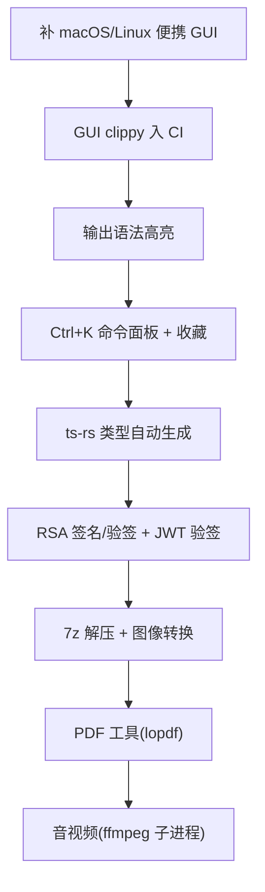

# 待办

> 当前系统的不足与未来开发方向。

## 当前不足

### 工具覆盖

- **归档转换已实现(zip/tar/gz/tar.gz)**:7z 解压、RAR 解压未做(专有格式)。
- **图像转换已实现(png/jpg/gif/bmp/webp/tiff/ico 互转+缩放)**:HEIC/RAW/AVIF 未做(需 libheif/libraw)。
- **PDF 工具已实现(拆分/旋转/加密/解密)**:合并(lopdf 无内置页树合并 API)、压缩优化(需 Ghostscript)、OCR(需 tesseract)未做。
- **音视频/文档/电子书转换未实现**:音视频(ffmpeg)、Office↔PDF(LibreOffice)、电子书(Calibre/pandoc)属引擎层,待接入。
- **HTTP 探测工具未实现**:原计划 `http` 工具(TLS 用 rustls)未做;dns 已有。
- **RSA 无签名**:仅 keygen/encrypt/decrypt,无 `rsa_sign`/`rsa_verify`。
- **JWT 仅解码不验签**:无签名验证。

### 交互

- **GUI 无快捷卡片**:首屏仅侧栏分组 + 搜索,无常用工具快捷入口。
- **无 Ctrl+K 命令面板**:工具多时键盘导航缺失。
- **无收藏机制**:无常用工具收藏/置顶。
- **输出无语法高亮**:JSON/SQL/XML 输出为纯文本,未接高亮。

### 工程与分发

- **本机无法编译 Tauri 全依赖图**:Windows 提交内存配额限制,GUI 编译验证依赖 CI。
- **便携 GUI 仅 Windows**:CI 已加便携 exe 步骤,macOS/Linux 便携形态待补。
- **GUI clippy 未在 CI 跑**:tauri-build job 仅编译不 clippy(gui clippy 需前端 dist)。
- **无 ts-rs 类型绑定**:Rust↔TS 类型手写,command 增多有漂移风险。
- **未签名**:macOS Gatekeeper 警告、Windows SmartScreen 警告。

### i18n

- **仅中英双语**:locale 结构已埋,未扩展其他语言。

## 未来方向

### 引擎层(对标 freeconvert 全功能)

核心层保持纯 Rust 轻量,重引擎按需接入,数据不离本机。文件转换支持上传文件,产物输出到源文件所在目录。

| 格式族 | 引擎 | 纯 Rust | 可行性 |
|---|---|---|---|
| 归档(zip/tar/gz) | `zip` / `tar` / `flate2` | 是 | ✓ 已交付 |
| 归档(7z/RAR) | `sevenz-rust2` / `unrar` | 是/否 | 中(7z 解压待做;RAR 仅解压) |
| 图像(常用栅格) | `image` | 是 | ✓ 已交付 |
| 图像(HEIC/RAW/AVIF/矢量) | `libheif` / `libraw` / `resvg` | 否/否/是 | 中(待做) |
| PDF 操作(拆分/旋转/加密/解密) | `lopdf` | 是 | ✓ 已交付(1.80 兼容) |
| PDF 合并/压缩优化/OCR | `lopdf`(合并待研)/Ghostscript/tesseract | 是/否/否 | 中(合并待做;压缩/OCR 外部引擎) |
| 音视频 | `ffmpeg`(子进程) | 否 | 中(单二进制、秒启动,体积大) |
| 图像(HEIC/RAW) | `libheif` / `libraw` | 否 | 中 |
| Office↔PDF | LibreOffice headless | 否 | 低(500MB+,仅探测系统已装) |
| 电子书 | `pandoc` / Calibre | 否 | 低-中(MOBI/AZW3 不做) |

**原则:** 重引擎独立分发,不破坏核心包体积;首次使用提示安装;数据仍纯本地。

### 交互与工程

1. **便携 GUI 多平台**:macOS .app / Linux AppImage 便携形态。
2. **GUI clippy**:CI 加 gui clippy step(先 `npm run build` 产 dist)。
3. **输出高亮**:前端输出区接 highlight.js(JSON/SQL/XML/YAML/TOML/Markdown)。
4. **命令面板**:Ctrl+K 模糊搜索工具,键盘导航。
5. **收藏**:常用工具收藏持久化,首屏置顶。
6. **ts-rs**:Rust 结构体 derive `TS`,生成 `src/lib/bindings/`。
7. **RSA 签名/JWT 验签**:补 `rsa_sign`/`rsa_verify`、JWT 验签。
8. **7z 解压 + 图像转换**:sevenz-rust2 内存 API + image crate(jpg/png/gif/bmp/webp/tiff/ico),产物落源目录。
9. **PDF 工具**:lopdf merge/split/rotate/encrypt/decrypt(需 Rust 1.85+)。
10. **音视频**:ffmpeg 子进程(进度 Channel 流),数据纯本地。

### 智能层(远期)

- **Smart Detection**:剪贴板数据类型探测,自动推荐工具。
- **Recipe 流水线**:工具链式组合,配方可编码分享。
- **插件系统**:第三方工具扩展(WASM 或动态库,远期评估)。

### 分发演进

- 引擎包按需下载。
- 自动更新(tauri-updater)。
- 签名公证(macOS/Win)。

## 不做

- 在线/云转换(违背纯本地定位)。
- 移动端、账号/登录/遥测。
- Office↔PDF 高质量互转打包(LibreOffice 500MB+,仅探测系统已装)。
