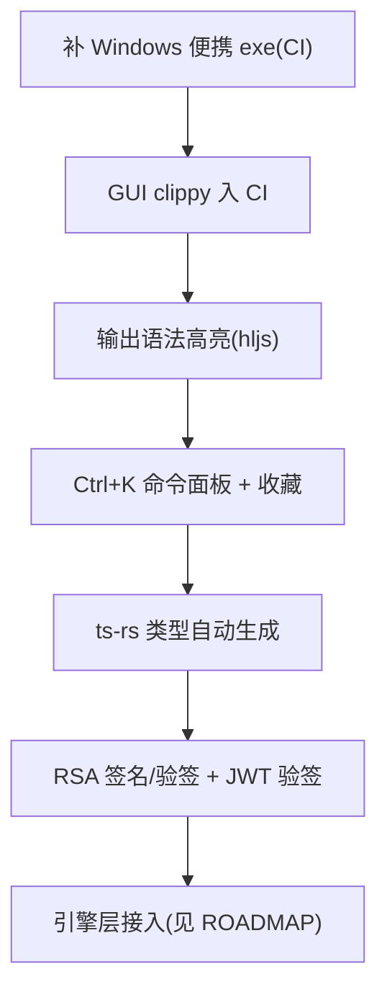

# 待办

> 当前系统的不足与近期开发方向。长期愿景见 [ROADMAP.md](ROADMAP.md)。

## 当前不足

### 工具覆盖

- **无重格式转换**:音视频(ffmpeg)、Office↔PDF(LibreOffice)、电子书(Calibre/pandoc)未实现,属引擎层。
- **HTTP 探测工具未实现**:原计划 `http` 工具(TLS 用 rustls)未做;dns 已有。
- **RSA 无签名**:仅 keygen/encrypt/decrypt,无 `rsa_sign`/`rsa_verify`。
- **JWT 仅解码不验签**:无签名验证。

### 交互

- **GUI 无快捷卡片**:首屏仅侧栏分组 + 搜索,无常用工具快捷入口(it-tools 风格)。
- **无 Ctrl+K 命令面板**:工具多时键盘导航缺失。
- **无收藏机制**:无常用工具收藏/置顶。
- **输出无语法高亮**:JSON/SQL/XML 输出为纯文本,未接高亮。

### 工程与分发

- **本机无法编译 Tauri 全依赖图**:Windows 提交内存配额限制,GUI 编译验证依赖 CI(非阻断,但本地开发受限)。
- **便携 GUI exe 仅 Windows 待补**:CI release 已产安装版,便携原始 exe 需 `--no-bundle` 步骤补充。
- **GUI clippy 未在 CI 跑**:tauri-build job 仅编译不 clippy(gui clippy 需前端 dist)。
- **无 ts-rs 类型绑定**:Rust↔TS 类型手写,command 增多有漂移风险。
- **未签名**:macOS Gatekeeper 警告、Windows SmartScreen 警告(开源初期文档告知)。

### i18n

- **仅中英双语**:locale 结构已埋,未扩展其他语言。

## 近期开发方向

1. **CI 便携 exe**:release.yml Windows 加 `--no-bundle` 步骤,上传便携原始 exe。
2. **GUI clippy**:CI 加 gui clippy step(先 `npm run build` 产 dist)。
3. **输出高亮**:前端输出区接 highlight.js(JSON/SQL/XML/YAML/TOML/Markdown)。
4. **命令面板**:Ctrl+K 模糊搜索工具 + 动作,键盘导航(参考 it-tools)。
5. **收藏**:常用工具收藏持久化,首屏置顶。
6. **ts-rs**:Rust 结构体 derive `TS`,脚本生成 `src/lib/bindings/`,消除手写类型。
7. **RSA 签名/JWT 验签**:补 `rsa_sign`/`rsa_verify`、JWT 验签(需公钥参数)。
