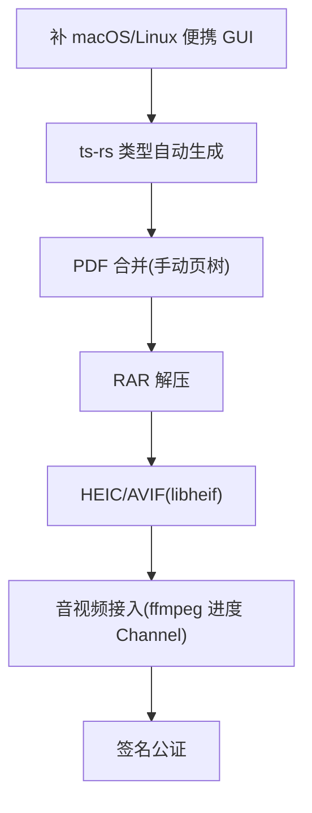

# 待办

> 当前系统的不足与未来开发方向。

## 当前不足

### 工具覆盖(已大幅扩充)

- **归档**:zip/tar/gz/tar.gz 全功能;7z 仅解压(创建待 sevenz-rust2 writer 深入);RAR 专有仅解压(未做)。
- **图像**:png/jpg/gif/bmp/webp/tiff/ico 全支持;HEIC/RAW/AVIF 未做(需 libheif/libraw C 绑定)。
- **PDF**:拆分/旋转/加密/解密已交付;**合并**待做(lopdf 0.44 无内置页树合并 API,手动实现需深度对象/resources 迁移);压缩优化需 Ghostscript;OCR 需 tesseract。
- **引擎层框架已建**(`fileconv::engine`):ffmpeg/LibreOffice/calibre/ghostscript/tesseract 子进程桥接 + 运行时探测 + 命令构造。实际转换需用户系统已装引擎,集成测试 `#[ignore]`。
- **HTTP 探测已实现**(ureq/rustls):URL 状态码 + 响应头 + 重定向跟踪。
- **RSA 签名/验签已实现**(PKCS1v15/SHA256);**JWT 验签已实现**(HS256/RS256)。
- **单位换算已实现**(10 类:长度/面积/体积/质量/温度/时间/速度/数据/能量/频率)。

### 交互(已增强)

- **输出语法高亮已实现**(highlight.js:JSON/SQL/XML/YAML)。
- **Ctrl+K 命令面板已实现**(模糊搜索 + 键盘导航)。
- **收藏已实现**(localStorage 持久化,侧栏置顶)。
- **GUI clippy 已入 CI**(tauri-build job 加 clippy step)。
- 快捷卡片首屏未做(收藏置顶已部分覆盖)。

### 工程

- **ts-rs 类型绑定未做**:Rust↔TS 类型手写(tools.ts),command 稳定后接入成本高,推迟。
- **便携 GUI 仅 Windows**:macOS .app / Linux AppImage 便携形态待补(release.yml)。
- **未签名**:macOS Gatekeeper / Windows SmartScreen 警告(需证书)。
- **本机无法编译 Tauri 全依赖图**:windows crate 栈溢出 ICE,GUI 编译验证依赖 CI。

### i18n

- **仅中英双语**:locale 结构已埋,未扩展其他语言。

## 未来方向

### 引擎层(对标 freeconvert 全功能)

引擎层框架已建(`fileconv::engine`),实际接入需绑定具体转换场景 + 进度 Channel:

| 格式族 | 引擎 | 纯 Rust | 状态 |
|---|---|---|---|
| 归档(zip/tar/gz) | `zip`/`tar`/`flate2` | 是 | ✓ 已交付 |
| 归档(7z) | `sevenz-rust2` | 是 | ✓ 解压已交付(创建待做) |
| 归档(RAR) | `unrar` | 否 | 待做(仅解压) |
| 图像(常用栅格) | `image` | 是 | ✓ 已交付 |
| 图像(HEIC/RAW/AVIF) | `libheif`/`libraw` | 否 | 待做 |
| PDF(拆分/旋转/加解密) | `lopdf` | 是 | ✓ 已交付 |
| PDF 合并 | `lopdf` | 是 | 待做(手动页树) |
| PDF 优化/OCR | Ghostscript/tesseract | 否 | 待做(框架已建) |
| 音视频 | `ffmpeg`(子进程) | 否 | 框架已建,待接入 |
| Office↔PDF | LibreOffice headless | 否 | 框架已建,待接入 |
| 电子书 | `calibre` | 否 | 框架已建,待接入 |

**原则:** 重引擎独立分发,不破坏核心包体积;首次使用提示安装;数据纯本地。

### 近期方向

1. **便携 GUI 多平台**:macOS .app / Linux AppImage 便携形态(release.yml)。
2. **ts-rs**:Rust 结构体 derive `TS`,生成 `src/lib/bindings/`,消除手写类型。
3. **PDF 合并**:手动页树合并(renumber + 资源迁移)。
4. **RAR 解压**:unrar crate(C++ 绑定,仅解压)。
5. **HEIC/AVIF**:libheif/libraw(图像扩展)。
6. **音视频接入**:ffmpeg 子进程 + Channel 进度流(对标 freeconvert video converter)。
7. **签名公证**:macOS/Win 证书签名。

### 智能层(远期)

- **Smart Detection**:剪贴板数据类型探测,自动推荐工具。
- **Recipe 流水线**:工具链式组合,配方可编码分享。
- **插件系统**:第三方工具扩展(WASM 或动态库,远期评估)。

## 不做

- 在线/云转换(违背纯本地定位)。
- 移动端、账号/登录/遥测。
- Office↔PDF 高质量互转打包(LibreOffice 500MB+,仅探测系统已装)。
