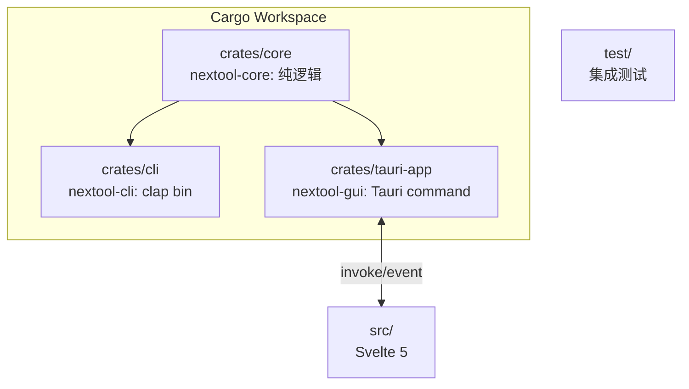

# NexToolkit v0.1 — 技术选型与设计依据

> 技术决策与依据。产品级见 `docs/PRD.md`;版本需求见 `docs/v0.1/PRD.md`。
> 每个设计决策标注依据来源:参考仓库(`reference/competitors/`,git 忽略,本地分析)、调研报告、官方文档。无法直接证伪的标 `UNVERIFIED:`。

## 1. 技术栈决策

| 维度 | 决策 | 依据来源 |
|---|---|---|
| 桌面框架 | Tauri 2.11.x | 官方:GitHub releases API 确认 `tauri-v2.11.5`(2026-07-01);context7 `/tauri-apps/tauri-docs`。系统原生 WebView,产物 5–15MB,对比 Electron 80–200MB。 |
| 前端 | Svelte 5 + Vite + TypeScript | 前端基线 ~8KB(React 40KB、Vue 14KB),编译期消除运行时;Tauri 官方一等支持。UI 薄(表单+结果),生态够用。依据:Tauri 文档 frontend agnostic + 竞品 DevToys 用 Blazor 偏重(见 `reference/competitors/DevToys/`,shallow clone 183M)。 |
| 后端语言 | Rust | 单二进制、无运行时依赖、跨平台一致、crypto/编码 crate 成熟。对比 DevToys(.NET 8 运行时)、CyberChef(Node >=24,见 `reference/competitors/CyberChef/package.json`)。 |
| CLI | 独立 clap 二进制(非 tauri-plugin-cli) | 几 MB、headless 可用、进 CI/管道;与 GUI 共享 core。依据:Tauri 文档 `tauri-plugin-cli` 仍需 WebView2,与 CLI 脚本化冲突。 |
| TLS | reqwest + rustls-tls | 纯 Rust TLS,避免 Linux OpenSSL 动态链接陷阱。依据:社区多篇生产指南一致(`UNVERIFIED:` 未在本机实测跨编译)。 |
| 错误 | thiserror(core) | 统一错误类型,Tauri 层 map 为前端可读。 |
| Windows 链接器 | msvc target(`x86_64-pc-windows-msvc`) | 初期用 gnu target(本机有 mingw gcc,免装 VS)。core/CLI 在 gnu 下编译通过。但 GUI 集成阶段发现 gnu rustc 编译 `windows-sys 0.59`(Tauri 依赖链拉入完整 Win32 绑定)时 `STATUS_STACK_BUFFER_OVERRUN` ICE——gnu rustc 处理超大规模 FFI 绑定的栈溢出,debug 模式亦崩。故切换 MSVC target:装 VS BuildTools 2022(MSVC 14.51 + Windows 11 SDK 22621),装在 `D:\DevelopTools\VisualStudio`。MSVC 为 Tauri Windows 官方推荐路径。CI 三平台矩阵各平台用各自原生工具链。 |

## 2. Cargo Workspace 架构



```
NexToolkit/
├── Cargo.toml                # workspace 定义 + 共享 profile
├── crates/
│   ├── core/                 # 纯逻辑:工具 trait + 实现,可独立单测
│   ├── cli/                  # clap 子命令,调 core
│   └── tauri-app/            # Tauri command 薄封装,调 core
├── src/                      # Svelte 5 前端
├── test/                     # 集成测试(真实调用,无 mock)
├── docs/                     # PRD / 调研 / 审计
├── reference/                # 竞品源码(git 忽略,本地分析)
└── .github/workflows/        # 三平台 CI
```

**分层依据(借鉴 DevToys GUI/CLI 同契约,但用 Rust trait 而非属性反射):**

- DevToys 用 `IGuiTool`/`ICommandLineTool` 接口让同一工具类同时挂 GUI 与 CLI(见 `reference/competitors/DevToys/src/app/dev/DevToys.Api/`)。我们用 Rust trait 实现同等解耦,但**不采用 MEF + NuGet 插件系统**——DevToys 2.0 把默认工具外移到独立仓库 `DevToys.Tools`,双仓库版本同步成本高;Rust 无等价运行时插件生态,初期工具内置 core 即可。
- CyberChef 的 `Operation` 模型(每个操作一个 `.mjs`,`inputType`/`outputType`/`run`,见 `reference/competitors/CyberChef/src/core/operations/`,505 个操作)启发了 core 的 `Tool` trait 设计:输入输出类型明确,`run` 为核心方法。
- **不采用 Boop 的"文本进文本出"模型**:Boop 脚本仅读写 `state.text`(见 `reference/competitors/Boop/Boop/Boop/System/ScriptManager.swift` 与 `Boop/Boop/scripts/*.js`,72 个),无法支持文件/图片/结构化表单输入,做不了 PNG 压缩、QR 生成。

## 3. 工具契约设计

```rust
//! nextool-core:工具统一契约

/// 工具输入输出明确,逻辑与 UI 解耦(CLI 与 GUI 共享)
pub trait Tool {
    fn name(&self) -> &str;
    fn run(&self, input: &str, opts: &Options) -> Result<String, ToolError>;
}
```

依据:CyberChef `Operation` 的 `inputType`/`outputType`/`run`(`reference/competitors/CyberChef/src/core/operations/*.mjs`);DevToys 同工具双接口(`reference/competitors/DevToys/src/app/dev/DevToys.Api/`)。Rust trait 替代属性反射,编译期确定,无运行时开销。

## 4. 功能分类

七组:Encoders/Decoders、Converters、Formatters、Generators、Text、Crypto、Net/Time。

依据:
- DevToys `PredefinedCommonToolGroupNames` 定义 7 组(Converters/Encoders-Decoders/Formatters/Generators/Graphic/Testers/Text),见 `reference/competitors/DevToys/src/app/dev/DevToys.Api/Tool/GUI/PredefinedCommonToolGroupNames.cs`。
- CyberChef `Categories.json` 配置驱动,操作可属多组,见 `reference/competitors/CyberChef/src/core/config/Categories.json`。
- 我们合并为按"工具族 + 用途"七组,用单一配置文件声明归属,允许跨组(借鉴 CyberChef)。

## 5. 三大类分发(便携度从高到低)

依据:调研报告 `docs/research/2026-08-21-local-oss-toolbox.md` §3-§5 把市面工具按便携度分三类(极致便携/免安装便携包/需安装)。NexToolkit 分发产物对齐同一心智:

| 类 | 形态 | 便携度 | 产物 |
|---|---|---|---|
| 第一类·极致便携 | CLI 单二进制 | 最高 | `nextool-cli-{win,linux,mac}` |
| 第二类·免安装便携包 | 便携 GUI | 高 | Win: exe + `webviewInstallMode=skip`;macOS: `.app`;Linux: `AppImage` |
| 第三类·安装版 | 系统安装器 | 中 | Win: `.msi`/`.nsis`;macOS: `.dmg`;Linux: `.deb` |

- Windows 便携 `skip` 依据:Win11 默认预装 WebView2(本机实测 `Microsoft/EdgeWebView/Application/` 存在 151.0.4129.x);不嵌 runtime(嵌入增 100–200MB,违背轻量)。`UNVERIFIED:` `webviewInstallMode` 精确枚举值未在 context7 直接命中,实施前以 `tauri.conf.json` schema 与 `tauri-utils` 源码最终确认。
- CI:`tauri-action` 三平台矩阵(跨平台编译无法单机交叉)。

## 6. 命令

```bash
pnpm install                          # 前端依赖
cargo fetch                           # Rust 依赖
pnpm tauri dev                        # GUI 开发(热重载)
cargo run -p nextool-cli -- <工具>    # CLI 开发
cargo build -p nextool-cli --release  # CLI 单二进制
pnpm tauri build                      # GUI 全形态
pnpm tauri build --no-bundle          # GUI 便携原始 exe
cargo test --workspace                # 全测试(真实数据)
cargo clippy --workspace -- -D warnings
cargo fmt --check
pnpm check                            # svelte-check
```

## 7. 代码风格

Rust,中文注释,文件头与关键函数注释。core 工具统一 trait:

```rust
//! nextool-core 编解码模块:Base64/URL/Hex 等

/// 工具统一契约:输入输出明确,逻辑与 UI 解耦
pub trait Tool {
    fn name(&self) -> &str;
    fn run(&self, input: &str, opts: &Options) -> Result<String, ToolError>;
}

/// Base64 编解码
pub struct Base64;

impl Tool for Base64 {
    fn name(&self) -> &str { "base64" }
    fn run(&self, input: &str, opts: &Options) -> Result<String, ToolError> {
        match opts.mode {
            Mode::Encode => Ok(base64::engine::general_purpose::STANDARD.encode(input.as_bytes())),
            Mode::Decode => {
                let bytes = base64::engine::general_purpose::STANDARD.decode(input)?;
                String::from_utf8(bytes).map_err(ToolError::from)
            }
        }
    }
}
```

前端 Svelte 5 runes,TypeScript,中文文案走 locale 文件。

## 8. 测试策略

准则:真实调用、真实数据,禁止 mock(CLAUDE.md)。优先用最高 seam(纯逻辑单测),全仓 seam 最少:

- core 单测(`crates/core/src/*.rs` `#[cfg(test)]`):纯逻辑,无 Tauri/clap,主战场。
- CLI 集成测试(`test/cli/`):`assert_cmd` 真起二进制。
- Tauri command 层:薄,由 core 单测覆盖。
- GUI E2E:v0.1 仅冒烟。

覆盖期望:每工具 ≥3 用例(正常/边界/错误),core 行覆盖 >85%。

## 9. 避坑(综合竞品分析)

1. **不照搬 DevToys MEF + 双仓库**:运行时插件对 Rust 过重,双仓库版本同步成本高(见 `reference/competitors/DevToys/` 2.0 工具外移至 `DevToys.Tools`)。
2. **不照搬 CyberChef 旧栈**:Grunt/jQuery/Bootstrap4 + 80+ npm crypto 依赖,安全面广。前端用 Svelte,crypto 用 Rust 成熟 crate。
3. **不像 Boop 无分类 + 文本-only**:工具一多不可导航,且受限模型做不了文件/图片输入(见 `reference/competitors/Boop/`)。
4. **commands.rs 按域拆**:避免单巨型文件编译爆炸(DevToys 反模式)。
5. **Capabilities 最小权限**:不通配,CSP 锁紧。
6. **Windows WebView2**:`skip` + 文档说明;不嵌 runtime。
7. **体积优化**:Cargo profile `lto=true`/`opt-level="z"`/`codegen-units=1`/`panic="abort"`/`strip=true`;前端 Svelte。

## 10. 依据来源索引

| 来源 | 路径/链接 | 用途 |
|---|---|---|
| DevToys 源码 | `reference/competitors/DevToys/`(MIT,shallow 183M) | 分层/分类/同契约/避坑 |
| DevToys 分组常量 | `reference/competitors/DevToys/src/app/dev/DevToys.Api/Tool/GUI/PredefinedCommonToolGroupNames.cs` | 七组分类依据 |
| CyberChef 源码 | `reference/competitors/CyberChef/`(Apache-2.0,shallow 36M) | 操作模型/分类配置 |
| CyberChef 操作 | `reference/competitors/CyberChef/src/core/operations/*.mjs`(505 个,已核实) | Tool trait 依据 |
| CyberChef 分类 | `reference/competitors/CyberChef/src/core/config/Categories.json`(已核实) | 配置驱动分类依据 |
| Boop 源码 | `reference/competitors/Boop/`(MIT,shallow 10M) | 脚本模型/避坑 |
| Boop 脚本管理 | `reference/competitors/Boop/Boop/Boop/System/ScriptManager.swift`(已核实) | 文本-only 模型依据 |
| Boop 脚本 | `reference/competitors/Boop/Boop/scripts/*.js`(72 个,已核实) | 脚本格式依据 |
| 生态调研报告 | `docs/research/2026-08-21-local-oss-toolbox.md` | freeconvert 对标/便携度三类/协议陷阱 |
| Tauri 官方文档 | context7 `/tauri-apps/tauri-docs`;GitHub releases `tauri-v2.11.5`(2026-07-01) | 版本/bundle/CSP/CLI |

`UNVERIFIED:` DevToys `IGuiTool`/`ICommandLineTool` 接口确切文件路径未逐一打开核实(仅确认 `PredefinedCommonToolGroupNames.cs`);各竞品实际产物体积未编译测量(仅 shallow clone 仓库体积);Tauri gnu-target GUI 链接兼容性未实测。
